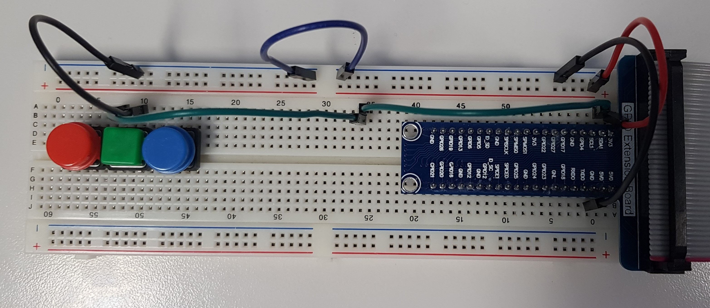

## Journal de bord du travail de diplôme 2021
### 19.04.2021
* J'ai copié le disque dur de M. Bauduccio car le mien causait des soucis
* M. Moreno, M. Huber et moi avons eu un entretien avec M. Bonvin pour discuter des appréciations du stage
* J'ai mis en place mon poste (Création du repository, installation des programmes nécessaires tel que : VS Code, Github Desktop, Suite Office, etc...)
* J'ai lu le chapitre 6 du magpi nommé "Le guide officiel du débutant Raspberry Pi" conseillé par M. Bonvin
* J'ai commencé à m'intéresser à l'utilisation du Remote GPIO pour établir une connexion entre mon Raspberry Pi 4 et celui de M. Moreno
  * Nous avons d'abord mis nos 2 Raspberry Pi sur le même réseau, ensuite nous nous sommes assurés que l'interface `Remote GPIO` était bien active des 2 côtés et nous avons vérifié que `pigpio` était bien installé, puis pour terminer nous avons mis en place le code disponible dans ce [PDF](https://magpi.raspberrypi.org/issues/60) à la page 61 sur le Raspberry Pi de M. Moreno. Avant d'exécuter le programme, nous avons tout deux exécuter la commande suivante dans un terminal `sudo pigpiod`
  * De son côté nous avons utilisé un bouton pressoir et du miens une LED
  * 
    * Le bouton est connecté au GPIO 2, donc la pin 3
  * 
    * La led est connectée au GPIO 17, donc la pin 11
  * Le code disponible sur la machine de M. Moreno va attendre que le bouton soit pressé, une fois ceci fait, la LED connecté en remote (liée à mon Raspberry Pi) se vera allumée.
* J'ai commencé mes recherches sur l'échange d'informations par bluetooth entre 2 Raspberry Pi 4
  * J'ai tenté de mettre en place le code disponible sur ce [repos](https://gist.github.com/keithweaver/3d5dbf38074cee4250c7d9807510c7c3) mais j'avais l'erreur suivante `ModuleNotFoundError: No module named 'bluetooth'`, pourtant j'avais déjà le bluetooth d'installé ainsi que blueman. En faisant des recherches je suis tombé sur cette commande `sudo apt-get install bluetooth libbluetooth-dev && sudo python3 -m pip install pybluez`. Depuis l'installation des 2 commandes je n'ai plus d'erreurs d'import.
#### Liens consultés
##### Remote GPIO
* https://www.instructables.com/Remote-control-Raspberry-PI-GPIO-pins-over-the-int/
* https://www.instructables.com/Raspberry-Pi-Remote-GPIO/
* https://magpi.raspberrypi.org/articles/remote-control-gpio-raspberry-pi-gpio-zero
* https://magpi.raspberrypi.org/issues/60
##### Échange d'informations par bluetooth entre 2 Raspberry Pi 4
* https://technologisttips.com/raspberry-pi-bluetooth/
* https://bluedot.readthedocs.io/en/latest/pairpipi.html
* https://gist.github.com/keithweaver/3d5dbf38074cee4250c7d9807510c7c3
* https://www.stuffaboutcode.com/2017/07/python-bluetooth-rfcomm-client-server.html
* https://bluedot.readthedocs.io/en/latest/pairpipi.html
* https://stackoverflow.com/questions/23985163/python3-error-no-module-named-bluetooth-on-linux-mint#23985374

### 20.04.2021
* M. Moreno et moi avons continué l'échange d'informations par bluetooth entre nos 2 Raspberry Pi 4
  * De mon côté, j'ai utilisé les fonctions suivantes :
    * `lookUpNearbyBluetoothDevices`, va lancer un scan bluetooth pour découvrir les appareils alentours. Pour chaque appareil trouvés, ils vont être affichés dans la console, si l'un de ces appareils est nommé `morenoPi42` alors son adresse mac se voit être retournée pour être utilisée en paramètre par la fonction ci-dessous.
    * `sendMessageTo` va se connecter à un appareil à l'aide de son adresse mac et d'un port désigné (le port 1 dans notre cas) pour ensuite lui envoyé une information et fermner la connexion.
* Du côté de M. Moreno, il a utilisé la méthode `receiveMessage` qui va écouter sur le port spécifié (dans notre cas, il s'agit toujours du port 1), qui va ensuite accepter la connexion entrante jusqu'à 1024 bytes, puis affiche dans la console les données reçues, une fois cela fait, elle va fermer les sockets de connexion.

* Avec M. Moreno, nous avons modifié le programme pour en faire un t'chat par bluetooth. Pour lancer le programme, il faut utiliser la commande suivante en remplaçant le _XXXX_ par le nom d'hôte de l'appareil bluetooth : `python3 bluetooth_data_transfer.py XXXX`
  * En premier temps nous avons pensé regrouper l'ouverture des sockets dans une fonction d'initialisation afin d'avoir une trace sur les sockets pour pouvoir les fermer lorsque cela est voulu.
    * Nous avons une erreur nous indiquant ceci `_bluetooth.error: (111, 'Connection refused')`, cela nous a fait comprendre que pour s'envoyer des informations, il faut que l'un écoute pendant que l'autre parle et réciproquement dans l'autre sens.
    * Nous avons mis en place une boucle while qui tourne constamment. Dans cette boucle, il y a des if qui vérifient le mode actuel.
      * 0 veut dire que nous sommes en attente d'un message
      * 1 veut dire que nous allons envoyé un message

1. Affiche le nom d'hôte et l'adresse mac de l'appareil connecté
2. Espace de saisie de message à envoyer
3. Connexion réussie à l'appareil (adresse mac, port)
4. Réception du message
5. Espace de saisie de message à envoyer, utilisant une commande personnalisée pour quitter le programme

* J'ai commencé mes recherches sur le Technic Hub

#### Liens consultés
##### Échange d'informations par bluetooth entre 2 Raspberry Pi 4
* https://pybluez.readthedocs.io/en/latest/api/bluetooth_socket.html
##### Sockets
* https://docs.python.org/3/library/socket.html
##### Récupération de saisie utilisateur
* https://pythonprogramminglanguage.com/user-input-python/
##### Récupération de paramètres en ligne de commande Python
* https://www.pythonforbeginners.com/system/python-sys-argv
##### Bluetooth LEGO
* https://lego.github.io/lego-ble-wireless-protocol-docs/
* https://github.com/hoharald/leguno-remote

### 21.04.2021
#### Liens consultés
##### ----
##### ----

### 22.04.2021
#### Liens consultés
##### ----
##### ----

### 23.04.2021
#### Liens consultés
##### ----
##### ----