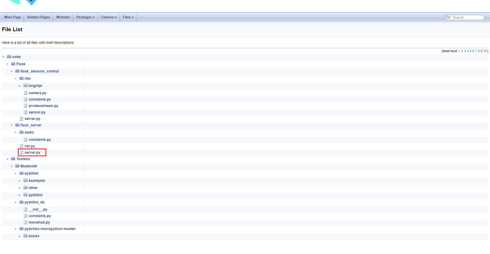
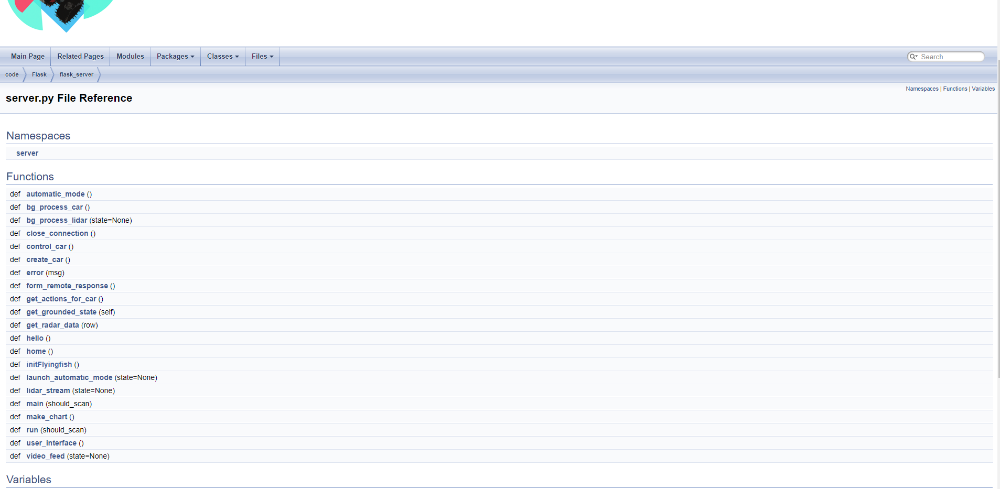
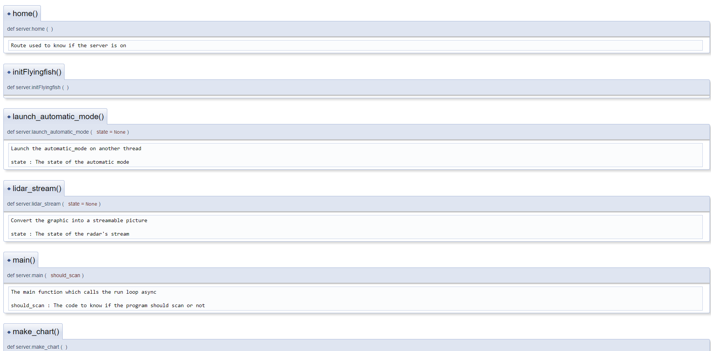

# Rendu du travail de diplôme
Vous trouverez ci-dessous les éléments importants : 

## Repository du projet
Pour avoir accès au code source, rendez vous sur mon repository git ici présent : 
L'entièreté du code est placée dans le répertoire `code`.
https://github.com/ACKERMANNGUE/ACKERMANNGUE-AG_Dipl_Tech_2021_VoitureAssistee

## Documentation du projet
Pour avoir accès à la documentation du projet, veuillez vous rendre sur ce lien : https://ackermanngue-ag-dipl-tech-2021-voitureassistee.readthedocs.io/fr/latest/index.html

## Documentation du code du projet
Pour avoir accès à la documentation du code générée avec Doxygen il faut télécharger le repository du projet à cette adresse : https://github.com/ACKERMANNGUE/ACKERMANNGUE-AG_Dipl_Tech_2021_VoitureAssistee. 

Une fois le repository téléchargé, allez dans le répertoire `\docs\Doxygen\html`, puis ouvrez le fichier html nommé : `files.html`.
Une fois ouvert, vous pourrez avoir accès au code commenté que j'ai écrit. 
Par exemple, si vous souhaitez voir le code sur serveur principal, cliquez sur le fichier `server.py` présent dans `\code\Flask\flask_server\`. Une page comme celle-ci apparaîtra :

Depuis cette page, vous aurez accès aux divers méthodes présentes dans le fichier. Si vous cliquez sur une des méthodes, vous serez redirigé vers la description de cette dernière:

Pour voir les divers mini projets de tests élaborés qui m'ont servis à implémenter les divers éléments, allez dans le répertoire `Toolbox`. Ce répertoire contient aussi des codes d'exemples trouvés sur internet.

