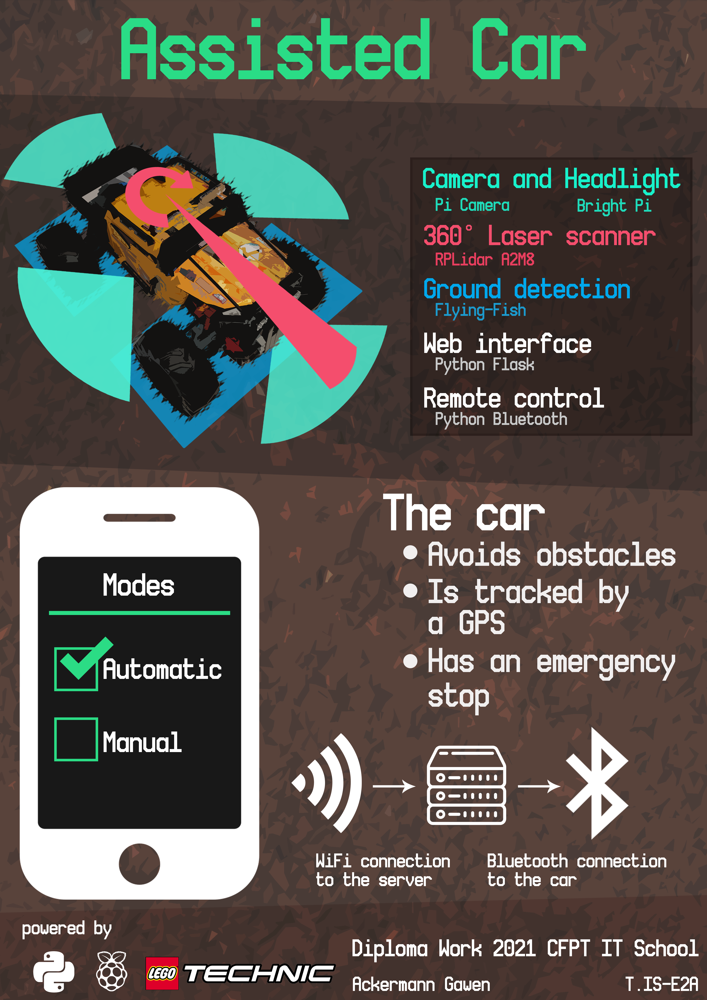
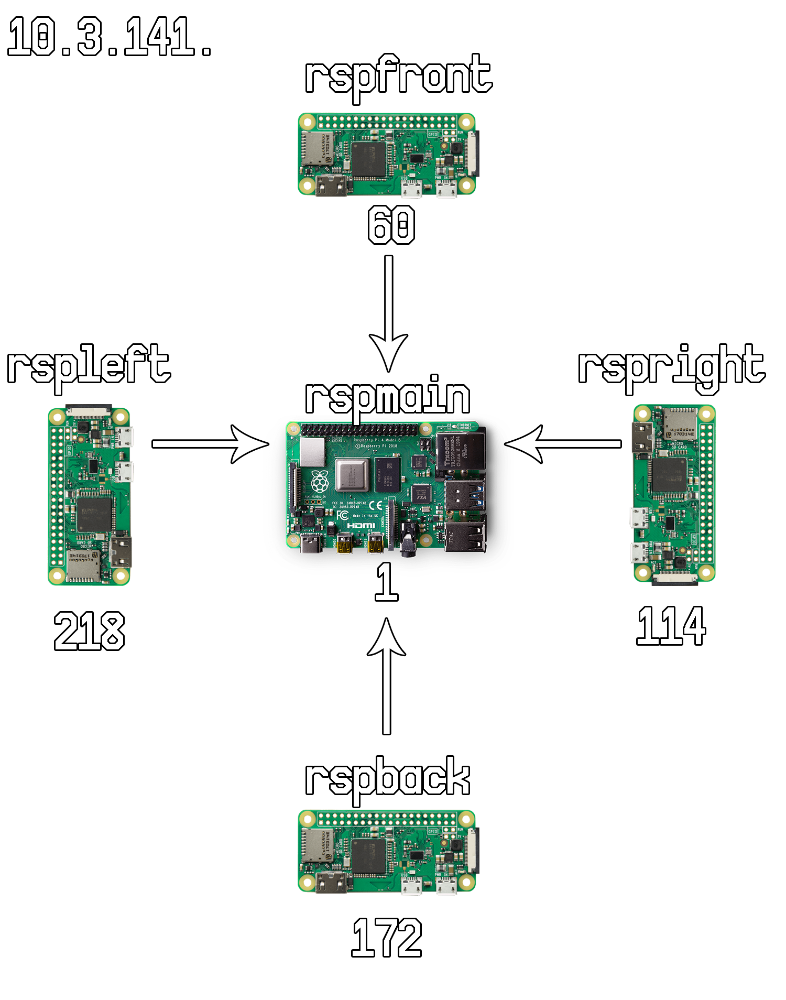
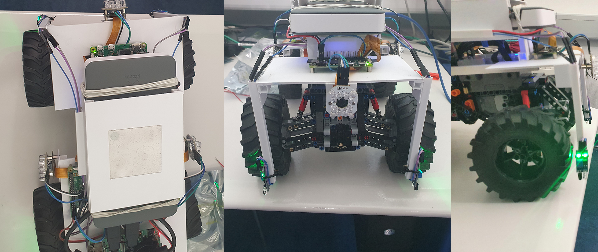

--- 
title: "Documentation technique de Voiture Assistée"
author: Ackermann Gawen
---
# Documentation technique
## Résumé

_Voiture assistée_ est un projet d'étude portant sur les voitures autonomes et leur fonctionnement. Ce projet est un défi que je me suis lancé étant donné la découverte des différents appareils utilisés pour ce projet. La plus-value sera surtout l'acquisition de nouvelles connaissances dans le domaine de l'informatique physique et de la mise en pratique des connaissances aquises durant ces 6 dernières années d'études d'informatique. Par conséquent, le but du projet est de réaliser une voiture se déplaçant à l'aide d'une interface web et qui sait se déplacer par elle-même en évitant les obstacles sur sa route.

## Abstract

_Assisted Car_ is a study project about autonomous cars and how they work. This project is a challenge that I set myself given the discovery of the different devices used for this project. The added value will be mainly the acquisition of new knowledge in the field of physical computing and the application of the knowledge acquired during the last 6 years of computer science studies. Therefore, the goal of the project is to realize a car moving with the help of a web interface and which knows how to move by itself by avoiding the obstacles on its way.

## Poster



## Cahier des charges

### Titre du projet

Le titre du projet est Voiture assistée, car le but du projet est d'en réaliser une.

### Contexte

Ce projet m'a été proposé par M. Bonvin car il a vu que j'allais faire une simulation de voiture autonome, il s'est dit que l'on pourrait tourner la chose autrement. Il a une multitude de Raspberry Pi, de composants ainsi qu'une voiture LEGO controlable. C'est pourquoi il m'a dirigé vers une programmation utilisant des capteurs et du bluetooth.

### Objectif

L'objectif principal de ce projet est de réaliser une voiture capable de se déplacer d'un point A à un point B en évitant les différents obstacles sur sa route. Pour ce faire, il faudra trouver un moyen de communiquer avec le Technic Hub afin de mouvoir la voiture. Ensuite, il faudra faire fonctionner indépendamment les différents capteurs. Pour ensuite créer un algorithme événementiel gérant les différentes pondérations des messages que les capteurs enverront.

### Technologies et matériels utilisés

#### Logiciels

- Visual Studio Code
  - Python
  - Flask
- Github
- Markdown
- QCAD
- Photoshop CS6
- Pencil
- Trello

#### Matériels

- Raspberry Pi 0 WiFi
- Raspberry Pi 4B
- 4 Caméras infrarouges (PI NoIR)
- 4 phares (Bright Pi v1.0)
- GPS (Ultimate GPS Breakout v3)
- Émetteur WiFi (ASUS RT-AC58U)
- LEGO 4x4 X-trem Off-Roader
- Détecteur infrarouge (Flying-Fish)
- Radar 360 (RPLiDAR A2M8)

#### Environnement de développement

Pour me connecter au Raspberry Pi sur lequel je travail, j'utilise :

- Remote SSH pour éditer le code
  - Il s'agit d'une extension Visual Studio Code disponible [ici](https://marketplace.visualstudio.com/items?itemName=ms-vscode-remote.remote-ssh)
- Github pour publié mon code écrit sur le Raspberry Pi et pour mettre à disposition la documentation technique ainsi que le journal de bord
- RealVNC pour me connecter à distance à l'interface graphique du Raspberry Pi
  - Il s'agit d'un logiciel créant un serveur et un client permettant de contrôler à distance l'écran d'un autre ordinateur, disponible [ici](https://www.realvnc.com/fr/connect/download/viewer/).

### Description détaillée de ce que l'application fait

La voiture est télécommandable à distance à l'aide d'une interface web. Sur le site internet, on a accès à la gestion des états des différents capteurs ainsi que des données qu'ils envoient tel que pour la détection sol, le radar 360° ainsi que pour le flux vidéo des caméras.

#### Plan de la voiture


Dans le croquis du plan de la voiture présent ci-dessus, je vais énoncer le rôle de chaque composant.

1. Les phares sont représentés par le Bright Pi
2. Les détecteurs de sol placés au niveau des roues sont représentés par le Flying-Fish
3. Le Raspberry Pi 4 est représenté par RSP 4
4. Le Raspberry Pi 0 WiFi est représenté par RSP 0 W
5. Le scanner 360° est représenté par le Lidar

En comparaison, voici de quoi est équipée une vraie voiture autonome :


#### Schéma explicatif de l'application

L'application offre plusieurs pages.

#### Interface utilisateur de l'application

Une page d'interface utilisateur, pour avoir accès aux informations des capteurs ainsi que leurs états.


#### Interface télécommande

Une page de télécommande pour la voiture.

##### En mode manuel

L'utilisateur déplace la voiture à l'aide de la manette disponible sur le site web.


##### En mode automatique

La voiture se déplace de manière rectiligne en évitant les obstacles sur sa route.


## Contact

| Status                |    Nom    | Prénom |        Email         | Numéro de téléphone |
| --------------------- | :-------: | :----: | :------------------: | ------------------- |
| Élève                 | Ackermann | Gawen  | gawen.ackrm@eduge.ch | +41 79 88 98 69 4   |
| Professeur de diplôme |  Bonvin   | Pascal | edu-bonvinp@eduge.ch | +33 6 32 17 84 11   |

## Manuel technique
Dans cette rubrique, nous allons voir comment les divers éléments utilisés dans ce projet ont été mis en place.

### Structure du projet
Dans cette section, je vais vous expliquer la structure de mon projet.

```
├── code
│   ├── Flask
│   └── Toolbox
├── docs
│   ├── images
│   ├── plans
│   ├── documentation_technique.md
│   ├── index.md
│   ├── logbook.md
│   └── requirements.txt
├── site
├── mkdocs.yml
└── README.md
```

Le répertoire :

* `Flask` contient les 2 serveurs Flask à exécuter sur les divers Raspberry Pi
* `Toolbox` contient les différents fichiers python et C++ utilisés pour la mise en place ainsi que les premiers tests des divers éléments à utiliser dans l'application
* `images` contient toutes les images utilisées pour la documentation technique
* `plans` contient les fichiers QCad des plans initiaux de la voiture
* `site` la documentation compilée par MkDocs

### Plan réseau

Étant donné que les divers éléments communiquent par le WiFi, ils doivent donc avoir des adresses IP. Dans mon cas, j'ai choisis d'utiliser des adresses IP statiques. Tous les Raspberry Pi 0 WiFi sont connectés sur le point d'accès qu'est le Raspberry Pi 4. Pour comprendre comment le Raspberry Pi 4 a été transformer en point d'accès, veuillez lire la section parlant de RaspAP dans le guide de mise en place des éléments utilisés.



### Branchements
#### Alimentation générale
Pour l'alimentation générale, j'ai pris 2 anciens câbles USB que j'ai coupé et dénudé afin de récupérer l'alimentation (Le VCC et le GND). Ces deux câbles ont ensuite été soudés sur les pins soudées à la plaquette.

À la base, la plaquette et la rangée de pins ressemblaient à ceci : 


Pour ensuite être soudé de la sorte : 


Le courant est soudé sur la pin de gauche tandis que la terre sur la pin de droite. Ce processus a été répété 2 fois car il y a du sorties présentes sur la batterie externe.

Les câbles USB sont branchés dans les ports Output 1 et 2 de la batterie externe comme ceci :


Il est important de noter, que chaque composant est branché à l'alimentation générale de la sorte : 


Par conséquent sur cet exemple, les câbles rouges, blancs et violets sont branchés sur le courant et les câbles noirs, gris et bruns sont branchés sur la terre.

#### Raspberry Pi 4
De base, le Raspberry Pi 4 était branché à l'alimentation générale et était alimenté par les pins 4 et 6 du GPIO, mais après quelque tests, j'ai pu me rendre compte que certain Raspberry Pi 0 WiFi branchés au système d'alimentation générale n'avaient pas assez de courant et ne faisaient que de redémarrer en boucle. C'est pourquoi après réflexion, j'ai branché le Raspberry Pi 4 sur la batterie externe en USB-C comme ceci afin de libérer de la charge de courant de l'alimentation générale :


##### Lidar
Le lidar est connecté à l'adaptateur qui permet de le brancher en USB au raspberry comme vu dans la section portant sur le Lidar dans le guide de mise en place.

Pour l'affichage graphique des données perçues par le Lidar, veuillez regarder la section parlant de Matplotlib dans le guide de mise en place et pour ce qui est de l'affichage des données en un quasi-temps réel, j'utilise la même méthode que pour la récupération du flux de la caméra en temps réel.

##### Fyling-Fish
Les divers Flying-Fish sont branchés par des câbles gris et violets à l'alimentation générale, mais les valeurs de sorties qu'ils fournissent sont branchés par des câbles bleus sur les GPIO suivant du raspberry pi 4 :


### Raspberry Pi 0 WiFi
Le raspberry pi 0 WiFi est branché à l'alimentation générale et est alimenté par les pins 4 et 6 du GPIO.

##### Caméra 
La caméra est branché de la même manière que dans la section explicant la module caméra dans le document de mise en place des composants.

#### Bright Pi 
Le Bright Pi est branché sur l'alimentation générale avec des câbles blancs et noirs. Les 2 autres câbles bleus et verts sont branchés sur des GPIO I2C, donc les pins 2 et 9. Pour ce qui est du câblage pour les câbles bleus et verts, il est identique à la section explicant ce qu'est le Bright Pi dans le guide de mise en place.

### Analyse organique
Dans cette section, nous allons parler plus en détails du fonctionnement de l'application et des éléments mis en place.

#### Raspberry Pi 4
##### À quoi sert-il ?
Ce raspberry pi est le raspberry pi principale. C'est-à-dire que c'est lui qui va être le point d'accès par rapport aux autres rapsberry pi dont la voiture est équipée.

##### Comment on l'utilise ?
Pour exécuter le script du serveur principal, il faut utiliser la commande `python3 server.py` depuis le répertoire `/code/Flask/flask_server`. Ce script est un serveur Flask nous donnant accès aux différentes fonctionnalitées de l'application.

##### Comment fonctionne-t-il ?
Une fois le serveur lancé, et après nous être rendu avec un navigateur web connecté à l'adresse du raspberry pi et sur le port 5000 du réseau fournit par le raspberry pi 4. Exemple : `10.3.141.1:5000`

###### Barre de navigation
La barre de navigation nous permet de changer de page. Cette dernière contient 5 éléments.


* A. Redirection sur la page d'accueil
* B. Redirection sur la page de télécommande
* C. Redirection sur la page du tableau de bord
* D. Création d'une connexion avec la voiture
* E. Déconnexion avec la voiture
  
###### Page d'accueil
Ceci est la page sur laquelle on arrive lorsque l'on tape l'adresse IP du point d'accès avec le port 5000.


* A. Bouton créant une connexion avec la voiture

###### Page de télécommande
Cette page permet, si une connexion avec la voiture est établie, de contrôler la voiture.


* A. Une barre coulissante allant de -100 à 100 pour gérer la vitesse de la voiture
* B. Une barre coulissante allant de -100 à 100 pour gérer le guidon de la voiture
* C. Bouton remettant le guidon à sa position initiale
* D. Bouton coupant les moteurs de la voiture
* E. Bouton de déconnexion à la voiture

Il est important de savoir que dans le code gérant les déplacement de la voiture, j'inverse les données et les divises par 100 car les valeurs sont comprisent entre -1 et 1. La raison pour laquelle j'inverse par la suite les vitesses dans le code, c'est parce que pour avancer avec la voiture, il faut lui donner une vitesse négative, cependant je trouvais plus logique pour une interface utilisateur que pour avancer l'on ajuste la barre coulissante à droite.

###### Page du tableau de bord
Cette page permet à l'utilisateur de gérer les différents capteurs et de voir en temps réel les données reçues par les caméras ainsi que par le Lidar.


* A. Case à cocher (dés)activant le mode automatique
* B. Case à cocher (dés)activant les leds à la position indiquée 
  * Les cases de gauche allument les leds blanches, les cases de droites allument les leds infrarouges
* C. Case à cocher (dés)activant la caméra à la position indiqué
* D. Case à cocher (dés)activant la récuperation des données du Lidar

De base, toutes les caméras sont éteintes ainsi que le radar :


Voici ce à quoi ça ressemble lorsque l'on active une caméra et le radar :


J'ai choisis d'afficher les éléments à la suite, car l'utilisateur va utiliser son téléphone pour se connecter à l'application. Il est donc plus pratique d'avoir accès aux éléments comme ceci étant sur un téléphone portable.

Pour comprendre comment le flux des caméras sont récupérer, veuillez regarder la section parlant du récupération du flux vidéo dans le guide de mise en place. 

###### Page création de connexion
Lors de l'appuie sur cet élément, cela va lancer une connexion avec la voiture.

###### Page de déconnexion
Lors de l'appuie sur cet élément, cela va lancer une déconnexion avec la voiture.

##### Comment fonctionne la connexion avec la voiture ?
La création de la connexion avec la voiture s'effectue dans la classe `car`. Cette classe lorsque l'on crée un nouvel objet, va demander une connexion Gatt au Technic Hub.

[[DIAG DE CLASSE DE VOITURE]]

```python
class CarController:
    """Class controlling the car"""

    MY_MOVEHUB_ADD = "90:84:2B:50:36:43"
    MY_BTCTRLR_HCI = "hci0"
    MIN_ANGLE = -1
    MAX_ANGLE = 1
    DEFAULT_ANGLE = 0
    MAX_MOTOR_POWER = 1
    MOTOR_STOP_POWER = 0
    MAXIMUM_SPEED_WHEN_GROUND_ISNT_DETECTED = 0.2

    def __init__(cls):
        cls.connection = get_connection_gatt(hub_mac=cls.MY_MOVEHUB_ADD)
        try:
            cls.movehub = MoveHub(cls.connection)
            # The motors
            cls.front_motor = Motor(cls.movehub, cls.movehub.PORT_A)
            cls.back_motor = Motor(cls.movehub, cls.movehub.PORT_B)
            cls.directionnal_motor = EncodedMotor(cls.movehub, cls.movehub.PORT_C)
            cls.old_angle = cls.DEFAULT_ANGLE
        except:
            cls.movehub = None
            cls.front_motor = None
            cls.back_motor = None
            cls.directionnal_motor = None
            cls.instance = None
            cls.connection = None
            cls.old_angle = None

```

On fait un try / except car si la demande n'est pas aboutie, il faut que l'on puisse tout de même remplir les champs de la classe.

Voici la route qui permet de créer la connexion :

```python
@app.route("/create_car/")
def create_car():
    """Used to the creation of the car"""
    global car
    car = CarController()
    if hasattr(car, "connection"):
        return render_template("form_remote_car.html")
    else:
        car = None
        return render_template(
            "error.html", msg="Une connexion est nécessaire pour pouvoir intéragir avec"
        )
```

Lors de l'appel à la route ci-dessus, il ne faut pas oublier de cliquer sur le bouton vert du `Technic Hub`. 


Il est important de noter que la voiture est stockée dans une variable globale car ceci nous permet de alors d'avoir accès à la voiture depuis divers méthodes. À la base, cette connexion avec la voiture était faite à travers le design pattern du Singelton : 

```python
def __new__(cls):
    if(cls.instance is None):
        cls.instance = super(CarController, cls).__new__(cls)
        cls.connection = get_connection_gatt(hub_mac=cls.MY_MOVEHUB_ADD)
        try:
            cls.movehub = MoveHub(cls.connection)
            # The motors
            cls.front_motor = Motor(cls.movehub, cls.movehub.PORT_A)
            cls.back_motor = Motor(cls.movehub, cls.movehub.PORT_B)
            cls.directionnal_motor = EncodedMotor(cls.movehub, cls.movehub.PORT_C)
        except:
            cls.movehub = None
            cls.front_motor = None
            cls.back_motor = None
            cls.directionnal_motor = None
    return cls.instance
```

Le problème que le Singleton avait était que des fois, il perdait la connexion à la voiture alors que l'instance de l'objet était toujours présente. C'est-à-dire, que lorsque l'on se déconnectait de la voiture à l'aide de la méthode de déconnexion appelée par la route :

```python
# Code présent dans la classe CarController
def disconnect(self):
        self.connection.disconnect()

# Code présent dans le fichier server.py dans le répertoire /code/Flask/flask_server/
@app.route("/close_connection/")
def close_connection():
    """Close the connection between the Raspberry Pi and the Technic Hub"""
    global car
    output = "Connexion toujours en cours"
    if car != None:
        car.disconnect()
        output = "Connexion fermée avec l'appareil {0}".format(car.MY_MOVEHUB_ADD)
        car = None

    return render_template("connection.html", msg=output)

```

##### Comment fonctionne la récupération des données du Lidar ?

Pour activer l'API C++ pour y récupérer les distances à chaque angles qui sont écrits dans la console et afin d'éviter de rendre le code bloquant, j'ai utilisé `Asyncio`. 

Voici le code permettant l'appel et le traitement asynchrone des données :

```python
@app.route("/bg_processing_lidar/<string:state>", methods=["POST"])
def bg_process_lidar(state=None):
    """Process the values passed by Javascript"""

    try:
        loop = asyncio.get_running_loop()
    except RuntimeError:  # no event loop running:
        loop = asyncio.new_event_loop()
    finally:
        loop.run_until_complete(main(state))

    return ""

async def main(should_scan):
    """
    The main function which calls the run loop async

    should_scan : The code to know if the program should scan or not
    """
    await run(should_scan)

async def run(should_scan):
    """
    Will run the subprocess and bind the async method

    should_scan : The code to know if the program should scan or not
    """
    command = ("./scanner/simple_grabber /dev/ttyUSB0 " + should_scan).split()
    process = await create_subprocess_exec(*command, stdout=PIPE, stderr=PIPE)
    await asyncio.wait([_read_stream(process.stdout, lambda x: {get_radar_data(x)})])
    await process.wait()

async def _read_stream(stream, callback):
    """
    Will read the text in the console from the process simple_grabber

    stream : The streaming of the data in the console
    callback : The method to call when data has been received

    """
    while True:
        line = await stream.readline()
        if line:
            callback(line.split(b","))
        else:
            break

def get_radar_data(row):
    """
    Will parse the data received in text by the Lidar

    row : Row to read and to add or modify in the array of angles
    """
    global rows
    # row normaly is like [angle, distance]
    tmp = row
    if len(tmp) == 2:
        angle = int(tmp[0])
        # remove the line return
        dist = tmp[1].replace(b"\n", b"")
        rows[angle] = float(dist)

```

Comme l'on peut le voir, lors de l'activation ainsi que de la désactivation du Lidar. On effectue un processus, car étant donné que dans le code de l'API, il s'agit d'une boucle infinie récupérant et lissant les données qui sont affichées dans la console, on a besoin de manière asynchrone à traiter ses données et à les mettre dans le tableau.

C'est ce à quoi sert la méthode `_read_stream`. Cette méthode nous permet de lire ligne par ligne le contenu de sortie de la console (`process.stdout`) et en l'ajoutant dans le tableau avec la méthode `get_radar_data(row)`.


###### Code de l'API C++ modifié

```cpp

int main(int argc, const char *argv[])
{
    const char *opt_com_path = NULL;
    _u32 opt_com_baudrate = 115200;
    u_result op_result;
    bool run_scan = false;

    // check if the the program should run scans
    if(argc == 3) {
        char arg = (char)*argv[2];
        if(arg == '1') {
            run_scan = true;
        } else if(arg == '0') {
            run_scan = false;
        }
    }

    if (argc < 2)
    {
        print_usage(argc, argv);
        return -1;
    }
    opt_com_path = argv[1];

    // create the driver instance
    RPlidarDriver *drv = RPlidarDriver::CreateDriver(DRIVER_TYPE_SERIALPORT);

    if (!drv)
    {
        fprintf(stderr, "insufficent memory, exit\n");
        exit(-2);
    }

    rplidar_response_device_health_t healthinfo;
    rplidar_response_device_info_t devinfo;
    do
    {
        // try to connect
        if (IS_FAIL(drv->connect(opt_com_path, opt_com_baudrate)))
        {
            fprintf(stderr, "Error, cannot bind to the specified serial port %s.\n", opt_com_path);
            break;
        }

        op_result = drv->getDeviceInfo(devinfo);

        if (IS_FAIL(op_result))
        {
            if (op_result == RESULT_OPERATION_TIMEOUT)
            {
                // you can check the detailed failure reason
                fprintf(stderr, "Error, operation time out.\n");
            }
            else
            {
                fprintf(stderr, "Error, unexpected error, code: %x\n", op_result);
                // other unexpected result
            }
            break;
        }

        op_result = drv->getHealth(healthinfo);
        if (IS_OK(op_result))
        { // the macro IS_OK is the preperred way to judge whether the operation is succeed.
            switch (healthinfo.status)
            {
            case RPLIDAR_STATUS_WARNING:
                printf("Warning.");
                break;
            case RPLIDAR_STATUS_ERROR:
                printf("Error.");
                break;
            }
            printf(" (errorcode: %d)\n", healthinfo.error_code);
        }
        else
        {
            fprintf(stderr, "Error, cannot retrieve the lidar health code: %x\n", op_result);
            break;
        }

        if (healthinfo.status == RPLIDAR_STATUS_ERROR)
        {
            fprintf(stderr, "Error, rplidar internal error detected. Please reboot the device to retry.\n");
            break;
        }

        drv->startMotor();

        if (IS_FAIL(drv->startScan(0, 1))) // you can force rplidar to perform scan operation regardless whether the motor is rotating
        {
            fprintf(stderr, "Error, cannot start the scan operation.\n");
            break;
        }

        int max_size_arr_angle_dist = 360;
        float angle_dist_tmp[max_size_arr_angle_dist];
        float angle_dist[max_size_arr_angle_dist];
        int size_arr_angle_dist = (sizeof(angle_dist) / sizeof(angle_dist[0]));

        const int MAX_RANGE_LIDAR = 16000.0f;
        const int MIN_RANGE_LIDAR = 0.0f;
        // used as a code in order to treat the data below in another process
        //printf("<<<\n");
        while (run_scan)
        {
            //reset the array to empty (empty represented by the 0)
            std::fill_n(angle_dist, max_size_arr_angle_dist, 0.0f);
            capture_and_display(angle_dist, drv);

            if (size_arr_angle_dist == 0)
            {
                fprintf(stderr, "Error, cannot grab scan data.\n");
                break;
            }
            
            /* Correct the errors */
            for (size_t j = 0; j < max_size_arr_angle_dist; j++)
            {
                if (angle_dist[j] < MIN_RANGE_LIDAR && angle_dist[j] >= MAX_RANGE_LIDAR)
                {
                    angle_dist[j] = MIN_RANGE_LIDAR;
                }
            }

            /* make the average of distance */
            capture_and_display(angle_dist_tmp, drv);
            for (size_t j = 0; j < max_size_arr_angle_dist; j++)
            {
                if (angle_dist_tmp[j] > MIN_RANGE_LIDAR && angle_dist_tmp[j] < MAX_RANGE_LIDAR)
                {
                    angle_dist[j] = (angle_dist[j] + angle_dist_tmp[j]) / 2;
                }
            }

            for (size_t j = 0; j < max_size_arr_angle_dist; j++)
            {
                printf("%d,%f\n", j, angle_dist[j]);
            }
        }

    } while (0);

    drv->stop();
    drv->stopMotor();

    RPlidarDriver::DisposeDriver(drv);
    return 0;
}


```

##### Comment fonctionne la gestion du déplacement de la voiture ?
###### Télécommande
La télécommande effectue des appels AJAX avec les valeurs des barres coulissantes comme ceci :

```javascript
<script type="text/javascript">

$(document).on('input', '#rngMove', function() {
    execute();
});

$(document).on('input', '#rngRotationAngle', function() {
    execute();
});

function execute(){
    $.ajax({
            url: '/bg_processing_car/',
            data: $('form').serialize(),
            type: 'POST',
            success: function(response) {
                console.log("action performed");
            },
            error: function(error) {
                console.log(error);
            }
        });
    }
</script>
```

Les ID `rngMove` et `rngRotationAngle` sont ceux attachés aux barres coulissantes. À chaque changement de valeurs, qu'il s'agisse du guidon ou de la vitesse des moteurs, la route appelée à l'aide d'AJAX `/bg_processing_car/` se charge de faire le traitement :

```python
@app.route("/bg_processing_car/", methods=["POST"])
def bg_process_car():
    """Process the values passed by Javascript"""

    global car

    move_speed = request.form["rngMove"]
    angle_rotation = request.form["rngRotationAngle"]

    if car != None:
        # Convert the values
        move_speed = float(move_speed)
        angle_rotation = int(angle_rotation)
        # Get the allowed actions of the car
        actions = get_actions_for_car(move_speed)
        car.move(move_speed, angle_rotation, actions)
    return render_template(
        "form_remote_car.html",
        speed=move_speed,
        angle=angle_rotation,
    )


def get_actions_for_car(speed):
    """Process the actions that the car is allowed to do according to the flying-fish"""
    actions = (constants.CODE_TURN_NOTHING, constants.CODE_MOVE_NOTHING)
    # INDEX 0 represent the turn code
    # INDEX 1 represent the move code
    if (
        GPIO.input(constants.GPIO_FLYING_FISH_FRONT_LEFT)
        and GPIO.input(constants.GPIO_FLYING_FISH_FRONT_RIGHT)
        and not GPIO.input(constants.GPIO_FLYING_FISH_BACK_LEFT)
        and not GPIO.input(constants.GPIO_FLYING_FISH_BACK_RIGHT)
    ):
        print("les deux avant")
        actions = (constants.CODE_TURN_NOTHING, constants.CODE_MOVE_BACKWARD)

    elif GPIO.input(constants.GPIO_FLYING_FISH_FRONT_LEFT):
        print("gauche avant")
        actions = (constants.CODE_TURN_RIGHT, constants.CODE_MOVE_NOTHING)

    elif GPIO.input(constants.GPIO_FLYING_FISH_FRONT_RIGHT):
        print("droite avant")
        actions = (constants.CODE_TURN_LEFT, constants.CODE_MOVE_NOTHING)

    elif (
        not GPIO.input(constants.GPIO_FLYING_FISH_FRONT_LEFT)
        and not GPIO.input(constants.GPIO_FLYING_FISH_FRONT_RIGHT)
        and GPIO.input(constants.GPIO_FLYING_FISH_BACK_LEFT)
        and GPIO.input(constants.GPIO_FLYING_FISH_BACK_RIGHT)
    ):
        print("les deux arrière")
        actions = (constants.CODE_TURN_NOTHING, constants.CODE_MOVE_FORWARD)

    elif GPIO.input(constants.GPIO_FLYING_FISH_BACK_LEFT):
        print("gauche arrière")
        actions = (constants.CODE_TURN_RIGHT, constants.CODE_MOVE_FORWARD)

    elif GPIO.input(constants.GPIO_FLYING_FISH_BACK_RIGHT):
        print("droite arrière")
        actions = (constants.CODE_TURN_LEFT, constants.CODE_MOVE_FORWARD)

    return actions
```

Voici le code de déplacement pour la voiture dans la classe `CarController` :

```python

    def move(self, motor_speed, angle_rotation, actions):
        """Moves the car with a specific speed and rotation

        motor_speed : The motor's speed
                      NOTE : to move forward, the value must be reversed because it is basically negative
        angle_rotation : The rotation of the directionnal motor
        actions : The list of the possible actions
        """
        # Invert the power direction
        if motor_speed != 0:
            motor_speed *= -1
        # Max value of motor is -1 and +1 but in the HTML form, the range input can be set between -100 to +100
        motor_speed /= 100
        angle_rotation /= 100

        # INDEX 0 represent the turn code
        # INDEX 1 represent the move code
        try:
            if actions[0] == constants.CODE_TURN_LEFT and angle_rotation < 0:
                self.turn(angle_rotation)

            elif actions[0] == constants.CODE_TURN_RIGHT and angle_rotation > 0:
                self.turn(angle_rotation)

            elif actions[0] == constants.CODE_TURN_NOTHING:
                self.turn(angle_rotation)

            if actions[1] == constants.CODE_MOVE_FORWARD and motor_speed < 0:
                if motor_speed > self.MAXIMUM_SPEED_WHEN_GROUND_ISNT_DETECTED:
                    motor_speed = self.MAXIMUM_SPEED_WHEN_GROUND_ISNT_DETECTED
                self.front_motor.start_power(motor_speed)
                self.back_motor.start_power(motor_speed)

            elif actions[1] == constants.CODE_MOVE_BACKWARD and motor_speed > 0:
                if motor_speed > self.MAXIMUM_SPEED_WHEN_GROUND_ISNT_DETECTED:
                    motor_speed = self.MAXIMUM_SPEED_WHEN_GROUND_ISNT_DETECTED
                self.front_motor.start_power(motor_speed)
                self.back_motor.start_power(motor_speed)

            elif actions[1] == constants.CODE_MOVE_NOTHING:
                self.front_motor.start_power(motor_speed)
                self.back_motor.start_power(motor_speed)
        except AssertionError:
            pass

    def turn(self, angle):
        """Turn the directionnal motor from the input value

        angle : The angle we wants the directionnal motor goes to
        """
        try:
            self.directionnal_motor.start_power(angle)
            self.old_angle = angle
        except AssertionError:
            pass

    def reset_handlebar(self):
        # Reset the angle
        angle = self.old_angle * -1
        angle /= 2
        try:
            self.directionnal_motor.start_power(angle)
            self.old_angle = angle
        except AssertionError:
            pass

    def stop_moving(self):
        """Stop the motors"""
        # Reset the angle
        try:
            self.reset_handlebar()
            self.front_motor.start_power(self.MOTOR_STOP_POWER)
            self.back_motor.start_power(self.MOTOR_STOP_POWER)
        except AssertionError:
            pass
```

On peut remarquer que dans les différentes méthodes j'utilise des `try` / `except`. Je suis obligé de les utiliser, car lors de l'envoie d'une commande au `Technic Hub`, il doit retourner une réponse, cependant des fois il se peut que pendant qu'il traite une commande, avant qu'il aie pu répondre une autre commande lui soit envoyée. Ce qui cause un problème de confirmation, et qui par conséquent faisait crash le programme.

###### Boutons
Pour comprendre plus en détail le rôle des boutons présent sur la page de télécommande, veuillez vous référer à la section décrivant l'interface pour la télécommande. 

Voici comment les actions qu'ils produisent sont gérées :

```python
@app.route("/form_remote_response/", methods=["POST"])
def form_remote_response():
    """The form's answer of the remote"""
    global car
    # Init
    move_speed = constants.DEFAULT_SPEED
    angle_rotation = constants.DEFAULT_ANGLE

    returned_value = render_template(
        "form_remote_car.html",
        speed=move_speed,
        angle=angle_rotation,
    )
    error = render_template(
        "error.html", msg="Une connexion est nécessaire pour pouvoir intéragir avec"
    )
    if request.method == "POST":
        if request.form["send_request"] == constants.BTN_REQUEST_RESET_ANGLE:
            if car != None:
                car.reset_handlebar()
            else:
                returned_value = error
        elif request.form["send_request"] == constants.BTN_REQUEST_STOP:
            if car != None:
                car.stop_moving()
            else:
                returned_value = error
        elif request.form["send_request"] == constants.BTN_REQUEST_DISCONNECT:
            returned_value = redirect("/close_connection/")
    return returned_value
```

###### Comment fonctionne le système d'arrêt d'urgence de la voiture ?

Le système d'argent d'urgence est basé sur ce que les Flying-Fish détectent.

Au lancement de l'application, la méthode `initFlyingFish()` est exécutée, ils ont tous été attachés à une méthode qui se déclenchera à chaque changement d'état :

```python

flying_fish_state = [
    constants.FLYING_FISH_STATE_GROUNDED,
    constants.FLYING_FISH_STATE_GROUNDED,
    constants.FLYING_FISH_STATE_GROUNDED,
    constants.FLYING_FISH_STATE_GROUNDED,
]

def initFlyingfish():
    # Set the mode into Broadcom SOC channel
    # It allows to use GPIO number instead of pin number
    GPIO.setmode(GPIO.BCM)
    # Set the GPIO into input mode
    GPIO.setup(constants.GPIO_FLYING_FISH_FRONT_RIGHT, GPIO.IN)
    GPIO.setup(constants.GPIO_FLYING_FISH_FRONT_LEFT, GPIO.IN)
    GPIO.setup(constants.GPIO_FLYING_FISH_BACK_RIGHT, GPIO.IN)
    GPIO.setup(constants.GPIO_FLYING_FISH_BACK_LEFT, GPIO.IN)

    # Add the events
    GPIO.add_event_detect(
        constants.GPIO_FLYING_FISH_FRONT_RIGHT, # GPIO 17
        GPIO.FALLING,
        callback=get_grounded_state,
        bouncetime=constants.GPIO_BOUNCEBACK, 
    )
    GPIO.add_event_detect(
        constants.GPIO_FLYING_FISH_FRONT_LEFT,  # GPIO 27
        GPIO.FALLING,
        callback=get_grounded_state,
        bouncetime=constants.GPIO_BOUNCEBACK,
    )
    GPIO.add_event_detect(
        constants.GPIO_FLYING_FISH_BACK_RIGHT,  # GPIO 23
        GPIO.FALLING,
        callback=get_grounded_state,
        bouncetime=constants.GPIO_BOUNCEBACK,
    )
    GPIO.add_event_detect(
        constants.GPIO_FLYING_FISH_BACK_LEFT,  # GPIO 24
        GPIO.FALLING,
        callback=get_grounded_state,
        bouncetime=constants.GPIO_BOUNCEBACK,
    )

def get_grounded_state(self):
    """Will stop the motors if the ground isn't detected anymore"""
    global car
    global flying_fish_state

    for i in range(len(constants.GPIO_FLYING_FISH)):
        for sensor_state in flying_fish_state:
            input_values = not GPIO.input(constants.GPIO_FLYING_FISH[i][0])
            if sensor_state != input_values:
                if car != None and (input_values) != True:
                    car.stop_moving()
                # Invert his state
                sensor_state = input_values
        flying_fish_state[i] = sensor_state
    print(flying_fish_state)

```

Pour savoir quel Flying-Fish est associée à quel GPIO, veuillez lire la section en parlant dans la section des branchements.

Lorsque l'un des Flying-Fish change d'état et que son nouvel état n'est pas `True`, la voiture coupe alors ses moteurs. Si le nouvel état est `True`, cela veut dire que l'on vient de détecter du sol.

À noter, que l'utilisateur peut toujours faire avancer sa voiture lorsque l'un des capteurs ne détecte plus de sol, car si on arrive dans une configuration comme celle ci :


Sachant qu'il s'agit de l'utilisateur, il est conscient qu'il peut toujours avancer, cependant je n'ai pas laissé l'utilisateur allez dans le sens du vide, car même s'il se peut qu l'on arrive dans la quasi-même configuration que vu dans l'image du dessus, mais avec les deux roues entres les tables. 

Je ne l'ai pas laissé avancer dans le sens du vide, car dans la plupart du temps si la ligne de détecteur ne détecte plus de sol. C'est qu'il y a de fortes chances que nous puissions pas atteindre l'autre côté du vide et par conséquent faire tomber la voiture dans ce dernier.

Mais dans le cas ou la voiture est au bord de table de justesse, l'utilisateur peut tout de même mettre les gaz à fond. Ce qui est déconseillé, car certes  du moment ou ne l'on détecte plus de sol, les moteurs se coupent, mais à cause de l'inertie des roues, la voiture tombe dans le vide. Il est donc très important que dans ce genre de cas l'utilisateur soit conscient de ce qu'il fait.



##### Comment fonctionne le mode automatique de la voiture ?

Lorsque le lidar est actif et que le mode automatique a été activée par la route `/launch_automatic_mode/<int:state>`, la méthode gérant la voiture va être lancée sur un autre thread différent de celui principal. À la base, j'avais tenté d'utiliser `Asyncio` une nouvelle fois pour ce cas mais j'avais besoin de pouvoir changer l'état de le boucle présente dans `automatic_mode()`, car avec `Asyncio` lorsque je relançais le mode automatique, il y avait des erreurs qui intervenaient tandis qu'en exécutant le programme sur un autre thread on peut relancer le mode avec l'état de la case à cocher associée.

```python
@app.route("/launch_automatic_mode/<int:state>", methods=["POST"])
def launch_automatic_mode(state=None):
    """Launch the automatic_mode on another thread"""
    global automatic_mode_state
    automatic_mode_state = state
    # Create the thread
    thread = threading.Thread(target=automatic_mode)
    # Launch it
    thread.start()
    return ""


def automatic_mode():
    """Execute the automatic mode"""
    global car
    global rows
    global automatic_mode_state
    global obstacles_distances_front_left
    global obstacles_distances_front_right

    while automatic_mode_state == constants.MODE_ON:
        # Used to store the obstacles detected at left and right
        obstacles_distances_front_left = []
        obstacles_distances_front_right = []
        for i in range(len(rows)):
            distance = rows[i]

            if car != None:
                # Verify that the current angle is between 0 and 15, 345 and 360 
                if (
                    i < constants.MAX_ANGLE_OBSTACLE_DETECTION
                    or i > constants.FULL_ANGLE - constants.MAX_ANGLE_OBSTACLE_DETECTION
                ):
                    # Verify if the distance is lower than the max front distance obstacle detection 
                    if (
                        distance < constants.FRONT_DISTANCE_OBSTACLE_DETECTION
                        and distance > 0
                    ):
                        # If the current angle is lower than the max angle
                        # Add it into the left array
                        if i < constants.MAX_ANGLE_OBSTACLE_DETECTION:
                            obstacles_distances_front_left.append(distance)
                        # If the current angle is greater than the max angle inverted (345 to 360)
                        # Add it into the right array
                        if (
                            i
                            > constants.FULL_ANGLE
                            - constants.MAX_ANGLE_OBSTACLE_DETECTION
                        ):
                            obstacles_distances_front_right.append(distance)
                        # Compute the power, more the obstacle is near, more the motors will be powered
                        speed = distance / constants.FRONT_DISTANCE_OBSTACLE_DETECTION
                        # Goes backward
                        car.auto_move(speed)
                # Verify that the current angle is between 165 and 180, 180 and 195 
                elif (
                    i < constants.HALF_ANGLE + constants.MAX_ANGLE_OBSTACLE_DETECTION
                    or i > constants.HALF_ANGLE - constants.MAX_ANGLE_OBSTACLE_DETECTION
                ):
                    # Verify if the distance is lower than the max front distance obstacle detection 
                    if (
                        distance < constants.BACK_DISTANCE_OBSTACLE_DETECTION
                        and distance > 0
                    ):
                        # Compute the power, more the obstacle is near, more the motors will be powered
                        speed = distance / constants.BACK_DISTANCE_OBSTACLE_DETECTION
                        # Goes forward
                        car.auto_move(speed * (-1))
                else:
                    # If nothing, reset the handlebar and stop the motors
                    car.stop_moving()
                    car.reset_handlebar()

                # Select the smallest element
                lowest_dist_left = constants.FRONT_DISTANCE_OBSTACLE_DETECTION
                for i in range(len(obstacles_distances_front_left)):
                    if lowest_dist_left > obstacles_distances_front_left[i]:
                        lowest_dist_left = obstacles_distances_front_left[i]

                
                # Select the smallest element
                lowest_dist_right = constants.FRONT_DISTANCE_OBSTACLE_DETECTION
                for i in range(len(obstacles_distances_front_right)):
                    if lowest_dist_right > obstacles_distances_front_right[i]:
                        lowest_dist_right = obstacles_distances_front_right[i]
                # Check that their values are not the default one
                if (
                    lowest_dist_right != constants.FRONT_DISTANCE_OBSTACLE_DETECTION
                    and lowest_dist_left != constants.FRONT_DISTANCE_OBSTACLE_DETECTION
                ):
                    # If the nearest obstacle is at left, we need to turn to the right
                    if lowest_dist_left < lowest_dist_right:
                        car.turn(car.MIN_ANGLE)
                    # If the nearest obstacle is at right, we need to turn to the left
                    elif lowest_dist_left > lowest_dist_right:
                        car.turn(car.MAX_ANGLE)
                    # Else, just reset the handlebar
                    else:
                        car.reset_handlebar()
```

Voici l'algorithme résumé :


#### Raspberry Pi 0 WiFi

##### À quoi servent-ils ?
Les raspberry pi 0 WiFi, sont utilisés pour gérer les caméras et les phares.

##### Comment on l'utilise ?
Il faut lancer sur chaque raspberry pi 0 WiFi le serveur Flask avec la commande : `python3 ACKERMANNGUE-AG_Dipl_Tech_2021_VoitureAssistee/code/Flask/flask_sensors_control/server.py`.
##### Comment fonctionne-t-il ?
Le serveur Flask proprose 2 routes :

###### Gestion des capteurs à distance
Pour gérer les capteurs à distance, j'utilise 2 serveurs Flask différents.

Le premier est le serveur principale tournant sur le Pi 4, celui sur lequel l'utilisateur sera pour avoir accès au tableau de bord, à la télécommande pour la voiture.

Le second est le serveur tournant sur les Pi 0 WiFi, son rôle est d'effectuer des actions en fonction des diverses routes utilisées. Il y a 2 routes très importantes.

1. `@app.route('/streaming_camera')`
2. `@app.route('/<string:sensor>/<int:state>', methods=['POST', 'OPTIONS'])`

1. Le flux vidéo de la caméra
2. La gestion des modules caméra et bright-pi

La seconde est celle qui effectue les actions sur les capteurs, voici un exemple : `192.168.50.230:5000/camera/1`. 

À noter, il est important d'utiliser `Flask-CORS` comme suit :

```python

...

from flask_cors import CORS
from flask_cors.decorator import cross_origin

...

app = Flask(__name__)
cors = CORS(app, withCredentials = True)

...

```

Chaque composant est considéré comme un capteur ayant pour valeurs de classes un nom ainsi qu'un état : 

[[DIAG CLASS SENSOR]]

Vu que l'on accède à cette route depuis une autre adresse IP, il est nécessaire d'ajouter cette ligne `@cross_origin()` car elle permet de laisser l'accès à cette route depuis un autre domaine. De plus, il est important d'ajouter `'OPTIONS'` car lors de la première _lecture_ de CORS, cette méthode sera utilisée en tant qu'approbation de la part du serveur.

```python

@app.route('/<string:sensor>/<int:state>', methods=['POST', 'OPTIONS'])
@cross_origin()
def sensor_control(sensor=None, state=None):
"""
    Route used to manage the sensors

    sensors : The sensor's name
    state : The sensor's state
    """
    state = int(state)
    
    global brightpi_led_state
    global brightpi_ir_state
    global camera_state
    global light
    
    sensors = []
    # Check the request method
    if request.method == "POST": 
        # Change the state
        if sensor == constants.SENSOR_BRIGHTPI_LED:
            if state == constants.STATE_ON:
                brightpi_led_state = constants.STATE_ON
            elif state == constants.STATE_OFF:
                brightpi_led_state = constants.STATE_OFF
            light.set_led_on_off(brightpilib.LED_WHITE, brightpi_led_state)
        elif sensor == constants.SENSOR_BRIGHTPI_IR:
            if state == constants.STATE_ON:
                brightpi_ir_state = constants.STATE_ON
            elif state == constants.STATE_OFF:
                brightpi_ir_state = constants.STATE_OFF
            light.set_led_on_off(brightpilib.LED_IR, brightpi_ir_state)

        if sensor == constants.SENSOR_CAMERA:
            if state == constants.STATE_ON:
                camera_state = constants.STATE_ON
            elif state == constants.STATE_OFF:
                camera_state = constants.STATE_OFF

    # Add the sensors into the list
    sensors.append(Sensor(constants.SENSOR_BRIGHTPI_LED, brightpi_led_state))
    sensors.append(Sensor(constants.SENSOR_BRIGHTPI_IR, brightpi_ir_state))
    sensors.append(Sensor(constants.SENSOR_CAMERA, camera_state))

    return convert_array_to_json(sensors)

...

```


Dans la page du tableau de bord pour l'utilisateur se trouve l'appel AJAX qui va effectuer l'action :

```javascript

<script type="text/javascript">
const STATE_ON = 1;
const STATE_OFF = 0;

const CODE_FRONT = 0;
const CODE_RIGHT = 1;
const CODE_BACK = 2;
const CODE_LEFT = 3;
const CODE_OTHER = 4;

const SENSOR_CAMERA = "camera"
const SENSOR_LIDAR = "lidar"

const MODE_AUTOMATIC = "auto"

const IP_RSP_FRONT = 60;
const IP_RSP_RIGHT = 114;
const IP_RSP_BACK = 172;
const IP_RSP_LEFT = 218;
const IP_RSP_MAIN = 1;
const IP_NETWORK = "10.3.141.";

$(document).ready(function () {
    $("#form_dashboard :checkbox").change(function () {
        let endpoint = "";
        let ip_address = IP_NETWORK;
        // get the value of the checkbok, it can be "bright-pi", "camera" or "flying-fish"
        let cbx_value = $(this).val()
        // get the name of the checkbox
        let cbx_name = $(this).attr('name')
        // get the last char of the checkbox's name in order to know which side needs to be changed
        // example : cbxLight0, the 0 = the bright pi front sensors
        let code_position = parseInt(cbx_name.substring(cbx_name.length - 1, cbx_name.length))
        // reload the iframe of the selected camera
        if(cbx_value == SENSOR_CAMERA){
            var iframe = document.getElementById(`cnvCam${code_position}`);
            console.log(iframe.src)
            iframe.src = iframe.src
        }

        // choose the correct ip for the raspberry 
        switch (code_position) {
            case CODE_FRONT:
                ip_address+=IP_RSP_FRONT
                break;
            case CODE_RIGHT:
                ip_address+=IP_RSP_RIGHT
                break;
            case CODE_BACK:
                ip_address+=IP_RSP_BACK
                break;
            case CODE_LEFT:
                ip_address+=IP_RSP_LEFT
                break;
            case CODE_OTHER:
                ip_address+=IP_RSP_MAIN
                break;
            default:
                break;
        }
        // verify the state of the checkbox
        if (this.checked) {
            cbx_state = STATE_ON;
        } else {
            cbx_state = STATE_OFF;
        }
        // add the Flask port
        ip_address += ":5000";
        // set the URL
        endpoint = `http://${ip_address}/${cbx_value}/${cbx_state}`
        if(cbx_value == SENSOR_LIDAR){
            endpoint = `/bg_processing_lidar/${cbx_state}`;
            $("#lidar").attr("src", `/video_feed/${cbx_state}`);
        }
        if(cbx_value == MODE_AUTOMATIC){
            endpoint = `/launch_automatic_mode/${cbx_state}`;
        }
        execute(endpoint);
    });
});

function execute(endpoint) {
    $.ajax({
        url: endpoint,
        type: "POST",
        success: function (response) {
            console.log(response);
        },
        error: function (error) {
            console.log(error);
        },
    });
}

</script>

```


###### Récupération du flux vidéo
La méthode que j'utilise pour récupérer le flux vidéo de la caméra avec un serveur Flask est tiré de [ce github](https://github.com/EbenKouao/pi-camera-stream-flask).

Cette méthode se construit comme suit : 


Voici le code utilisé dans le fichier `server.py` présent dans le répertoire `\code\Flask\flask_sensors_control` :

```python

@app.route('/streaming_camera')
def cam_stream():
    global camera_state
    return render_template('index.html', name=constants.FRONT_CAM, mode=camera_state, on=constants.STATE_ON, off=constants.STATE_OFF)

def gen(camera):
    #get camera frame
    while True:
        frame = camera.get_frame()
        yield (b'--frame\r\n'
               b'Content-Type: image/jpeg\r\n\r\n' + frame + b'\r\n\r\n')

@app.route('/video_feed')
def video_feed():
    global pi_camera
    return Response(gen(pi_camera),
                    mimetype='multipart/x-mixed-replace; boundary=frame')

```

À noter, le code pour la caméra a été repris du GitHub, mais dans mon cas il a été important de le modifier car à la base la caméra avait comme nombre de frame par seconde à 30 ainsi qu'une qualité d'image de 480p ce que j'ai changé à la moitié afin d'éviter de surcharger le processeur du Raspberry Pi 4 :

```python

import cv2
from libs.pivideostream import PiVideoStream
import imutils
import time
import numpy as np

class VideoCamera(object):
    def __init__(self, flip = True, fps=15, res=(320, 256)):
        print("cam init")
        self.vs = PiVideoStream(resolution=res, framerate=fps).start()
        time.sleep(2.0)
        if self.vs != None:
            print("cam init done")
        self.flip = flip
        

    def __del__(self):
        print("cam del")
        self.vs.stop()

    def flip_if_needed(self, frame):
        if self.flip:
            return np.flip(frame, 0)
        return frame

    def get_frame(self):
        frame = self.flip_if_needed(self.vs.read())
        ret, jpg = cv2.imencode('.jpg', frame)
        return jpg.tobytes()
```

Voici le code `HTML` utilisé pour faire l'affichage de l'image :

```HTML
<title>{{name}}</title>
<meta name="viewport" content="width=device-width, initial-scale=1">
<link rel="stylesheet" href="https://cdnjs.cloudflare.com/ajax/libs/font-awesome/4.7.0/css/font-awesome.min.css">

<body>
  <div class="main" id="newpost">
    
    
    
    
    
  </div>
</body>
```

Cette image va donc être modifiée à chaque frame reçue par la caméra.

## Dates importantes

- Lundi 19 avril 2021 : Début du travail de diplôme
- Vendredi 30 avril 2021 : Évaluation intermédiaire 1
- Vendredi 14 mai 2021 : Rendu du rapport intermédiaire + poster
- Vendredi 14 mai 2021 : Rendu version intermédiaire du résumé et de l’abstract (pour conseils par l’enseignant d’anglais)
  Lundi 17 mai 2021 : Évaluation intermédiaire 2
- Jeudi 20 mai 2021 après-midi : Soirée poster : amis, famille, CFC, experts
  - 14h00 : Visite des classes de 1re année (cf. SG)
  - 16h30 : Amis, famille, experts, enseignants Tech ES…
  - 18h00 : Fin de la soirée poster
- Lundi 31 mai 2021 : Évaluation intermédiaire 3
- Vendredi 11 juin 2021 : Rendu du travail avant 12h00
- Jeudi 17 juin 2021 : Défenses à blanc + harmonisation des notes
- Lundi 21 juin ou mardi 22 juin 2021 : Défenses de diplôme

## Retour d'expérience

### Problèmes bloquants

Durant la conception de ce projet, n'étant pas assez préparer théoriquement dans l'univers qu'est l'informatique physique. J'ai rencontré de nombreux problèmes qui m'ont fait perdre du temps.

#### Bluetooth

Le tout premier problème que j'ai eu était le problème de la connexion bluetooth à la voiture. Ce problème m'a très vite fait perdre une semaine et demi de travail car je m'y étais mal pris dès le départ. La première erreur que j'ai faite a été de penser que pour se connecter à la voiture, il fallait utiliser notre propore connexion bluetooth à la voiture, ceci avec un script python utilisant le module bluetooth. J'ai donc été faire des recherches sur les potentiels manières de s'y connecter. 
La première librairie que j'ai essayée fut celle de [BrickNil](https://github.com/virantha/bricknil), mais je n'avais rien réussi à en faire. Ensuite, je suis tombé sur la libraire [pyb00st](https://github.com/JorgePe/pyb00st) mais en lisant sa documentation j'ai vu qu'il parlait d'un `BOOST Move Hub` pour son code et vu que j'utilisais un `Technic Hub` et que même visuellement il ne ressemblait pas au hub que j'utilisais, j'ai par conséquent cru que cela ne fonctionnerait pas. Cependant, dans la documentation de `pyb00st`, je me suis aperçu que pour se connecter à la voiture il utilisait 2 méthodes diverses avec le bluetooth. `Bluez` et `BlueGiga`, ayant entendu parler de `Bluez`, je m'était dit qu'il fallait donc que je me connecte par moi même avec le bluetooth du raspberry pi à la voiture. J'ai donc repris le code que j'ai fait pour le t'chat bluetooth que j'ai tenté de modifier afin de me connecter à la voiture. Après plusieurs tentatives qui n'ont pas fonctionner, je suis tombé sur la libraire de [pylgbst](https://github.com/undera/pylgbst) et en lisant ce qu'il proposait, j'ai vu qu'il proposait différents types de connexion bluetooth (`gatt`, `bluepy` et `bleak`) et permettait la connexion avec un appareil à l'aide de sa mac adresse. Le truc qui m'a fait perdre un peu de temps, c'est que vu qu'il parlait du `LEGO BOOST Move Hub` lui aussi. Je m'étais donc dit que j'allais me concentrer sur l'envoie de commandes par le bluetooth à la voiture grâce à `pygatt`, car j'étais tombé sur [cette documentation](https://lego.github.io/lego-ble-wireless-protocol-docs/). J'ai vu qu'elle y proposait des commandes en bytes, exactement ce que je pensais avoir besoin. Après avoir tenté, 2-3 approches avec gatt, je me suis dit que j'allais aller fouiller dans le code `pylgbst` pour voir comment eux ils envoyaient leurs commandes. En fouillant, je me suis aperçu qu'il faisait exactement ce que j'avais besoin, c'est donc comme ça que j'ai pu m'apercevoir, sans que ce ne soit écrit quelque part, que le `Technic Hub` était considéré lui aussi comme un `Move Hub`, par conséquent, en utilisant le code de `pylgbst`, j'ai pu résoudre ce problème.

Durant quasiment toute la durée du projet j'ai eu des problèmes de connexion avec la voiture et ce car j'utilisais un singleton afin de recréer un objet `car` dans chaque méthode nécessitant l'appel aux méthodes de la voiture. Le problème était que lorsque je demandais une instance lors de la création de la voiture (sachant qu'il existait toujours une instance en cours), la connexion avec le bluetooth ne se faisait plus et cela faisait planter l'application.

#### Lidar

Le second problème auquel j'ai fait face à été celui de la récupération des données fournies par le Lidar. La aussi, mon erreur a été de m'arrêter au code trouver durant le sprint 0. J'avais regardé en un premier temps ce que le site officiel du fabriquant des Lidar, appelé [Slamtec](https://www.slamtec.com). Dans la section mettant à disposition le kit de développement, on y trouve un repository GitHub. Dans ce repository, on y trouve des fichiers écrits en C++, qui une fois compilé rendent les informations du lidar en temps réel dans la console. Ayant vu que le code fonctionnait parfaitement et qu'il s'agissait du code fournit par le fabriquant officiel des Lidar, je me suis dit que c'était la meilleure option. Par conséquent, même si l'on dessoudais le port et qu'on soudait les câbles aux pins associées, je n'avais aucune idée de comment je pourrais récupérer ses informations étant donné que il n'y a pas une API qui me rend de valeur sûre. Du moins, c'est ce que je pensais, car après avoir compris ce qu'était ces 2 pins. Je me suis renseigné afin de voir si il n'y avait pas de moyen de récupérer les informations en python depuis ces pins. En faisant mes recherches, je suis tombé sur ce [repository GitHub](https://github.com/SkoltechRobotics/rplidar) qui permettait d'intéragir avec le lidar connecté en USB. Cependant, le code C++ était déjà modifié en conséquence et  mon script python s'occupait de traiter les données reçues dans la console de manière asynchrone et pour finir je n'ai pas très bien compris sa manière dont il pouvait récupérer les distances pour les angles avec son code.

#### Alimentation

Le troisième problème majeur a été les problèmes d'alimentations. Ayant mis un système d'alimentation générale afin d'éviter de surcharger le courant des différents rapsberry pi, j'ai pu me rendre compte que certain éléments pompaient trop de courant et que par conséquent l'alimentation générale n'en fournissait pas suffisement pour certain raspberry pi. Pour m'en rendre compte, j'ai du démonter la voiture, montée de A à Z afin d'y tester unitairement chaque composants pour m'assurer que ce n'était pas un problème matériel, ce qui m'a pris beaucoup de temps. Tout cela, pour me rendre compte qu'il s'agissait d'un problème de courant trop faible distribué par la batterie externe. 

### Résultat

Au cours de ces 2 derniers mois, j'ai pu mettre en place les différents capteurs et intéragir avec eux : Le Bright Pi, La Camera, Le Flying-Fish ainsi que le Lidar. J'ai pu mettre le site web en place, celui permettant de gérer les capteurs et de voir les données qu'ils retournent. J'ai pu télécommander la voiture à distance depuis cette même interface et faire la voiture se déplacer en evitant des obstacles ainsi que la chute lorsqu'une roue ne détecte plus de sol.

### Ce qu'il reste à faire

Dans ce projet, il manque l'utilisation du GPS, l'affichage sur les caméras des carrés montrant les obstacles et leurs distances, l'insertion des choix pris par la voiture dans une base de données afin de pouvoir avoir accès aux logs, avoir une image de la voiture et des icônes signifiant à l'utilisateur quels capteurs sont allumés et lesquels sont éteints. La dernière chose qu'il manque est le système de pondérations des différents éléments, car pour l'instant cette pondération est équivalente pour tous les capteurs. C'est-à-dire que les flying-fish ont autant d'importance que le lidar en terme de priorités des opérations en fonction de leur pondérations.

### Améliorations possibles

#### Optimisation

En un premier temps, j'aimerai pouvoir ajuster le système automatique de la voiture car je pense que l'on peut rendre la détection plus précise. 

Je pense que le code n'est pas très propre par moment, par conséquent que l'on pourrait optimiser certaine partie du code qu'il s'agisse de performance ou tout simplement de suppression de redondance dans certain cas. De plus, je pense que l'utilisation du Lidar branché sur le pins du GPIO du Raspberry Pi 4 serait moins coûteux énergétiquement et en terme de calculs pour le processeur.

D'une manière ou d'une autre, je pense qu'il est possible d'optimiser le code affichant le radar en un quasi-temps réel car le problème qu'il y a avec le graphique, c'est que les images s'affichent à la suite et au fur et à mesure s'empilent, donc elles prennent du retard.

#### Caméra
On pourrait : 

* Faire en sorte que la voiture se déplace le long d'une ligne détectée au sol
* Enregistrer le flux vidéo afin de pouvoir les regarder plus tard depuis l'interface web.
* Mettre en place la reconnaissance de panneau et de feux de signalisation pour que la voiture réagisse en conséquence

#### Lidar
On pourrait faire la voiture se déplacer dans une certaine zone, que les données du lidar soit enregristrées afin de pouvoir cartographier une pièce. 

#### Capteur de son
On pourrait ajouter un système de commandes vocales à l'aide d'un capteur de son. Ces commandes seraient des instructions simples tel que `Connexion`, `Avance`, `Recule`, `Tourne à droite`, etc...

#### Interface utilisateur

Pour plus de praticiter, je pense qu'il serait une bonne idée de rendre les caméras changeable à l'aide d'un balayage sur le côté :


### Apports personnels

|                  Fonctionnalité                 | Taux d'apport |                                                        Commentaire                                                        |
|:-----------------------------------------------:|:-------------:|:-------------------------------------------------------------------------------------------------------------------------:|
| Mise en place de serveurs Flask                 |      100%     |                                                                                                                           |
| Utilisation du Bright Pi                        |      50%      | La librairie fournit avec est très complète et simple d'utilisation                                                       |
| Utilisation du Flying-Fish                      |      80%      | M. Bonvin m'a indiqué que l'on pouvait récupérer le signal depuis les pins étant des GPIO                                 |
| Utilisation du Lidar                            |      70%      | L'API C++ a été modifiée par moi pour rendre les distances des angles comme j'en avais besoin                             |
| Utilisation des caméras                         |      40%      | J'ai utilisé le code d'EbenKouao pour avoir accès au flux vidéo à distance                                                |
| Création d'un point d'accès                     |      40%      | L'application RaspAP m'a permis de rapidement transformer un Raspberry Pi en point d'accès                                |
| Gestion de la voiture                           |      60%      | Le code de pylgbst m'a été très bénéfique                                                                                 |
| Communication entre les divers appareils        |      100%     |                                                                                                                           |
| Gestion des capteurs à distance                 |      100%     |                                                                                                                           |
| Affichage des données du Lidar sur un graphique |      70%      | La librairie Matplotlib m'a permis d'afficher les données dans un format de graphique en cercle pour représenter un radar |

## Conclusion

Il s'est passé plein de choses durant ce travail de diplôme. Ces deux derniers mois ont mis mes connaissances informatiques à rudes épreuve. Malgré les divers problèmes que j'ai pu rencontrer durant l'élaboration de ce projet, je suis très fier de ce que j'ai réussis à produire avec les connaissances actuelles que j'ai, n'étant pas un professionnel dans le domaine de l'informatique physique. Grâce à ces 2 mois j'ai pu apprendre de nombreuses choses. 

La première est qu'il est nécessaire d'avoir une approche méthodique et organisée face au travail qui nous est demandé de réaliser. Pour ma part, je devais réaliser une application permettant de controler une voiture à distance ainsi de pouvoir intéragir avec les capteurs suivant :

- Caméra infrarouge
- Bright Pi
- GPS
- Flying-Fish
- RPLiDAR

Et de récupérer leurs données s'ils en retournent. L'élément que je n'ai pas pu implémenter a été le GPS ainsi que la fonctionnalité d'affichage des obstacles sur la caméra. Cependant, on peut avoir accès au radar 360° en temps réel, ce qui remplace à peu près cette fonctionnalité. De plus, avec mon projet on peut controler la voiture à distance et intéragir en temps réel avec les capteurs attachés à la voiture à l'aide de son téléphone portable.

La seconde est qu'avoir une approche méthodique et rigoureuse est très importante, car c'est en décomposant les diverses thématiques que l'on peut plus aisément prévoir les points bloquants afin de les résoudrent. En plus de toutes les connaissances que j'avais, décomposer les problèmes auxquels j'ai fait face, m'a permis de les résoudrent plus aisément. 

La dernière chose est la connaissance générale concernant l'informatique physique. De plus, je pense que c'est une très bonne chose de mettre ses compétences à l'épreuve de temps en temps, car connaissant les bases d'un domaine, si dans ce même domaine on donne tout ce qu'on a pour mener à bien un projet, ce dernier nous le rendra en aquisition de connaissances. 

C'est pourquoi je suis fier de ce que j'ai réalisé durant ce travail de diplôme et que s'il m'était demandé de refaire un projet similaire, je sauterai sur l'occasion sans hésiter, car pouvoir créer quelque chose de physique est très satisfaisant.

### Remerciements

Je souhaite remercier :

* M. Bonvin qui a su m'aiguiller dans ce projet
* M. Garcia qui a commandé les divers éléments nécessaires à la réalisation du projet


## Code source
