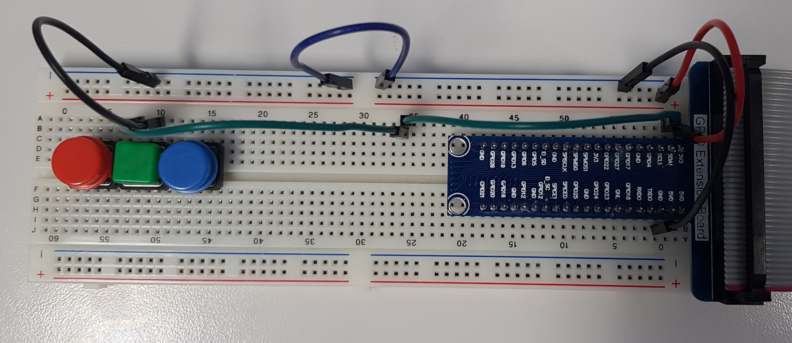

## Journal de bord du travail de diplôme 2021
### 19.04.2021
* J'ai copié le disque dur de M. Bauduccio car le mien causait des soucis
* M. Moreno, M. Huber et moi avons eu un entretien avec M. Bonvin pour discuter des appréciations du stage
* J'ai mis en place mon poste (Création du repository, installation des programmes nécessaires tel que : VS Code, Github Desktop, Suite Office, etc...)
* J'ai lu le chapitre 6 du magpi nommé "Le guide officiel du débutant Raspberry Pi" conseillé par M. Bonvin
* J'ai commencé à m'intéresser à l'utilisation du Remote GPIO pour établir une connexion entre mon Raspberry Pi 4 et celui de M. Moreno
  * Nous avons d'abord mis nos 2 Raspberry Pi sur le même réseau, ensuite nous nous sommes assurés que l'interface `Remote GPIO` était bien active des 2 côtés et nous avons vérifié que `pigpio` était bien installé, puis pour terminer nous avons mis en place le code disponible dans ce [PDF](https://magpi.raspberrypi.org/issues/60) à la page 61 sur le Raspberry Pi de M. Moreno. Avant d'exécuter le programme, nous avons tout deux exécuter la commande suivante dans un terminal `sudo pigpiod`
  * De son côté nous avons utilisé un bouton pressoir et du miens une LED
  * 
    * Le bouton est connecté au GPIO 2, donc la pin 3
  * 
    * La led est connectée au GPIO 17, donc la pin 11
  * Le code disponible sur la machine de M. Moreno va attendre que le bouton soit pressé, une fois ceci fait, la LED connecté en remote (liée à mon Raspberry Pi) se vera allumée.
* J'ai commencé mes recherches sur l'échange d'informations par bluetooth entre 2 Raspberry Pi 4
  * J'ai tenté de mettre en place le code disponible sur ce [repos](https://gist.github.com/keithweaver/3d5dbf38074cee4250c7d9807510c7c3) mais j'avais l'erreur suivante `ModuleNotFoundError: No module named 'bluetooth'`, pourtant j'avais déjà le bluetooth d'installé ainsi que blueman. En faisant des recherches je suis tombé sur cette commande `sudo apt-get install bluetooth libbluetooth-dev && sudo python3 -m pip install pybluez`. Depuis l'installation des 2 commandes je n'ai plus d'erreurs d'import.
#### Liens consultés
##### Remote GPIO
* https://www.instructables.com/Remote-control-Raspberry-PI-GPIO-pins-over-the-int/
* https://www.instructables.com/Raspberry-Pi-Remote-GPIO/
* https://magpi.raspberrypi.org/articles/remote-control-gpio-raspberry-pi-gpio-zero
* https://magpi.raspberrypi.org/issues/60
##### Échange d'informations par bluetooth entre 2 Raspberry Pi 4
* https://technologisttips.com/raspberry-pi-bluetooth/
* https://bluedot.readthedocs.io/en/latest/pairpipi.html
* https://gist.github.com/keithweaver/3d5dbf38074cee4250c7d9807510c7c3
* https://www.stuffaboutcode.com/2017/07/python-bluetooth-rfcomm-client-server.html
* https://bluedot.readthedocs.io/en/latest/pairpipi.html
* https://stackoverflow.com/questions/23985163/python3-error-no-module-named-bluetooth-on-linux-mint#23985374

### 20.04.2021
* M. Moreno et moi avons continué l'échange d'informations par bluetooth entre nos 2 Raspberry Pi 4
  * De mon côté, j'ai utilisé les fonctions suivantes :
    * `lookUpNearbyBluetoothDevices`, va lancer un scan bluetooth pour découvrir les appareils alentours. Pour chaque appareil trouvés, ils vont être affichés dans la console, si l'un de ces appareils est nommé `morenoPi42` alors son adresse mac se voit être retournée pour être utilisée en paramètre par la fonction ci-dessous.
    * `sendMessageTo` va se connecter à un appareil à l'aide de son adresse mac et d'un port désigné (le port 1 dans notre cas) pour ensuite lui envoyé une information et fermner la connexion.
* Du côté de M. Moreno, il a utilisé la méthode `receiveMessage` qui va écouter sur le port spécifié (dans notre cas, il s'agit toujours du port 1), qui va ensuite accepter la connexion entrante jusqu'à 1024 bytes, puis affiche dans la console les données reçues, une fois cela fait, elle va fermer les sockets de connexion.


* Avec M. Moreno, nous avons modifié le programme pour en faire un t'chat par bluetooth. Pour lancer le programme, il faut utiliser la commande suivante en remplaçant le _XXXX_ par le nom d'hôte de l'appareil bluetooth : `python3 bluetooth_data_transfer.py XXXX`
  * En premier temps nous avons pensé regrouper l'ouverture des sockets dans une fonction d'initialisation afin d'avoir une trace sur les sockets pour pouvoir les fermer lorsque cela est voulu.
    * Nous avons une erreur nous indiquant ceci `_bluetooth.error: (111, 'Connection refused')`, cela nous a fait comprendre que pour s'envoyer des informations, il faut que l'un écoute pendant que l'autre parle et réciproquement dans l'autre sens.
    * Nous avons mis en place une boucle while qui tourne constamment. Dans cette boucle, il y a des if qui vérifient le mode actuel.
      * 0 veut dire que nous sommes en attente d'un message
      * 1 veut dire que nous allons envoyé un message


1. Affiche le nom d'hôte et l'adresse mac de l'appareil connecté
2. Espace de saisie de message à envoyer
3. Connexion réussie à l'appareil (adresse mac, port)
4. Réception du message
5. Espace de saisie de message à envoyer, utilisant une commande personnalisée pour quitter le programme

* J'ai commencé mes recherches sur le `Technic Hub`.

#### Liens consultés
##### Échange d'informations par bluetooth entre 2 Raspberry Pi 4
* https://pybluez.readthedocs.io/en/latest/api/bluetooth_socket.html
##### Sockets
* https://docs.python.org/3/library/socket.html
##### Récupération de saisie utilisateur
* https://pythonprogramminglanguage.com/user-input-python/
##### Récupération de paramètres en ligne de commande Python
* https://www.pythonforbeginners.com/system/python-sys-argv
##### Bluetooth LEGO
* https://lego.github.io/lego-ble-wireless-protocol-docs/
* https://github.com/hoharald/leguno-remote

### 21.04.2021
* J'ai commencé la journée par lire [cet article sur le bluetooth](https://www.novelbits.io/deep-dive-ble-packets-events/) pour tenter d'approfondir mes connaissances afin de régler le problème de connexion entre le Raspberry Pi et le `Technic Hub`. Après avoir lu l'article, j'ai tenté de relancer le code d'exemple disponible sur le repos [Bricknil](https://github.com/virantha/bricknil), malheureusement j'avais toujours la même erreur. Je me suis dit que j'allais tenté de créer un script python qui ne fait que se connecter pour l'instant pour pouvoir ensuite tenté d'envoyer des ordres par bluetooth.
  * J'ai commencé par essayer de lire dans [cette documentation](https://lego.github.io/lego-ble-wireless-protocol-docs/index.html#port-information-request) et de comprendre comment je pouvais envoyer des messages que le `Technic Hub` pourrait comprendre. J'ai donc en un premier temps cherché à comprendre si c'était à moi d'envoyé le premier message et sur quel port ou de faire l'inverse, c'est-à-dire moi écouter un port particulier car à chaque fois que depuis l'interface graphique ou par commande dans le terminal, quand je tente de me connecter au `Technic Hub`, j'ai toujours cette erreur ci : `Failed to pair: org.bluez.Error.AuthenticationFailed`.
  * La première chose que j'ai constaté, c'est que des fois après avoir beaucoup tenté d'utiliser le bluetooth de redémarrer le Raspberry Pi car il a de la peine à capter les appareils alentours, tandis qu'une fois redémarré, si l'on utilise `bluetoothctl`, qu'on active le scan avec `scan on`, on peut voir les informations suivantes :
```
[NEW] Device 90:84:2B:50:36:43 Technic Hub
[CHG] Device 90:84:2B:50:36:43 RSSI: -58
[CHG] Device 90:84:2B:50:36:43 TxPower: 0
[CHG] Device 90:84:2B:50:36:43 ManufacturerData Key: 0x0397
[CHG] Device 90:84:2B:50:36:43 ManufacturerData Value: 
  00 80 06 00 61 00                                ....a. 
```

  * RSSI (Received Signal Strength Indicator) représente la mesure du niveau de la puissance au niveau du récepteur. Il est mesuré en  dBm, sur une échelle logarithmique et étant négatif. Plus le nombre est négatif, plus le dispositif est éloigné. Par exemple, une valeur de -20 à -30 dBm indique que le dispositif est proche, tandis qu'une valeur de -120 indique que le dispositif est proche de la limite de détection.
  * TxPower représente la puissance du signal. Pour un émetteur Bluetooth, 0 dBm (décibel-milliwatt) est le niveau de puissance standard
  * ManufacturerData Key: 0x0397 est le code de LEGO System A/S
  * ManufacturerData Value: 00 80 06 00 61 00
    1. Longueur des données (0x09)
    2. Le nom du type de données (0xFF)
    3. L'ID du fabricant (0x0397)
    4. L'état du bouton (entre 0x00 et 0x01)
    5. Le type de système et le numéro de l'appareil (entre 0x00 et 0xFF)
    6. Les capacités de l'appareil  (entre 0x01 et 0xFF)
    7. L'id du précédent réseau (entre 0x00 et 0xFF)
    8. Le statut actuel (entre 0x00 et 0xFF)
* En continuant mes recherches, je me suis demandé s'il n'était pas une bonne idée de tester petit à petit ce que propose le code de Bricknil pour ensuite l'implémenté petit à petit. Le premier élément que je voulais tester était le `bleak` car j'avais vu lorsque je lançais le code de Bricknil qu'il y avait un message contenant le nom de ce module. Pour installer `bleak`, `pygatt` et `bluepy` j'ai utilisé cette commande : `sudo pip3 install pygatt && pip3 install gatt && pip3 install gattlib && pip3 install bluepy && pip3 install bleak`. Une fois cela fait, j'ai donc été sur [le repos officiel](https://github.com/hbldh/bleak) pour exécuter le code présent. Le premier code nous montre la méthode `discover` tandis que le second nous montre une manière de s'appareiller.
  * La première chose que j'ai faite c'est de tester la connexion. Pour ce faire, j'ai testé la méthode `discover` disponible grâce à `BleakScanner`. J'ai pu voir apparaître le `Technic Hub` dans la liste des appareils détectés. Pour tenter de me "connecter", j'ai utilisé l'adresse mac tel que : `90:84:2B:50:36:43` ainsi que le `Characteristic UUID` tel que : `00001624-1212-EFDE-1623-785FEABCD123` qui va ensuite retourner le numéro de modèle. La led sur le `Technic Hub` devient bleue lorsque je lance le programme et que la méthode `read_gatt_char` est exécutée. Cette méthode retourne un array de byte, dans mon cas voici ce qu'elle me retourne `\x05\x00\x04\x03\x00.\x00\x00\x10\x00\x00\x00\x10\x00\x00\x00\x00\x00\x00\x00`, autrement écrit : `50430460016000160000000`.
   
#### Liens consultés
##### Bluetooth
 * https://www.novelbits.io/deep-dive-ble-packets-events/
 * https://punchthrough.com/crash-course-in-2m-bluetooth-low-energy-phy/
 * https://github.com/karulis/pybluez
 * https://www.bluetoothle.wiki/tx_power
 * https://www.bluetoothle.wiki/rssi?s[]=rssi
 * https://www.bluetooth.com/specifications/assigned-numbers/company-identifiers/
 * https://lego.github.io/lego-ble-wireless-protocol-docs/index.html
 * https://bleak.readthedocs.io/en/latest/usage.html
 * https://github.com/hbldh/bleak
 * https://learn.adafruit.com/introduction-to-bluetooth-low-energy/gatt
##### Repos Bricknil
* https://github.com/virantha/bricknil

##### Date avec python
* https://www.tutorialspoint.com/How-to-print-current-date-and-time-using-Python

### 22.04.2021
* J'ai continué mon travail sur le bluetooth. Histoire d'y voir un peu plus claire je me suis résigné à faire un schéma explicant + en détails quelles sont les valeurs que nous avons reçu et qu'est-ce qu'elles veulent dire à l'aide de [la documentation de Lego pour le Bluetooth](https://lego.github.io/lego-ble-wireless-protocol-docs/index.html#advertising). J'ai remarqué un potentiel problème. Soit c'était moi qui n'arrivait pas à comprendre comment le tableau des Manufacturer Data était conçu ou si juste les données reçus par le bluetooth lors du scan de l'appareil étaient incomplètes.
  * Comme on peut le voir ci-dessous, je n'ai pas pris en compte l'ID du fabricant car comme vu ici : `[CHG] Device 90:84:2B:50:36:43 ManufacturerData Key: 0x0397`, il a ne semble pas avoir de champ pour lui dans le `[CHG] Device 90:84:2B:50:36:43 ManufacturerData Value: `. J'ai tenté de rentrer les informations suivantes : `00 80 06 00 61 00` en prenant compte de la taille min et max de chaque cellules (voir [la documentation de Lego pour le Bluetooth](https://lego.github.io/lego-ble-wireless-protocol-docs/index.html#advertising)) pour calculer la longueur de la trame, j'ai ensuite vérifié que les données puissent rentrer dans les champs et c'est à ce moment que j'ai commencé à me demander si quelque chose ne jouait pas.

  * En effectuant des recherches, je suis tombé sur [cet article](https://docs.silabs.com/bluetooth/2.13/code-examples/stack-features/adv-and-scanning/adv-manufacturer-specific-data). Il parlait d'une application smarthphone nommée `EFR Connect`. J'en avais besoin car je voulais avoir plus d'informations concernant les `Manufacturer Data`. J'ai lancé un scan depuis l'application, et en ce qui concerne voici les informations que l'application m'a retrounée :
    1. Flags : `0x06: LE General Discoverable Mode, BR/EDR Not Supported`
    2. Complete list of 128-bit service class UUIDs : `00001624-1212-EFDE-1623-785FEABCD123` 
    3. Manufacturer Data : 
       1. Company Code : `0x0397`
       2. Data : `0x008006004100`
       3. Slave connection interval range : `20.0ms`
       4. Tx power level: `0 dBm`
       5. Complete local name : `Technic Hub`
 * Je me suis ensuite connecté au `Technic Hub` avec l'application, j'ai vu apparaître un sous menu m'affichant 3 sections :
    1. Generic attribute : `0x1801`
       1. UUID : `0x2A05`
       2. Descriptor : _champs vide_
       3. Client characteristic configuration : `0x2902`
    2. Generic access :
       1. Device name : `0x1800`
       2. Appearance : `0x2A01`
       3. Peripheral preffered connection parameters : `0x2A04`
          1. 
    3. _Unknown Service_ : 
       1. UUID : `00001624-1212-EFDE-1623-785FEABCD123`
       2. Descriptor : _champs vide_
       3. Client characteristic configuration : `0x2902`
       4. Value : `50430460016000160000000` mais lorsque depuis l'application j'active le mode `notify` sa valeur change à `0F 04 64 01 36 00 01 00 00 00 01 00 00 00 00 00 00 00 00`
  * En voyant ces données je me suis dit que j'avais pris les mauvaises données à mettre dans le tableau des Manufacturer Data. J'ai abandonné l'idée de remplir le tableau de Manufacturer Data car ces données ne correspondaient pas. En revanche, j'ai tenté de jouer avec l'application `EFR Connect` car on peut lire, écrire et être notifié. Lorsque je me connecte au `Technic Hub` et que je lit les données présentes voici ce que je reçois :  `0F 04 64 01 36 00 01 00 00 00 01 00 00 00 00 00 00 00 00`. J'ai ensuite essayer d'envoyer la commande `Hub Properties` car on peut envoyer de l'hexadécimal au hub, j'ai donc tenté avec les valeurs du tableau [ici présent]((https://lego.github.io/lego-ble-wireless-protocol-docs/index.html#message-types)). Ensuite, avec le mode écriture  lorsque j'ai relus le contenu avec changé et était devenu : `05 00 05 00 05 36 00 01 00 00 00 01 00 00 00 00 00 00 00 00`. En me balandant sur internet je suis retombé sur [ce lien](https://brickarchitect.com/powered-up/#footnote1) qui disait que le `Technich Hub` peut uniquement être programmé avec le firmware de PyBricks. J'ai donc essayé de télécharger [le repos git](https://github.com/pybricks/pybricks-micropython) et d'installer le firmware "manuellement" afin de pouvoir écrire mes propres script python pour contrôler la voiture. J'ai suivi le tutoriel de mise en place pour un environnement de développement mais je n'ai réussi à le mettre en place. Je suis ensuite tombé sur [cette issue git](https://github.com/pybricks/support/issues/167) qui met à disposition des fichier de firmware pour les hub `Spike` et `Mindstorm`. J'ai ensuite retenté de comprendre comment lire [la documentation de Lego](https://lego.github.io/lego-ble-wireless-protocol-docs/index.html).
#### Liens consultés
##### Bluetooth
* https://lego.github.io/lego-ble-wireless-protocol-docs/index.html
* https://stackoverflow.com/questions/52352378/manufacturer-specific-data-on-ble
* https://docs.silabs.com/bluetooth/2.13/code-examples/stack-features/adv-and-scanning/adv-manufacturer-specific-data
* https://brickarchitect.com/powered-up/#footnote1
* https://github.com/pybricks/pybricks-micropython
* https://github.com/pybricks/support/issues/167
* https://github.com/pybricks/pybricksdev

### 23.04.2021
* J'ai commencé la journée par lire cette documentation pour mieux comprendre ce qu'est GATT et comment il est structuré, pour pouvoir l'utiliser ensuite. Les attributs GATT sont des éléments d'information adressables qui peuvent contenir des données utilisateur pertinentes (ou métadonnées) sur la structure et le regroupement des différents attributs contenus dans le serveur. Gatt est structuré de la manière suivante :
  * Roles
    * Client
    * Server
  * UUID
  * Attributes
    * Handle : 0x0000 = dénote un handle invalde, le montant d'handle dipsonible sur chaque serveur GATT est 0xFFFF (soit 16 bits, 65535)
    * Type : détermine le type de donnée des valeurs de l'attribut, il s'agit d'un UUID
    * Permissions
      * Access permissions : similaire au droit lié aux fichiers (None, Readable, Writable, Readable & Writable)
      * Encryption :
        * Security mode 1, level 1
          * Attribut accessible en texte, connexion non encryptée
        * Security mode 1, level 2
          * La connexion doit être encryptée pour avoir accès à l'attribut, mais les clés d'encryptions non pas besoin d'être authentifiées
        * Security mode 1, level 3
          * La connexion doit être encryptée avec des clés authentifiées pour avois accès à l'attribut.
      * Autorization : détermine si une permission utilisateur est nécessaire
    * Value : Contient les données de l'attribut, il n'y a pas de restrictions pour le type de données qu'il contient mais jusqu'à une limite de 512 bytes
  * Attribute and data hierarchy
    * 
        * GATT Server : Technic Hub
        * Service : Generic Attribute
          * Characteristic : Service Change
        * Service : Generic Access
          * Characteristic : Device Name
          * Characteristic : Appearance
          * Characteristic : Peripheral Preferred Connection Parameters
        * Service : LegoTechnicHub (renommée car de base l'application affichait Unknown service)
          * Characteristic : Unknown Charateristic
    * Les attributs sont groupés en _services_, chaque _services_ peut contenir 0 ou + _characteristics_. Ces dernières peuvent avoir de 0 à + _descriptors_
  * Advanced attribute concepts
  * Features
  * Security
  * GATT service

* J'ai installé gatt à l'aide de la commande `sudo pip3 install gatt`. Ensuite j'ai scanné les alentours avec la commande `sudo gattctl --discover`. Une fois que j'ai vu apparaître le `Technic Hub` je m'y suis connecté à l'aide de `sudo gattctl --connect 90:84:2B:50:36:43`. On peut voir que les données reçues sont bien celles présentes dans l'application `EFR Connect` :
```
Connecting...
[90:84:2b:50:36:43] Discovered, alias = Technic Hub
[90:84:2b:50:36:43] Connected
[90:84:2b:50:36:43] Discovered, alias = Technic Hub
[90:84:2b:50:36:43] Resolved services
[90:84:2b:50:36:43]  Service [00001623-1212-efde-1623-785feabcd123]
[90:84:2b:50:36:43]    Characteristic [00001624-1212-efde-1623-785feabcd123]
[90:84:2b:50:36:43]  Service [00001801-0000-1000-8000-00805f9b34fb]
[90:84:2b:50:36:43]    Characteristic [00002a05-0000-1000-8000-00805f9b34fb]
```
* M. Bonvin m'a montré comment utiliser [QCad](https://qcad.org/en/), c'est un outil de dessin technique assité.
* Je me suis ensuite remis sur [la documentation](https://www.oreilly.com/library/view/getting-started-with/9781491900550/ch04.html) pour comprendre comment cela marchait. J'ai exécuter le second code présent sur [le repos](https://github.com/getsenic/gatt-python) mais cette erreur m'est apparue :
```
ERROR:dbus.connection:Exception in handler for D-Bus signal:
Traceback (most recent call last):
  File "/usr/local/lib/python3.7/dist-packages/dbus/connection.py", line 232, in maybe_handle_message
    self._handler(*args, **kwargs)
  File "/home/pi/.local/lib/python3.7/site-packages/gatt/gatt_linux.py", line 398, in properties_changed
    self.services_resolved()
  File "gatt_connection.py", line 10, in services_resolved
    s for s in self.services
StopIteration
```
* J'ai été voir sur internet ce que l'erreur `ERROR:dbus.connection:Exception in handler for D-Bus signal` voulait signifier. Je n'ai pas réussis à trouver d'informations pertinentes, donc je me suis remis sur le script python utilisant GATT. J'ai tenté de modifier le second code afin d'être sûr qu'il fonctionnait. Il semble donc que l'erreur vienne du second script. J'ai cherché ce quel élément pose problème mais je peine encore à trouver le problème.
#### Liens consultés
##### Bluetooth
* http://software-dl.ti.com/lprf/sdg-latest/html/ble-stack-3.x/gatt.html
* https://www.oreilly.com/library/view/getting-started-with/9781491900550/ch04.html
* https://www.oreilly.com/library/view/getting-started-with/9781491900550/ch02.html#Protocol_Stack
* https://doc.qt.io/qt-5/qtbluetooth-le-overview.html
* https://github.com/getsenic/gatt-python

### 26.04.2021
#### Liens consultés
* Pour commencer la semaine, je me suis dit que regarder des vidéos explicative sur le fonctionnement de `GATT` et du bluetooth en général, car ayant passé la semaine passée sur de la documentation explicative sur `GATT` mais qui ne m'avait pas aidé à résoudre les soucis que j'avais.
* Comme pour le 23.04.2021, je vais tenter de refaire une explication détaillée du fonctionnement de GAP et `GATT` car ça me permettera de l'inclure plus aisément dans la documentation que je n'ai toujours pas commencée à l'heure actuelle, mais je me suis dit qu'aujourd'hui devait être le dernier délai pour conclure cette histoire de bluetooth car il faut que je me concentre sur la documentation technique sachant qu'elle sera évaluée le 30.04.2021.
  * `GAP`, _Generic Access Profile_, contrôle les connexions ainsi que l'avertissement déterminant comment les 2 appareils vont pouvoir ou pas intéragir.
  * `GATT`, _Generic Attribute Profile_ ,définit comment les 2 appareils vont échanger des données composées de _Services_ et de _Characteristics_. Ce protocole intérvient uniquement une fois le `GAP` passé.
* J'ai repris la structure que j'avais faite pour montrer la structure du `Technic Hub` au niveau `GATT` :
  * Profile : Technic Hub
    * Service : Generic Attribute
        * Characteristic : Service Change
    * Service : Generic Access
      * Characteristic : Device Name
      * Characteristic : Appearance
      * Characteristic : Peripheral Preferred Connection Parameters
    * Service : LegoTechnicHub (renommée car de base l'application affichait Unknown service)
      * Characteristic : Unknown Charateristic
* Comme on peut le voir, Profile contient une collection de services. Ces derniers divisent les données en entités logiques qui contiennent des blocs de données spécifiques appelés caractéristiques. Ce sont ces caractéristiques qui contiennent les données importantes.
* Depuis l'application mobile `EFR Connect`, j'ai tenté dans la characteristic concernant le `Technic Hub` d'écrire des commandes de la manière suivante : Dans la [documentation lego](https://lego.github.io/lego-ble-wireless-protocol-docs/index.html) les commandes sont dans un chapitre `Output Command 0x81`. Dans ce chapitre, les commandes présentent sont écrites comme suit `StartPower (Power1, Power2): Output Command 0x81 - Sub Command 0x02`. Étant donné qu'il s'agit de _sub command_, je ne sais pas si écrire en hexa une suite de bytes en hexa permet d'exécuter une commande. En tout cas, depuis que j'ai tenté d'écrire une commande, lorsque j'ai activé le mode _notify_ la valeur retournée est la suivante `0F 00 04 61 01 39 00 01 00 00 00 01 00 00 00`. 
* Je sais que je change de cap souvent, mais étant un peu perdu je tente d'explorer chaques idées qui me vient en tête. Celle que je viens d'avoir concerne l'utilisation du code présent sur [le repos de pyboost](https://github.com/JorgePe/pyb00st), car même s'il concerne le LEGO Boost Move Hub je me suis dit qu'il y a moyen que puisse l'utiliser. De plus sur la documentation de [Lego Wireless Protocol](https://lego.github.io/lego-ble-wireless-protocol-docs/index.html) il parlait de SDK, je me suis dit qu'il fallait que je trouve un bon SDK et je suis alors tombé en premier temps sur celle de `pyb00st`. Par conséquent, j'ai cloné le repos sur le Raspberry Pi afin d'exécuter les codes d'exemples. 
  * J'ai commencé par utiliser la méthode `set_led_color(color)` pour voir si la connexion et les méthodes intéragissaient avec le `Technic Hub`. Résultat, ça fonctionne. Maintenant je vais m'intéresser aux méthodes touchant aux moteurs. je n'ai pas réussi à implémenter `pyb00st`, cependant je me suis dit que d'utiliser le code de [pylgbst](https://github.com/undera/pylgbst) pourrait fonctionner car j'ai été lire la [documentation Lego](https://lego.github.io/lego-ble-wireless-protocol-docs/index.html), et vu qu'elle parle de commandes à envoyé, j'ai été voir s'il en proposait. Après quelque recherche, j'ai vu que oui. Même si rien n'était écris à propos du `Technic Hub`, je me suis lancé en me disant que ça doit être exactement le même mécanisme. 
  * J'ai commencé par utiliser la méthode `get_connection_auto()`, cette fonction va choisir parmi la liste suivante :
    * bluepy
    * bluegiga
    * gatt
    * bleak
    * gattool
    * gattlib
  * À noter qu'on peut choisir par nous même quel type de connexion nous voulons établir en reprennant `get_connection_auto()` mais en replaçant le `auto` par l'un des moyens disponible ci-dessus.
  * M'étant documenté ces dernier jours sur `GATT` et ayant utilisé un code fonctionnel, je suis partit du postulat que ça devrait fonctionné sans soucis. J'ai donc commencé par utiliser la méthode `get_connection_gatt()` en lui spécifiant l'adresse mac de l'appareil comme suit : `get_connection_gatt(hub_mac="90:84:2B:50:36:43")`. La méthode affiche ceci dans la console :
```
Have not dedicated class for peripheral type 0x2f on port 0x0
Have not dedicated class for peripheral type 0x2f on port 0x1
Have not dedicated class for peripheral type 0x2e on port 0x2
Have not dedicated class for peripheral type 0x3c on port 0x3d
Have not dedicated class for peripheral type 0x3c on port 0x60
Have not dedicated class for peripheral type 0x39 on port 0x61
Have not dedicated class for peripheral type 0x3a on port 0x62
Have not dedicated class for peripheral type 0x3b on port 0x63
Have not dedicated class for peripheral type 0x36 on port 0x64
Got only these devices: (Peripheral on port 0x0, Peripheral on port 0x1, None, LEDRGB on port 0x32, None, Current on port 0x3b, Voltage on port 0x3c)
```

  * Une fois ceci affiché, j'ai crû comprendre que la connexion était bien établie et que des commandes pouvait être envoyées. J'ai regardé dans les fichiers _peripherals_ et _hub_ fournis par `pylgbst` comment était structuré la classe moteur et quels fonctions étaient disponibles.
  * Après avoir compris, j'ai écrit ce bout de code :
  
```python
from pylgbst.hub import MoveHub
from pylgbst.peripherals import Motor
from pylgbst import *

MY_MOVEHUB_ADD = "90:84:2B:50:36:43"
MY_BTCTRLR_HCI = "hci0"

conn = get_connection_gatt(hub_mac=MY_MOVEHUB_ADD)
try:
    movehub = MoveHub(conn)
    motor_a = Motor(movehub, movehub.PORT_A)
    motor_c = Motor(movehub, movehub.PORT_C)
    motor_a.start_power(-1)
    motor_c.start_power(1)
    conn.disconnect()
finally:
    conn.disconnect()
```

 * Ce bout de code fonctionne parfaitement. Entre temps j'ai écris celui ci qui fonctionne parfaitement lui aussi : 
```python
  #!/usr/bin/env python3

from pylgbst.hub import MoveHub
from pylgbst.peripherals import Motor
from pylgbst import *
from time import sleep

MY_MOVEHUB_ADD = "90:84:2B:50:36:43"
MY_BTCTRLR_HCI = "hci0"

def play_scenario(movehub):
    motor_a = Motor(movehub, movehub.PORT_A)
    motor_b = Motor(movehub, movehub.PORT_B)
    motor_c = EncodedMotor(movehub, movehub.PORT_C)
    
    print("Forward:")
    forward(motor_a, motor_b, motor_c)
    sleep(1)
    
    print("Downward:")
    downward(motor_a, motor_b, motor_c)
    sleep(1)
    
    print("Left:")
    go_left(motor_a, motor_b, motor_c)
    sleep(1)

    print("Right:")
    go_right(motor_a, motor_b, motor_c)
    sleep(1)


def forward(motor_1, motor_2, motor_3):
    motor_1.start_power(-1)
    motor_2.start_power(-1)
    motor_3.start_power(0)
    print("done!")
    
def downward(motor_1, motor_2, motor_3):
    motor_1.start_power(1)
    motor_2.start_power(1)
    motor_3.start_power(0)
    print("done!")
    
def go_left(motor_1, motor_2, motor_3):
    motor_1.start_power(0)
    motor_2.start_power(0)
    motor_3.start_power(-1)
    print("done!")
    
def go_right(motor_1, motor_2, motor_3):
    motor_1.start_power(0)
    motor_2.start_power(0)
    motor_3.start_power(1)
    print("done!")

conn = get_connection_gatt(hub_mac=MY_MOVEHUB_ADD)
try:
    movehub = MoveHub(conn)
    play_scenario(movehub)
    conn.disconnect()
finally:
    conn.disconnect()
```
 * Cependant de temps en temps quand je relance le programme. Cette erreur apparaît :

```
Traceback (most recent call last):
  File "pylgbst_bluetooth.py", line 53, in <module>
    conn = get_connection_gatt(hub_mac=MY_MOVEHUB_ADD)
  File "/usr/local/lib/python3.7/dist-packages/pylgbst/__init__.py", line 25, in get_connection_gatt
    return GattConnection(controller).connect(hub_mac, hub_name)
  File "/usr/local/lib/python3.7/dist-packages/pylgbst/comms/cgatt.py", line 100, in connect
    for dev in devices:
RuntimeError: dictionary changed size during iteration
```

* Pour la résoudre, en général, j'éteins le bluetooth puis je le rallume et cela semble résoudre le problème de temps en temps. De temps à autre cette technique ne fonctionne pas et je dois redémarrer le Raspberry Pi afin de régler le problème. J'ai essayé pendant un long moment à mettre en place un système qui permetterai de reset l'angle du moteur gérant la direction. Le problème que j'ai est que je n'ai pas réussi à trouver les valeurs minimals et maximales pour les angles, car lorsque l'on dit au moteur d'utiliser la fonction `angled(degrees=-150)` suivi de `angled(degrees=75)`, ce qui devrait mettre le moteur tout à droite puis au centre mais le problème est qu'après la première instruction, l'exécution s'arrête. Est-ce que la première valeur fait crash le programme ? 
  * Ayant pratiquement terminé avec le bluetooth, je me suis dit que je devais commencer la documentation technique car pour l'heure rien n'avait été fait à ce sujet.
  
##### Bluetooth Youtube
* https://www.youtube.com/watch?v=u4HY3OIk2-c
* https://www.youtube.com/watch?v=MzM3-YWftxE
* https://www.youtube.com/watch?v=E8_5UZWDgMo
* https://www.youtube.com/watch?v=eHqtiCMe4NA
##### Bluetooth 
* http://software-dl.ti.com/lprf/sdg-latest/html/ble-stack-3.x/gatt.html#gatt-characteristics-and-attributes
* https://www.oreilly.com/library/view/getting-started-with/9781491900550/ch04.html#gatt_attr_table
* https://devzone.nordicsemi.com/f/nordic-q-a/6700/adding-characteristic-user-description-0x2901-0x2902
* https://github.com/getsenic/gatt-python
* https://bleak.readthedocs.io/en/latest/usage.html
* https://lego.github.io/lego-ble-wireless-protocol-docs/index.html
* https://github.com/peplin/pygatt
* https://github.com/JorgePe/pyb00st
* https://github.com/undera/pylgbst

### 27.04.2021
* J'ai débuté la journée en continuant le documentation technique.
* Durant l'après-midi, avec M. Ray Yvelin, M. Bonvin et moi même, nous sommes aller apporter du matériel en C305 à Ternier et nous avons pris dans cette salle :
  * 1 Oscilloscope
  * 1 Alimentation stabilisée
  * Les câbles associés au éléments ci-dessus
  * Des tournevis
  * 1 Fer à souder avec de la soudure
  * 1 Multimètre
  * 1 Étaux
* Après cela j'ai continué à travailler sur la documentation technique.
#### Liens consultés
##### Données relatives au capteurs
* https://pijaeducation.com/arduino/sensor/ir-sensor-and-arduino/
* https://fr.wikipedia.org/wiki/Baud_(mesure)
* https://fr.wikipedia.org/wiki/UART
* http://bucket.download.slamtec.com/20b2e974dd7c381e46c78db374772e31ea74370d/LD208_SLAMTEC_rplidar_datasheet_A2M8_v2.6_en.pdf
* https://en.wikipedia.org/wiki/Pulse-width_modulation
* https://github.com/Slamtec/rplidar_sdk/releases/tag/release%2Fv1.12.0

### 28.04.2021
* J'ai continué la documentation technique. Après l'entretien avec M. Bonvin, j'ai mis à disposition le code écrit sur le Raspberry Pi, puis je me suis remis à travailler sur la documentation technique. Pour expliquer plus en détails les composants qui composeront le voiture, j'ai réalisé ce croquis :


* J'ai tenté d'importer l'état actuel de ma documentation technique sur ReadTheDoc, mais la version en ligne qui créait une documentation à partir d'un repository Github ne fonctionnait pas vraiment. J'ai alors installé MkDocs pour générer la documentation à partir du fichier Markdown.
#### Liens consultés
##### Flask
* https://flask.palletsprojects.com/en/1.1.x/quickstart/

##### MkDocs
* https://www.mkdocs.org/#installation

### 29.04.2021
* J'ai commencé par définir plus clairement ce qu'était le bluetooth dans la documentation technique.
* J'ai recompilé la documentation technique avec MkDocs pour avoir un aperçu de la mise en forme.
    * J'ai eu des soucis de mise en page en ce qui concerne les listes à points ou numérotées tandis qu'affiche en Markdown fonctionnent très bien.
    * Pour ne pas perdre plus de temps dessus j'ai commenté tous le code écrit.
    * Après avoir tous commenté, je me suis remis sur la documentation afin d'expliquer le T'chat bluetooth fait en collaboration avec M. Moreno
    * Pour terminer la journée j'ai corrigé les problèmes de mise en forme pour la conversion avec MkDocs.
#### Liens consultés
##### Bluetooth
* https://arduino.stackexchange.com/questions/18895/how-master-and-slave-concept-works-with-bluetooth
* https://fr.wikipedia.org/wiki/S%C3%A9curit%C3%A9_des_protocoles_Bluetooth
* https://fr.wikipedia.org/wiki/Contr%C3%B4le_de_redondance_cyclique
* https://fr.wikipedia.org/wiki/Protocol_Data_Unit
* http://software-dl.ti.com/lprf/sdg-latest/html/ble-stack-3.x/gap.html#connection-parameters

### 30.04.2021
* J'ai customisé le thème de la documentation générée par MkDocs.
* J'ai mis à disposition la documentation technique sur ReadTheDocs : https://ackermanngue-ag-dipl-tech-2021-voitureassistee.readthedocs.io/fr/latest/documentation_technique/
* J'ai avancé la documentation technique afin de pouvoir me concentrer sur l'implémention de Flask en tant que télécommande pour contrôler la voiture une fois les derniers éléments ajoutés.
* J'ai commencé à travailler sur l'utilisation de Flask pour gérer la voiture à distance.
    * J'ai crée une variable globale concernant la voiture (elle s'occupe de la connexion ainsi que du déplacement de la voiture)
        * J'ai eu une erreur me disant que lors que je tente d'accéder à la route créant l'objet concernant la voiture il n'était pas accessible alors que je l'ai définit en tant que variable globale.
        * Pour palier à ce problème, j'ai voulu implémenter le design pattern Singleton car j'avais besoin de récupérer la référence sur la classe afin de pouvoir exécuter les méthodes associées. Pour ce faire, je me suis basé sur l'exemple présent [ici](https://blog.finxter.com/how-to-create-a-singleton-in-python/).
        * La méthode `__init__` est remplacée par la méthode `__new__`. La méthode `__init__` est appellée lorsque l'objet doit être initialisé tandis que la méthode `__new__` est appelée lors de la création de l'objet.
        * Voici le code écrit pour le constructeur de mon objet `CarController` :
```python
def __new__(cls):
    if(cls.instance is None):
        cls.instance = super(CarController, cls).__new__(cls)
        cls.connection = get_connection_gatt(hub_mac=cls.MY_MOVEHUB_ADD)
        try:
            # The motors 
            cls.movehub = MoveHub(cls.connection)
            cls.front_motor = Motor(cls.movehub, cls.movehub.PORT_A)
            cls.back_motor = Motor(cls.movehub, cls.movehub.PORT_B)
            cls.directionnal_motor = EncodedMotor(cls.movehub, cls.movehub.PORT_C)
        except:
            cls.movehub = None
            cls.front_motor = None
            cls.back_motor = None
            cls.directionnal_motor = None
    return cls.instance
```

* La raison pour laquelle on utilise `cls` à la place de `self` c'est parce que `self` doit être utilisé pour les méthodes d'instances tandis que `cls` est utilisé pour les méthodes de classes.
  * Par exemple, si une classe contient une méthode `move`, si nous utilisons des éléments propres à la classe dans ce cas on utilisera `self`.
  * Alors que pour si nous utilision une méthode tel que `__new__` ou `__init__`, étant donné qu'il s'agit de méthodes de classes, on utilisera `cls`.

```python
#Méthode de classe
__new__(cls)

# Méthode d'instance
move(self, motor_speed, angle_rotation)
```

 
#### Liens consultés
##### Python
* https://www.python.org/dev/peps/pep-0008/#function-and-method-arguments
* https://blog.finxter.com/how-to-create-a-singleton-in-python/
* https://www.geeksforgeeks.org/\_\_new__-in-python/

### 03.05.2021
* J'ai commencé par continué le code de la télécommande bluetooth avec Flask
    * J'ai eu un problème, lors de la tentative de déconnexion de l'appareil depuis un bouton présent sur le formulaire
    * lorsque j'accédais à la route depuis l'URL, cela déconnectait bien les appareils, cependant lorsque j'utilisais une redirection depuis le code, la déconnexion ne se faisait pas
        * C'est peut-être dû au fait qu'il doit passer au return quand même, même si un redirect est présent dans la méthode
        * En fait, le redirect c'est une fonction a retourner comme pour le `render_template`
    * Pour rendre l'application plus simple d'accès entre les différents routes j'ai regardé comment mettre en place une navbar 
    * J'ai regardé [ce tutoriel](https://medium.com/analytics-vidhya/flask-how-create-a-responsive-navbar-146c7213df60) pour comprendre les navbar étaients écrites
        * Premièrement il faut télécharger Bootstrap pour Flask, les navbar pour Flask avec la commande suivante `sudo pip3 install flask_bootstrap && sudo pip3 install flask_nav`
        * Après avoir mis en place une interface plus user friendly avec Bootstrap ainsi qu'une Navbar
            * J'ai tenté de régler problème `dictionary changed size during iteration`. De ce que j'ai pu voir sur internet, il faudrait modifier le code parcourant une liste en utilisant ses clés comme suit : `for i in d.keys():` ou en forçant la création d'une liste `for i in list(d):`
        * Au fur et à mesure que j'avançais, j'ai tenté de voir si la déconnexion fonctionnait bien et en soit oui elle fonctionne, cependant lorsque l'on suit ce schéma ça ne recréé pas une connexion :


* Je vais voir s'il n'y a pas moyen de clear le cache. J'ai lu cette [documentation](https://flask-caching.readthedocs.io/en/latest/index.html) j'ai par conséquent désactiver le cache car je pensais qu'il devait stocker une forme d'exécution des méthodes ou quelque chose dans le genre. Après l'avoir désactivé puis après avoir retesté le scénario présent sur le schéma ça n'a pas réglé le problème.
* J'ai passé le reste de l'après midi sur la tentative de compréhension de ce problème.
    * J'ai regardé dans les méthodes des objets fournis voir s'il y avait moyen d'avoir un callback sur la déconnexion pour s'assurer de la déconnexion


#### Liens consultés
##### Flask
* https://medium.com/analytics-vidhya/flask-how-create-a-responsive-navbar-146c7213df60
* https://medium.com/analytics-vidhya/flask-how-create-a-responsive-navbar-146c7213df60
* https://pypi.org/project/flask-navbar/
* https://flask-caching.readthedocs.io/en/latest/index.html
##### Jquery
* https://jquery.com/download/
##### Bootstrap
* https://getbootstrap.com/docs/4.0/components/buttons/

### 04.05.2021
* J'ai commencé la journée en m'informant sur la manière d'implémenter du JQuery avec Flask.
    * De ce que j'ai vu dans [cet article](https://codehandbook.org/python-flask-jquery-ajax-post/), vu qu'il s'agit de code Javascript on peut l'inclure dans nos fichiers comporant de l'HTML
    * Lors de la mise en place, j'ai eu une erreur HTTP : `405 Method Not Allowed` ce qui est normal car j'avais oublié d'inclure ceci : `methods=['POST']` dans la fonction de la route Flask
    * Ensuite j'ai eu une erreur 500 car lors de l'envoie de trop de données d'un coup, le Hub est surchargé et renvoie ce message : `AssertionError: Pending request MsgPortOutput({'payload': b'02110b240000009c647f03', 'needs_reply': True, 'port': 2, 'is_buffered': False, 'do_feedback': True, 'subcommand': 11, 'params': b'240000009c647f03'}) while trying to put MsgPortOutput({'payload': b'00110164', 'needs_reply': True, 'port': 0, 'is_buffered': False, 'do_feedback': True, 'subcommand': 1, 'params': b'64'})` car lors de l'envoie d'une commande il va bloquer un thread afin de s'en occuper. C'est pourquoi je pense qu'il ne faut pas que l'utilisateur surchage le changement de valeurs des sliders car je ne sais pas pour l'heure s'il est possible de palier à ce problème.
    * Voici la variable utilisée pour bloquer le thread.

```python
self._sync_lock = threading.Lock()
```

* J'ai refait le croquis du plan de la voiture après en avoir parlé à M. Bonvin. Voici ci-dessous la nouvelle version :


* Je me suis ensuite mis à réaliser le plan de la voiture avec QCAD. Après avoir terminé les mesures des endroits susceptible de gêner donc qu'il faudra découper pour pouvoir les laisser passer, j'ai tenté de prendre une photo du LEGO 4x4 depuis le dessus de la manière la plus droite possible afin de pouvoir faire une preview de ou et comment la plaque en plastique se positionnera sur la voiture. La photo n'étant pas prise parfaitement, il faut prendre en compte la perspective qu'ajoute la focale de l'appareil.
* À noter que le schéma ci-dessous est à l'échelle 1:2


* Pour poursuivre, je me suis occupé de la plaque qui sera devant et derrière. Celle qui s'occupera du support des Flying-Fish :


* Voici la version imprimée et testée avec une feuille (Il est incrusté dans la feuille, non pas juste poser dessus):


* Voici ou la plaque avant et arrière devrait se située :


* Je vais faire le plan de la voiture vue de côté car il y aura la caméra et le bright pi dessus.
* Voici où le Bright Pi et la caméra sera fixé sur le côté (dans le carré de 30 par 30) :


* Voici ce comment la caméra et le Bright Pi seront disposés :


#### Liens consultés
##### Python
* https://codehandbook.org/python-flask-jquery-ajax-post/

##### QCad
* https://qcad.org/doc/qcad/latest/reference/en/index.php?page=scripts/Draw/Image/doc/Image

##### LEGO Bluetooth
* https://lego.github.io/lego-ble-wireless-protocol-docs/index.html#document-index

### 05.05.2021
#### Liens consultés
##### 

### 06.05.2021
#### Liens consultés
##### 

### 07.05.2021
#### Liens consultés
##### 

### 10.05.2021
#### Liens consultés
#####

### 11.05.2021
#### Liens consultés
#####

### 12.05.2021
#### Liens consultés
##### 

### 13.05.2021
#### Liens consultés
##### 

### 14.05.2021
#### Liens consultés
##### 