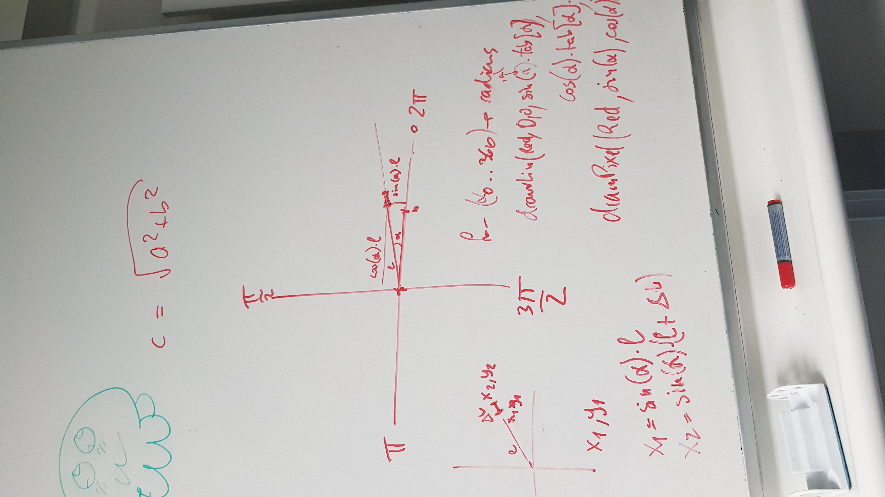
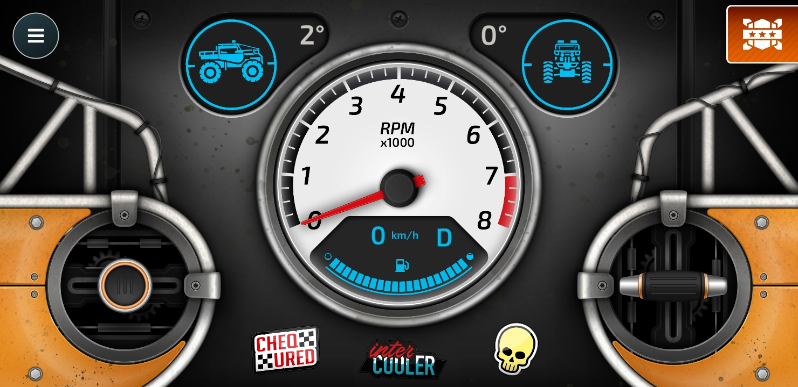

--- 
title: "Journal de bord du projet"
author: Ackermann Gawen
---
## Journal de bord du travail de diplôme 2021

### 19.04.2021

- J'ai copié le disque dur de M. Bauduccio car le mien causait des soucis
- M. Moreno, M. Huber et moi avons eu un entretien avec M. Bonvin pour discuter des appréciations du stage
- J'ai mis en place mon poste (Création du repository, installation des programmes nécessaires tel que : VS Code, Github Desktop, Suite Office, etc...)
- J'ai lu le chapitre 6 du magpi nommé "Le guide officiel du débutant Raspberry Pi" conseillé par M. Bonvin
- J'ai commencé à m'intéresser à l'utilisation du Remote GPIO pour établir une connexion entre mon Raspberry Pi 4 et celui de M. Moreno
  - Nous avons d'abord mis nos 2 Raspberry Pi sur le même réseau, ensuite nous nous sommes assurés que l'interface `Remote GPIO` était bien active des 2 côtés et nous avons vérifié que `pigpio` était bien installé, puis pour terminer nous avons mis en place le code disponible dans ce [PDF](https://magpi.raspberrypi.org/issues/60) à la page 61 sur le Raspberry Pi de M. Moreno. Avant d'exécuter le programme, nous avons tout deux exécuter la commande suivante dans un terminal `sudo pigpiod`
  - De son côté nous avons utilisé un bouton pressoir et du miens une LED
  - 
    - Le bouton est connecté au GPIO 2, donc la pin 3
  - 
    - La led est connectée au GPIO 17, donc la pin 11
  - Le code disponible sur la machine de M. Moreno va attendre que le bouton soit pressé, une fois ceci fait, la LED connecté en remote (liée à mon Raspberry Pi) se vera allumée.
- J'ai commencé mes recherches sur l'échange d'informations par bluetooth entre 2 Raspberry Pi 4
  - J'ai tenté de mettre en place le code disponible sur ce [repos](https://gist.github.com/keithweaver/3d5dbf38074cee4250c7d9807510c7c3) mais j'avais l'erreur suivante `ModuleNotFoundError: No module named 'bluetooth'`, pourtant j'avais déjà le bluetooth d'installé ainsi que blueman. En faisant des recherches je suis tombé sur cette commande `sudo apt-get install bluetooth libbluetooth-dev && sudo python3 -m pip install pybluez`. Depuis l'installation des 2 commandes je n'ai plus d'erreurs d'import.

#### Liens consultés

##### Remote GPIO

- https://www.instructables.com/Remote-control-Raspberry-PI-GPIO-pins-over-the-int/
- https://www.instructables.com/Raspberry-Pi-Remote-GPIO/
- https://magpi.raspberrypi.org/articles/remote-control-gpio-raspberry-pi-gpio-zero
- https://magpi.raspberrypi.org/issues/60

##### Échange d'informations par bluetooth entre 2 Raspberry Pi 4

- https://technologisttips.com/raspberry-pi-bluetooth/
- https://bluedot.readthedocs.io/en/latest/pairpipi.html
- https://gist.github.com/keithweaver/3d5dbf38074cee4250c7d9807510c7c3
- https://www.stuffaboutcode.com/2017/07/python-bluetooth-rfcomm-client-server.html
- https://bluedot.readthedocs.io/en/latest/pairpipi.html
- https://stackoverflow.com/questions/23985163/python3-error-no-module-named-bluetooth-on-linux-mint#23985374

### 20.04.2021

- M. Moreno et moi avons continué l'échange d'informations par bluetooth entre nos 2 Raspberry Pi 4
  - De mon côté, j'ai utilisé les fonctions suivantes :
    - `lookUpNearbyBluetoothDevices`, va lancer un scan bluetooth pour découvrir les appareils alentours. Pour chaque appareil trouvés, ils vont être affichés dans la console, si l'un de ces appareils est nommé `morenoPi42` alors son adresse mac se voit être retournée pour être utilisée en paramètre par la fonction ci-dessous.
    - `sendMessageTo` va se connecter à un appareil à l'aide de son adresse mac et d'un port désigné (le port 1 dans notre cas) pour ensuite lui envoyé une information et fermner la connexion.
- Du côté de M. Moreno, il a utilisé la méthode `receiveMessage` qui va écouter sur le port spécifié (dans notre cas, il s'agit toujours du port 1), qui va ensuite accepter la connexion entrante jusqu'à 1024 bytes, puis affiche dans la console les données reçues, une fois cela fait, elle va fermer les sockets de connexion.
  
  
- Avec M. Moreno, nous avons modifié le programme pour en faire un t'chat par bluetooth. Pour lancer le programme, il faut utiliser la commande suivante en remplaçant le _XXXX_ par le nom d'hôte de l'appareil bluetooth : `python3 bluetooth_data_transfer.py XXXX`
  - En premier temps nous avons pensé regrouper l'ouverture des sockets dans une fonction d'initialisation afin d'avoir une trace sur les sockets pour pouvoir les fermer lorsque cela est voulu.
    - Nous avons une erreur nous indiquant ceci `_bluetooth.error: (111, 'Connection refused')`, cela nous a fait comprendre que pour s'envoyer des informations, il faut que l'un écoute pendant que l'autre parle et réciproquement dans l'autre sens.
    - Nous avons mis en place une boucle while qui tourne constamment. Dans cette boucle, il y a des if qui vérifient le mode actuel.
      - 0 veut dire que nous sommes en attente d'un message
      - 1 veut dire que nous allons envoyé un message


1. Affiche le nom d'hôte et l'adresse mac de l'appareil connecté
2. Espace de saisie de message à envoyer
3. Connexion réussie à l'appareil (adresse mac, port)
4. Réception du message
5. Espace de saisie de message à envoyer, utilisant une commande personnalisée pour quitter le programme

- J'ai commencé mes recherches sur le `Technic Hub`.

#### Liens consultés

##### Échange d'informations par bluetooth entre 2 Raspberry Pi 4

- https://pybluez.readthedocs.io/en/latest/api/bluetooth_socket.html

##### Sockets

- https://docs.python.org/3/library/socket.html

##### Récupération de saisie utilisateur

- https://pythonprogramminglanguage.com/user-input-python/

##### Récupération de paramètres en ligne de commande Python

- https://www.pythonforbeginners.com/system/python-sys-argv

##### Bluetooth LEGO

- https://lego.github.io/lego-ble-wireless-protocol-docs/
- https://github.com/hoharald/leguno-remote

### 21.04.2021

- J'ai commencé la journée par lire [cet article sur le bluetooth](https://www.novelbits.io/deep-dive-ble-packets-events/) pour tenter d'approfondir mes connaissances afin de régler le problème de connexion entre le Raspberry Pi et le `Technic Hub`. Après avoir lu l'article, j'ai tenté de relancer le code d'exemple disponible sur le repos [Bricknil](https://github.com/virantha/bricknil), malheureusement j'avais toujours la même erreur. Je me suis dit que j'allais tenté de créer un script python qui ne fait que se connecter pour l'instant pour pouvoir ensuite tenté d'envoyer des ordres par bluetooth.
  - J'ai commencé par essayer de lire dans [cette documentation](https://lego.github.io/lego-ble-wireless-protocol-docs/index.html#port-information-request) et de comprendre comment je pouvais envoyer des messages que le `Technic Hub` pourrait comprendre. J'ai donc en un premier temps cherché à comprendre si c'était à moi d'envoyé le premier message et sur quel port ou de faire l'inverse, c'est-à-dire moi écouter un port particulier car à chaque fois que depuis l'interface graphique ou par commande dans le terminal, quand je tente de me connecter au `Technic Hub`, j'ai toujours cette erreur ci : `Failed to pair: org.bluez.Error.AuthenticationFailed`.
  - La première chose que j'ai constaté, c'est que des fois après avoir beaucoup tenté d'utiliser le bluetooth de redémarrer le Raspberry Pi car il a de la peine à capter les appareils alentours, tandis qu'une fois redémarré, si l'on utilise `bluetoothctl`, qu'on active le scan avec `scan on`, on peut voir les informations suivantes :

```
[NEW] Device 90:84:2B:50:36:43 Technic Hub
[CHG] Device 90:84:2B:50:36:43 RSSI: -58
[CHG] Device 90:84:2B:50:36:43 TxPower: 0
[CHG] Device 90:84:2B:50:36:43 ManufacturerData Key: 0x0397
[CHG] Device 90:84:2B:50:36:43 ManufacturerData Value:
  00 80 06 00 61 00                                ....a.
```

- RSSI (Received Signal Strength Indicator) représente la mesure du niveau de la puissance au niveau du récepteur. Il est mesuré en dBm, sur une échelle logarithmique et étant négatif. Plus le nombre est négatif, plus le dispositif est éloigné. Par exemple, une valeur de -20 à -30 dBm indique que le dispositif est proche, tandis qu'une valeur de -120 indique que le dispositif est proche de la limite de détection.
- TxPower représente la puissance du signal. Pour un émetteur Bluetooth, 0 dBm (décibel-milliwatt) est le niveau de puissance standard
- ManufacturerData Key: 0x0397 est le code de LEGO System A/S
- ManufacturerData Value: 00 80 06 00 61 00
  1. Longueur des données (0x09)
  2. Le nom du type de données (0xFF)
  3. L'ID du fabricant (0x0397)
  4. L'état du bouton (entre 0x00 et 0x01)
  5. Le type de système et le numéro de l'appareil (entre 0x00 et 0xFF)
  6. Les capacités de l'appareil (entre 0x01 et 0xFF)
  7. L'id du précédent réseau (entre 0x00 et 0xFF)
  8. Le statut actuel (entre 0x00 et 0xFF)
- En continuant mes recherches, je me suis demandé s'il n'était pas une bonne idée de tester petit à petit ce que propose le code de Bricknil pour ensuite l'implémenté petit à petit. Le premier élément que je voulais tester était le `bleak` car j'avais vu lorsque je lançais le code de Bricknil qu'il y avait un message contenant le nom de ce module. Pour installer `bleak`, `pygatt` et `bluepy` j'ai utilisé cette commande : `sudo pip3 install pygatt && pip3 install gatt && pip3 install gattlib && pip3 install bluepy && pip3 install bleak`. Une fois cela fait, j'ai donc été sur [le repos officiel](https://github.com/hbldh/bleak) pour exécuter le code présent. Le premier code nous montre la méthode `discover` tandis que le second nous montre une manière de s'appareiller.
  - La première chose que j'ai faite c'est de tester la connexion. Pour ce faire, j'ai testé la méthode `discover` disponible grâce à `BleakScanner`. J'ai pu voir apparaître le `Technic Hub` dans la liste des appareils détectés. Pour tenter de me "connecter", j'ai utilisé l'adresse mac tel que : `90:84:2B:50:36:43` ainsi que le `Characteristic UUID` tel que : `00001624-1212-EFDE-1623-785FEABCD123` qui va ensuite retourner le numéro de modèle. La led sur le `Technic Hub` devient bleue lorsque je lance le programme et que la méthode `read_gatt_char` est exécutée. Cette méthode retourne un array de byte, dans mon cas voici ce qu'elle me retourne `\x05\x00\x04\x03\x00.\x00\x00\x10\x00\x00\x00\x10\x00\x00\x00\x00\x00\x00\x00`, autrement écrit : `50430460016000160000000`.

#### Liens consultés

##### Bluetooth

- https://www.novelbits.io/deep-dive-ble-packets-events/
- https://punchthrough.com/crash-course-in-2m-bluetooth-low-energy-phy/
- https://github.com/karulis/pybluez
- https://www.bluetoothle.wiki/tx_power
- https://www.bluetoothle.wiki/rssi?s[]=rssi
- https://www.bluetooth.com/specifications/assigned-numbers/company-identifiers/
- https://lego.github.io/lego-ble-wireless-protocol-docs/index.html
- https://bleak.readthedocs.io/en/latest/usage.html
- https://github.com/hbldh/bleak
- https://learn.adafruit.com/introduction-to-bluetooth-low-energy/gatt

##### Repos Bricknil

- https://github.com/virantha/bricknil

##### Date avec python

- https://www.tutorialspoint.com/How-to-print-current-date-and-time-using-Python

### 22.04.2021

- J'ai continué mon travail sur le bluetooth. Histoire d'y voir un peu plus claire je me suis résigné à faire un schéma explicant + en détails quelles sont les valeurs que nous avons reçu et qu'est-ce qu'elles veulent dire à l'aide de [la documentation de Lego pour le Bluetooth](https://lego.github.io/lego-ble-wireless-protocol-docs/index.html#advertising). J'ai remarqué un potentiel problème. Soit c'était moi qui n'arrivait pas à comprendre comment le tableau des Manufacturer Data était conçu ou si juste les données reçus par le bluetooth lors du scan de l'appareil étaient incomplètes.
  - Comme on peut le voir ci-dessous, je n'ai pas pris en compte l'ID du fabricant car comme vu ici : `[CHG] Device 90:84:2B:50:36:43 ManufacturerData Key: 0x0397`, il a ne semble pas avoir de champ pour lui dans le `[CHG] Device 90:84:2B:50:36:43 ManufacturerData Value: `. J'ai tenté de rentrer les informations suivantes : `00 80 06 00 61 00` en prenant compte de la taille min et max de chaque cellules (voir [la documentation de Lego pour le Bluetooth](https://lego.github.io/lego-ble-wireless-protocol-docs/index.html#advertising)) pour calculer la longueur de la trame, j'ai ensuite vérifié que les données puissent rentrer dans les champs et c'est à ce moment que j'ai commencé à me demander si quelque chose ne jouait pas.
    
  - En effectuant des recherches, je suis tombé sur [cet article](https://docs.silabs.com/bluetooth/2.13/code-examples/stack-features/adv-and-scanning/adv-manufacturer-specific-data). Il parlait d'une application smarthphone nommée `EFR Connect`. J'en avais besoin car je voulais avoir plus d'informations concernant les `Manufacturer Data`. J'ai lancé un scan depuis l'application, et en ce qui concerne voici les informations que l'application m'a retrounée :
    1. Flags : `0x06: LE General Discoverable Mode, BR/EDR Not Supported`
    2. Complete list of 128-bit service class UUIDs : `00001624-1212-EFDE-1623-785FEABCD123`
    3. Manufacturer Data :
       1. Company Code : `0x0397`
       2. Data : `0x008006004100`
       3. Slave connection interval range : `20.0ms`
       4. Tx power level: `0 dBm`
       5. Complete local name : `Technic Hub`
- Je me suis ensuite connecté au `Technic Hub` avec l'application, j'ai vu apparaître un sous menu m'affichant 3 sections :
  1. Generic attribute : `0x1801`
     1. UUID : `0x2A05`
     2. Descriptor : _champs vide_
     3. Client characteristic configuration : `0x2902`
  2. Generic access :
     1. Device name : `0x1800`
     2. Appearance : `0x2A01`
     3. Peripheral preffered connection parameters : `0x2A04`
        1.
  3. _Unknown Service_ :
     1. UUID : `00001624-1212-EFDE-1623-785FEABCD123`
     2. Descriptor : _champs vide_
     3. Client characteristic configuration : `0x2902`
     4. Value : `50430460016000160000000` mais lorsque depuis l'application j'active le mode `notify` sa valeur change à `0F 04 64 01 36 00 01 00 00 00 01 00 00 00 00 00 00 00 00`
- En voyant ces données je me suis dit que j'avais pris les mauvaises données à mettre dans le tableau des Manufacturer Data. J'ai abandonné l'idée de remplir le tableau de Manufacturer Data car ces données ne correspondaient pas. En revanche, j'ai tenté de jouer avec l'application `EFR Connect` car on peut lire, écrire et être notifié. Lorsque je me connecte au `Technic Hub` et que je lit les données présentes voici ce que je reçois : `0F 04 64 01 36 00 01 00 00 00 01 00 00 00 00 00 00 00 00`. J'ai ensuite essayer d'envoyer la commande `Hub Properties` car on peut envoyer de l'hexadécimal au hub, j'ai donc tenté avec les valeurs du tableau [ici présent](<(https://lego.github.io/lego-ble-wireless-protocol-docs/index.html#message-types)>). Ensuite, avec le mode écriture lorsque j'ai relus le contenu avec changé et était devenu : `05 00 05 00 05 36 00 01 00 00 00 01 00 00 00 00 00 00 00 00`. En me balandant sur internet je suis retombé sur [ce lien](https://brickarchitect.com/powered-up/#footnote1) qui disait que le `Technich Hub` peut uniquement être programmé avec le firmware de PyBricks. J'ai donc essayé de télécharger [le repos git](https://github.com/pybricks/pybricks-micropython) et d'installer le firmware "manuellement" afin de pouvoir écrire mes propres script python pour contrôler la voiture. J'ai suivi le tutoriel de mise en place pour un environnement de développement mais je n'ai réussi à le mettre en place. Je suis ensuite tombé sur [cette issue git](https://github.com/pybricks/support/issues/167) qui met à disposition des fichier de firmware pour les hub `Spike` et `Mindstorm`. J'ai ensuite retenté de comprendre comment lire [la documentation de Lego](https://lego.github.io/lego-ble-wireless-protocol-docs/index.html).

#### Liens consultés

##### Bluetooth

- https://lego.github.io/lego-ble-wireless-protocol-docs/index.html
- https://stackoverflow.com/questions/52352378/manufacturer-specific-data-on-ble
- https://docs.silabs.com/bluetooth/2.13/code-examples/stack-features/adv-and-scanning/adv-manufacturer-specific-data
- https://brickarchitect.com/powered-up/#footnote1
- https://github.com/pybricks/pybricks-micropython
- https://github.com/pybricks/support/issues/167
- https://github.com/pybricks/pybricksdev

### 23.04.2021

- J'ai commencé la journée par lire cette documentation pour mieux comprendre ce qu'est GATT et comment il est structuré, pour pouvoir l'utiliser ensuite. Les attributs GATT sont des éléments d'information adressables qui peuvent contenir des données utilisateur pertinentes (ou métadonnées) sur la structure et le regroupement des différents attributs contenus dans le serveur. Gatt est structuré de la manière suivante :

  - Roles
    - Client
    - Server
  - UUID
  - Attributes
    - Handle : 0x0000 = dénote un handle invalde, le montant d'handle dipsonible sur chaque serveur GATT est 0xFFFF (soit 16 bits, 65535)
    - Type : détermine le type de donnée des valeurs de l'attribut, il s'agit d'un UUID
    - Permissions
      - Access permissions : similaire au droit lié aux fichiers (None, Readable, Writable, Readable & Writable)
      - Encryption :
        - Security mode 1, level 1
          - Attribut accessible en texte, connexion non encryptée
        - Security mode 1, level 2
          - La connexion doit être encryptée pour avoir accès à l'attribut, mais les clés d'encryptions non pas besoin d'être authentifiées
        - Security mode 1, level 3
          - La connexion doit être encryptée avec des clés authentifiées pour avois accès à l'attribut.
      - Autorization : détermine si une permission utilisateur est nécessaire
    - Value : Contient les données de l'attribut, il n'y a pas de restrictions pour le type de données qu'il contient mais jusqu'à une limite de 512 bytes
  - Attribute and data hierarchy
    - 
      - GATT Server : Technic Hub
      - Service : Generic Attribute
        - Characteristic : Service Change
      - Service : Generic Access
        - Characteristic : Device Name
        - Characteristic : Appearance
        - Characteristic : Peripheral Preferred Connection Parameters
      - Service : LegoTechnicHub (renommée car de base l'application affichait Unknown service)
        - Characteristic : Unknown Charateristic
    - Les attributs sont groupés en _services_, chaque _services_ peut contenir 0 ou + _characteristics_. Ces dernières peuvent avoir de 0 à + _descriptors_
  - Advanced attribute concepts
  - Features
  - Security
  - GATT service

- J'ai installé gatt à l'aide de la commande `sudo pip3 install gatt`. Ensuite j'ai scanné les alentours avec la commande `sudo gattctl --discover`. Une fois que j'ai vu apparaître le `Technic Hub` je m'y suis connecté à l'aide de `sudo gattctl --connect 90:84:2B:50:36:43`. On peut voir que les données reçues sont bien celles présentes dans l'application `EFR Connect` :

```
Connecting...
[90:84:2b:50:36:43] Discovered, alias = Technic Hub
[90:84:2b:50:36:43] Connected
[90:84:2b:50:36:43] Discovered, alias = Technic Hub
[90:84:2b:50:36:43] Resolved services
[90:84:2b:50:36:43]  Service [00001623-1212-efde-1623-785feabcd123]
[90:84:2b:50:36:43]    Characteristic [00001624-1212-efde-1623-785feabcd123]
[90:84:2b:50:36:43]  Service [00001801-0000-1000-8000-00805f9b34fb]
[90:84:2b:50:36:43]    Characteristic [00002a05-0000-1000-8000-00805f9b34fb]
```

- M. Bonvin m'a montré comment utiliser [QCad](https://qcad.org/en/), c'est un outil de dessin technique assité.
- Je me suis ensuite remis sur [la documentation](https://www.oreilly.com/library/view/getting-started-with/9781491900550/ch04.html) pour comprendre comment cela marchait. J'ai exécuter le second code présent sur [le repos](https://github.com/getsenic/gatt-python) mais cette erreur m'est apparue :

```
ERROR:dbus.connection:Exception in handler for D-Bus signal:
Traceback (most recent call last):
  File "/usr/local/lib/python3.7/dist-packages/dbus/connection.py", line 232, in maybe_handle_message
    self._handler(*args, **kwargs)
  File "/home/pi/.local/lib/python3.7/site-packages/gatt/gatt_linux.py", line 398, in properties_changed
    self.services_resolved()
  File "gatt_connection.py", line 10, in services_resolved
    s for s in self.services
StopIteration
```

- J'ai été voir sur internet ce que l'erreur `ERROR:dbus.connection:Exception in handler for D-Bus signal` voulait signifier. Je n'ai pas réussis à trouver d'informations pertinentes, donc je me suis remis sur le script python utilisant GATT. J'ai tenté de modifier le second code afin d'être sûr qu'il fonctionnait. Il semble donc que l'erreur vienne du second script. J'ai cherché ce quel élément pose problème mais je peine encore à trouver le problème.

#### Liens consultés

##### Bluetooth

- http://software-dl.ti.com/lprf/sdg-latest/html/ble-stack-3.x/gatt.html
- https://www.oreilly.com/library/view/getting-started-with/9781491900550/ch04.html
- https://www.oreilly.com/library/view/getting-started-with/9781491900550/ch02.html#Protocol_Stack
- https://doc.qt.io/qt-5/qtbluetooth-le-overview.html
- https://github.com/getsenic/gatt-python

### 26.04.2021

#### Liens consultés

- Pour commencer la semaine, je me suis dit que regarder des vidéos explicative sur le fonctionnement de `GATT` et du bluetooth en général, car ayant passé la semaine passée sur de la documentation explicative sur `GATT` mais qui ne m'avait pas aidé à résoudre les soucis que j'avais.
- Comme pour le 23.04.2021, je vais tenter de refaire une explication détaillée du fonctionnement de GAP et `GATT` car ça me permettera de l'inclure plus aisément dans la documentation que je n'ai toujours pas commencée à l'heure actuelle, mais je me suis dit qu'aujourd'hui devait être le dernier délai pour conclure cette histoire de bluetooth car il faut que je me concentre sur la documentation technique sachant qu'elle sera évaluée le 30.04.2021.
  - `GAP`, _Generic Access Profile_, contrôle les connexions ainsi que l'avertissement déterminant comment les 2 appareils vont pouvoir ou pas intéragir.
  - `GATT`, _Generic Attribute Profile_ ,définit comment les 2 appareils vont échanger des données composées de _Services_ et de _Characteristics_. Ce protocole intérvient uniquement une fois le `GAP` passé.
- J'ai repris la structure que j'avais faite pour montrer la structure du `Technic Hub` au niveau `GATT` :
  - Profile : Technic Hub
    - Service : Generic Attribute
      - Characteristic : Service Change
    - Service : Generic Access
      - Characteristic : Device Name
      - Characteristic : Appearance
      - Characteristic : Peripheral Preferred Connection Parameters
    - Service : LegoTechnicHub (renommée car de base l'application affichait Unknown service)
      - Characteristic : Unknown Charateristic
- Comme on peut le voir, Profile contient une collection de services. Ces derniers divisent les données en entités logiques qui contiennent des blocs de données spécifiques appelés caractéristiques. Ce sont ces caractéristiques qui contiennent les données importantes.
- Depuis l'application mobile `EFR Connect`, j'ai tenté dans la characteristic concernant le `Technic Hub` d'écrire des commandes de la manière suivante : Dans la [documentation lego](https://lego.github.io/lego-ble-wireless-protocol-docs/index.html) les commandes sont dans un chapitre `Output Command 0x81`. Dans ce chapitre, les commandes présentent sont écrites comme suit `StartPower (Power1, Power2): Output Command 0x81 - Sub Command 0x02`. Étant donné qu'il s'agit de _sub command_, je ne sais pas si écrire en hexa une suite de bytes en hexa permet d'exécuter une commande. En tout cas, depuis que j'ai tenté d'écrire une commande, lorsque j'ai activé le mode _notify_ la valeur retournée est la suivante `0F 00 04 61 01 39 00 01 00 00 00 01 00 00 00`.
- Je sais que je change de cap souvent, mais étant un peu perdu je tente d'explorer chaques idées qui me vient en tête. Celle que je viens d'avoir concerne l'utilisation du code présent sur [le repos de pyboost](https://github.com/JorgePe/pyb00st), car même s'il concerne le LEGO Boost Move Hub je me suis dit qu'il y a moyen que puisse l'utiliser. De plus sur la documentation de [Lego Wireless Protocol](https://lego.github.io/lego-ble-wireless-protocol-docs/index.html) il parlait de SDK, je me suis dit qu'il fallait que je trouve un bon SDK et je suis alors tombé en premier temps sur celle de `pyb00st`. Par conséquent, j'ai cloné le repos sur le Raspberry Pi afin d'exécuter les codes d'exemples.
  - J'ai commencé par utiliser la méthode `set_led_color(color)` pour voir si la connexion et les méthodes intéragissaient avec le `Technic Hub`. Résultat, ça fonctionne. Maintenant je vais m'intéresser aux méthodes touchant aux moteurs. je n'ai pas réussi à implémenter `pyb00st`, cependant je me suis dit que d'utiliser le code de [pylgbst](https://github.com/undera/pylgbst) pourrait fonctionner car j'ai été lire la [documentation Lego](https://lego.github.io/lego-ble-wireless-protocol-docs/index.html), et vu qu'elle parle de commandes à envoyé, j'ai été voir s'il en proposait. Après quelque recherche, j'ai vu que oui. Même si rien n'était écris à propos du `Technic Hub`, je me suis lancé en me disant que ça doit être exactement le même mécanisme.
  - J'ai commencé par utiliser la méthode `get_connection_auto()`, cette fonction va choisir parmi la liste suivante :
    - bluepy
    - bluegiga
    - gatt
    - bleak
    - gattool
    - gattlib
  - À noter qu'on peut choisir par nous même quel type de connexion nous voulons établir en reprennant `get_connection_auto()` mais en replaçant le `auto` par l'un des moyens disponible ci-dessus.
  - M'étant documenté ces dernier jours sur `GATT` et ayant utilisé un code fonctionnel, je suis partit du postulat que ça devrait fonctionné sans soucis. J'ai donc commencé par utiliser la méthode `get_connection_gatt()` en lui spécifiant l'adresse mac de l'appareil comme suit : `get_connection_gatt(hub_mac="90:84:2B:50:36:43")`. La méthode affiche ceci dans la console :

```
Have not dedicated class for peripheral type 0x2f on port 0x0
Have not dedicated class for peripheral type 0x2f on port 0x1
Have not dedicated class for peripheral type 0x2e on port 0x2
Have not dedicated class for peripheral type 0x3c on port 0x3d
Have not dedicated class for peripheral type 0x3c on port 0x60
Have not dedicated class for peripheral type 0x39 on port 0x61
Have not dedicated class for peripheral type 0x3a on port 0x62
Have not dedicated class for peripheral type 0x3b on port 0x63
Have not dedicated class for peripheral type 0x36 on port 0x64
Got only these devices: (Peripheral on port 0x0, Peripheral on port 0x1, None, LEDRGB on port 0x32, None, Current on port 0x3b, Voltage on port 0x3c)
```

- Une fois ceci affiché, j'ai crû comprendre que la connexion était bien établie et que des commandes pouvait être envoyées. J'ai regardé dans les fichiers _peripherals_ et _hub_ fournis par `pylgbst` comment était structuré la classe moteur et quels fonctions étaient disponibles.
- Après avoir compris, j'ai écrit ce bout de code :

```python
from pylgbst.hub import MoveHub
from pylgbst.peripherals import Motor
from pylgbst import *

MY_MOVEHUB_ADD = "90:84:2B:50:36:43"
MY_BTCTRLR_HCI = "hci0"

conn = get_connection_gatt(hub_mac=MY_MOVEHUB_ADD)
try:
    movehub = MoveHub(conn)
    motor_a = Motor(movehub, movehub.PORT_A)
    motor_c = Motor(movehub, movehub.PORT_C)
    motor_a.start_power(-1)
    motor_c.start_power(1)
    conn.disconnect()
finally:
    conn.disconnect()
```

- Ce bout de code fonctionne parfaitement. Entre temps j'ai écris celui ci qui fonctionne parfaitement lui aussi :

```python
  #!/usr/bin/env python3

from pylgbst.hub import MoveHub
from pylgbst.peripherals import Motor
from pylgbst import *
from time import sleep

MY_MOVEHUB_ADD = "90:84:2B:50:36:43"
MY_BTCTRLR_HCI = "hci0"

def play_scenario(movehub):
    motor_a = Motor(movehub, movehub.PORT_A)
    motor_b = Motor(movehub, movehub.PORT_B)
    motor_c = EncodedMotor(movehub, movehub.PORT_C)

    print("Forward:")
    forward(motor_a, motor_b, motor_c)
    sleep(1)

    print("Downward:")
    downward(motor_a, motor_b, motor_c)
    sleep(1)

    print("Left:")
    go_left(motor_a, motor_b, motor_c)
    sleep(1)

    print("Right:")
    go_right(motor_a, motor_b, motor_c)
    sleep(1)


def forward(motor_1, motor_2, motor_3):
    motor_1.start_power(-1)
    motor_2.start_power(-1)
    motor_3.start_power(0)
    print("done!")

def downward(motor_1, motor_2, motor_3):
    motor_1.start_power(1)
    motor_2.start_power(1)
    motor_3.start_power(0)
    print("done!")

def go_left(motor_1, motor_2, motor_3):
    motor_1.start_power(0)
    motor_2.start_power(0)
    motor_3.start_power(-1)
    print("done!")

def go_right(motor_1, motor_2, motor_3):
    motor_1.start_power(0)
    motor_2.start_power(0)
    motor_3.start_power(1)
    print("done!")

conn = get_connection_gatt(hub_mac=MY_MOVEHUB_ADD)
try:
    movehub = MoveHub(conn)
    play_scenario(movehub)
    conn.disconnect()
finally:
    conn.disconnect()
```

- Cependant de temps en temps quand je relance le programme. Cette erreur apparaît :

```
Traceback (most recent call last):
  File "pylgbst_bluetooth.py", line 53, in <module>
    conn = get_connection_gatt(hub_mac=MY_MOVEHUB_ADD)
  File "/usr/local/lib/python3.7/dist-packages/pylgbst/__init__.py", line 25, in get_connection_gatt
    return GattConnection(controller).connect(hub_mac, hub_name)
  File "/usr/local/lib/python3.7/dist-packages/pylgbst/comms/cgatt.py", line 100, in connect
    for dev in devices:
RuntimeError: dictionary changed size during iteration
```

- Pour la résoudre, en général, j'éteins le bluetooth puis je le rallume et cela semble résoudre le problème de temps en temps. De temps à autre cette technique ne fonctionne pas et je dois redémarrer le Raspberry Pi afin de régler le problème. J'ai essayé pendant un long moment à mettre en place un système qui permetterai de reset l'angle du moteur gérant la direction. Le problème que j'ai est que je n'ai pas réussi à trouver les valeurs minimals et maximales pour les angles, car lorsque l'on dit au moteur d'utiliser la fonction `angled(degrees=-150)` suivi de `angled(degrees=75)`, ce qui devrait mettre le moteur tout à droite puis au centre mais le problème est qu'après la première instruction, l'exécution s'arrête. Est-ce que la première valeur fait crash le programme ?
  - Ayant pratiquement terminé avec le bluetooth, je me suis dit que je devais commencer la documentation technique car pour l'heure rien n'avait été fait à ce sujet.

##### Bluetooth Youtube

- https://www.youtube.com/watch?v=u4HY3OIk2-c
- https://www.youtube.com/watch?v=MzM3-YWftxE
- https://www.youtube.com/watch?v=E8_5UZWDgMo
- https://www.youtube.com/watch?v=eHqtiCMe4NA

##### Bluetooth

- http://software-dl.ti.com/lprf/sdg-latest/html/ble-stack-3.x/gatt.html#gatt-characteristics-and-attributes
- https://www.oreilly.com/library/view/getting-started-with/9781491900550/ch04.html#gatt_attr_table
- https://devzone.nordicsemi.com/f/nordic-q-a/6700/adding-characteristic-user-description-0x2901-0x2902
- https://github.com/getsenic/gatt-python
- https://bleak.readthedocs.io/en/latest/usage.html
- https://lego.github.io/lego-ble-wireless-protocol-docs/index.html
- https://github.com/peplin/pygatt
- https://github.com/JorgePe/pyb00st
- https://github.com/undera/pylgbst

### 27.04.2021

- J'ai débuté la journée en continuant le documentation technique.
- Durant l'après-midi, avec M. Ray Yvelin, M. Bonvin et moi même, nous sommes aller apporter du matériel en C305 à Ternier et nous avons pris dans cette salle :
  - 1 Oscilloscope
  - 1 Alimentation stabilisée
  - Les câbles associés au éléments ci-dessus
  - Des tournevis
  - 1 Fer à souder avec de la soudure
  - 1 Multimètre
  - 1 Étaux
- Après cela j'ai continué à travailler sur la documentation technique.

#### Liens consultés

##### Données relatives au capteurs

- https://pijaeducation.com/arduino/sensor/ir-sensor-and-arduino/
- https://fr.wikipedia.org/wiki/Baud_(mesure)
- https://fr.wikipedia.org/wiki/UART
- http://bucket.download.slamtec.com/20b2e974dd7c381e46c78db374772e31ea74370d/LD208_SLAMTEC_rplidar_datasheet_A2M8_v2.6_en.pdf
- https://en.wikipedia.org/wiki/Pulse-width_modulation
- https://github.com/Slamtec/rplidar_sdk/releases/tag/release%2Fv1.12.0

### 28.04.2021

- J'ai continué la documentation technique. Après l'entretien avec M. Bonvin, j'ai mis à disposition le code écrit sur le Raspberry Pi, puis je me suis remis à travailler sur la documentation technique. Pour expliquer plus en détails les composants qui composeront le voiture, j'ai réalisé ce croquis :


- J'ai tenté d'importer l'état actuel de ma documentation technique sur ReadTheDoc, mais la version en ligne qui créait une documentation à partir d'un repository Github ne fonctionnait pas vraiment. J'ai alors installé MkDocs pour générer la documentation à partir du fichier Markdown.

#### Liens consultés

##### Flask

- https://flask.palletsprojects.com/en/1.1.x/quickstart/

##### MkDocs

- https://www.mkdocs.org/#installation

### 29.04.2021

- J'ai commencé par définir plus clairement ce qu'était le bluetooth dans la documentation technique.
- J'ai recompilé la documentation technique avec MkDocs pour avoir un aperçu de la mise en forme.
  - J'ai eu des soucis de mise en page en ce qui concerne les listes à points ou numérotées tandis qu'affiche en Markdown fonctionnent très bien.
  - Pour ne pas perdre plus de temps dessus j'ai commenté tous le code écrit.
  - Après avoir tous commenté, je me suis remis sur la documentation afin d'expliquer le T'chat bluetooth fait en collaboration avec M. Moreno
  - Pour terminer la journée j'ai corrigé les problèmes de mise en forme pour la conversion avec MkDocs.

#### Liens consultés

##### Bluetooth

- https://arduino.stackexchange.com/questions/18895/how-master-and-slave-concept-works-with-bluetooth
- https://fr.wikipedia.org/wiki/S%C3%A9curit%C3%A9_des_protocoles_Bluetooth
- https://fr.wikipedia.org/wiki/Contr%C3%B4le_de_redondance_cyclique
- https://fr.wikipedia.org/wiki/Protocol_Data_Unit
- http://software-dl.ti.com/lprf/sdg-latest/html/ble-stack-3.x/gap.html#connection-parameters

### 30.04.2021

- J'ai customisé le thème de la documentation générée par MkDocs.
- J'ai mis à disposition la documentation technique sur ReadTheDocs : https://ackermanngue-ag-dipl-tech-2021-voitureassistee.readthedocs.io/fr/latest/documentation_technique/
- J'ai avancé la documentation technique afin de pouvoir me concentrer sur l'implémention de Flask en tant que télécommande pour contrôler la voiture une fois les derniers éléments ajoutés.
- J'ai commencé à travailler sur l'utilisation de Flask pour gérer la voiture à distance.
  - J'ai crée une variable globale concernant la voiture (elle s'occupe de la connexion ainsi que du déplacement de la voiture)
    - J'ai eu une erreur me disant que lors que je tente d'accéder à la route créant l'objet concernant la voiture il n'était pas accessible alors que je l'ai définit en tant que variable globale.
    - Pour palier à ce problème, j'ai voulu implémenter le design pattern Singleton car j'avais besoin de récupérer la référence sur la classe afin de pouvoir exécuter les méthodes associées. Pour ce faire, je me suis basé sur l'exemple présent [ici](https://blog.finxter.com/how-to-create-a-singleton-in-python/).
    - La méthode `__init__` est remplacée par la méthode `__new__`. La méthode `__init__` est appellée lorsque l'objet doit être initialisé tandis que la méthode `__new__` est appelée lors de la création de l'objet.
    - Voici le code écrit pour le constructeur de mon objet `CarController` :

```python
def __new__(cls):
    if(cls.instance is None):
        cls.instance = super(CarController, cls).__new__(cls)
        cls.connection = get_connection_gatt(hub_mac=cls.MY_MOVEHUB_ADD)
        try:
            # The motors
            cls.movehub = MoveHub(cls.connection)
            cls.front_motor = Motor(cls.movehub, cls.movehub.PORT_A)
            cls.back_motor = Motor(cls.movehub, cls.movehub.PORT_B)
            cls.directionnal_motor = EncodedMotor(cls.movehub, cls.movehub.PORT_C)
        except:
            cls.movehub = None
            cls.front_motor = None
            cls.back_motor = None
            cls.directionnal_motor = None
    return cls.instance
```

- La raison pour laquelle on utilise `cls` à la place de `self` c'est parce que `self` doit être utilisé pour les méthodes d'instances tandis que `cls` est utilisé pour les méthodes de classes.
  - Par exemple, si une classe contient une méthode `move`, si nous utilisons des éléments propres à la classe dans ce cas on utilisera `self`.
  - Alors que pour si nous utilision une méthode tel que `__new__` ou `__init__`, étant donné qu'il s'agit de méthodes de classes, on utilisera `cls`.

```python
#Méthode de classe
__new__(cls)

# Méthode d'instance
move(self, motor_speed, angle_rotation)
```

#### Liens consultés

##### Python

- https://www.python.org/dev/peps/pep-0008/#function-and-method-arguments
- https://blog.finxter.com/how-to-create-a-singleton-in-python/
- https://www.geeksforgeeks.org/\_\_new__-in-python/

### 03.05.2021

- J'ai commencé par continué le code de la télécommande bluetooth avec Flask
  - J'ai eu un problème, lors de la tentative de déconnexion de l'appareil depuis un bouton présent sur le formulaire
  - lorsque j'accédais à la route depuis l'URL, cela déconnectait bien les appareils, cependant lorsque j'utilisais une redirection depuis le code, la déconnexion ne se faisait pas
    - C'est peut-être dû au fait qu'il doit passer au return quand même, même si un redirect est présent dans la méthode
    - En fait, le redirect c'est une fonction a retourner comme pour le `render_template`
  - Pour rendre l'application plus simple d'accès entre les différents routes j'ai regardé comment mettre en place une navbar
  - J'ai regardé [ce tutoriel](https://medium.com/analytics-vidhya/flask-how-create-a-responsive-navbar-146c7213df60) pour comprendre les navbar étaients écrites
    - Premièrement il faut télécharger Bootstrap pour Flask, les navbar pour Flask avec la commande suivante `sudo pip3 install flask_bootstrap && sudo pip3 install flask_nav`
    - Après avoir mis en place une interface plus user friendly avec Bootstrap ainsi qu'une Navbar
      - J'ai tenté de régler problème `dictionary changed size during iteration`. De ce que j'ai pu voir sur internet, il faudrait modifier le code parcourant une liste en utilisant ses clés comme suit : `for i in d.keys():` ou en forçant la création d'une liste `for i in list(d):`
    - Au fur et à mesure que j'avançais, j'ai tenté de voir si la déconnexion fonctionnait bien et en soit oui elle fonctionne, cependant lorsque l'on suit ce schéma ça ne recréé pas une connexion :


- Je vais voir s'il n'y a pas moyen de clear le cache. J'ai lu cette [documentation](https://flask-caching.readthedocs.io/en/latest/index.html) j'ai par conséquent désactiver le cache car je pensais qu'il devait stocker une forme d'exécution des méthodes ou quelque chose dans le genre. Après l'avoir désactivé puis après avoir retesté le scénario présent sur le schéma ça n'a pas réglé le problème.
- J'ai passé le reste de l'après midi sur la tentative de compréhension de ce problème.
  - J'ai regardé dans les méthodes des objets fournis voir s'il y avait moyen d'avoir un callback sur la déconnexion pour s'assurer de la déconnexion

#### Liens consultés

##### Flask

- https://medium.com/analytics-vidhya/flask-how-create-a-responsive-navbar-146c7213df60
- https://medium.com/analytics-vidhya/flask-how-create-a-responsive-navbar-146c7213df60
- https://pypi.org/project/flask-navbar/
- https://flask-caching.readthedocs.io/en/latest/index.html

##### Jquery

- https://jquery.com/download/

##### Bootstrap

- https://getbootstrap.com/docs/4.0/components/buttons/

### 04.05.2021

- J'ai commencé la journée en m'informant sur la manière d'implémenter du JQuery avec Flask.
  - De ce que j'ai vu dans [cet article](https://codehandbook.org/python-flask-jquery-ajax-post/), vu qu'il s'agit de code Javascript on peut l'inclure dans nos fichiers comporant de l'HTML
  - Lors de la mise en place, j'ai eu une erreur HTTP : `405 Method Not Allowed` ce qui est normal car j'avais oublié d'inclure ceci : `methods=['POST']` dans la fonction de la route Flask
  - Ensuite j'ai eu une erreur 500 car lors de l'envoie de trop de données d'un coup, le Hub est surchargé et renvoie ce message : `AssertionError: Pending request MsgPortOutput({'payload': b'02110b240000009c647f03', 'needs_reply': True, 'port': 2, 'is_buffered': False, 'do_feedback': True, 'subcommand': 11, 'params': b'240000009c647f03'}) while trying to put MsgPortOutput({'payload': b'00110164', 'needs_reply': True, 'port': 0, 'is_buffered': False, 'do_feedback': True, 'subcommand': 1, 'params': b'64'})` car lors de l'envoie d'une commande il va bloquer un thread afin de s'en occuper. C'est pourquoi je pense qu'il ne faut pas que l'utilisateur surchage le changement de valeurs des sliders car je ne sais pas pour l'heure s'il est possible de palier à ce problème.
  - Voici la variable utilisée pour bloquer le thread.

```python
self._sync_lock = threading.Lock()
```

- J'ai refait le croquis du plan de la voiture après en avoir parlé à M. Bonvin. Voici ci-dessous la nouvelle version :


- Je me suis ensuite mis à réaliser le plan de la voiture avec QCAD. Après avoir terminé les mesures des endroits susceptible de gêner donc qu'il faudra découper pour pouvoir les laisser passer, j'ai tenté de prendre une photo du LEGO 4x4 depuis le dessus de la manière la plus droite possible afin de pouvoir faire une preview de ou et comment la plaque en plastique se positionnera sur la voiture. La photo n'étant pas prise parfaitement, il faut prendre en compte la perspective qu'ajoute la focale de l'appareil.
- À noter que le schéma ci-dessous est à l'échelle 1:2


- Pour poursuivre, je me suis occupé de la plaque qui sera devant et derrière. Celle qui s'occupera du support des Flying-Fish :


- Voici la version imprimée et testée avec une feuille (Il est incrusté dans la feuille, non pas juste poser dessus):


- Voici ou la plaque avant et arrière devrait se située :


- Je vais faire le plan de la voiture vue de côté car il y aura la caméra et le bright pi dessus.
- Voici où le Bright Pi et la caméra sera fixé sur le côté (dans le carré de 30 par 30) :


- Voici ce comment la caméra et le Bright Pi seront disposés :


- De manière très schématique voici ce à quoi ça devrait ressemble (en omettant la plaque supérieur pour le moment) :


#### Liens consultés

##### Python

- https://codehandbook.org/python-flask-jquery-ajax-post/

##### QCad

- https://qcad.org/doc/qcad/latest/reference/en/index.php?page=scripts/Draw/Image/doc/Image

##### LEGO Bluetooth

- https://lego.github.io/lego-ble-wireless-protocol-docs/index.html#document-index

### 05.05.2021

- J'ai commencé la journée par continué ma documentation technique.
- Par la suite, j'ai mis en place le système d'évenement avec le GPIO. Grâce à cela, j'ai pu lancer l'arrêt des moteurs lorsque le flying-fish ne détecte plus de sol :

```python
def get_grounded_state(self):
  """Will stop the motors if the ground isn't detected anymore
  """
  car = CarController()
  if GPIO.input(23):
      car.stop_moving()

[...]

if __name__ == '__main__':
[...]
    # Set the mode into Broadcom SOC channel
    # It allows to use GPIO number instead of pin number
    GPIO.setmode(GPIO.BCM)
    # Set the GPIO 23 into input mode
    GPIO.setup(23, GPIO.IN)
    # Add the event
    GPIO.add_event_detect(23, GPIO.RISING, callback=get_grounded_state, bouncetime=100)

[...]
```

#### Liens consultés

##### GPIO

- https://magpi.raspberrypi.org/articles/remote-control-gpio-raspberry-pi-gpio-zero
- https://raspberrypi.stackexchange.com/questions/12966/what-is-the-difference-between-board-and-bcm-for-gpio-pin-numbering

##### Pull-up resistor

- https://www.electronics-tutorials.ws/logic/pull-up-resistor.html

### 06.05.2021

- Aujourd'hui, j'avais envie de faire quelque chose d'autre que du code. C'est pourquoi j'ai décidé de commencer la journée sur l'élaboration du Poster qui doit être rendu le 14.05.2021
- J'ai d'abord commencé par réfléchir à comment j'allais mettre en avant les différents capteurs et technologies que je vais utiliser
- Pour le découpage j'ai pensé découpé l'affiche en 4 parties

  1. Titre
  2. Liste des capteurs + image de la voiture
  3. Technologies utilisées
  4. Nom / Classe / Travail diplôme

- Pour la voiture, je me suis dit que ce serait une bonne idée de reprendre ce schéma afin de décrire les capteurs que nous alions utiliser et quel sont leur champs d'actions :


- Pour la voiture, j'ai pris une photo du 4x4 que j'ai détourée puis sur laquelle j'ai ajouté un filtre permettant d'en faire un _flat design_ :


- Ensuite, j'ai ajouté les capteurs avec différents couleurs afin de les représenter différements chacun :


- Le turquoise représente les caméras ainsi que les bright pi
- Le bleu sous les roues représente la détection du sol faite par le Flying-FIsh
- Le rouge pale représente la balayage du lidar

- Une fois les différents éléments assemblés voici le résultat :
  

- Pour avancer dans le projet, j'ai mis en place le routeur wifi
  - J'ai connecté le routeur puis j'ai été sur router.asus.com, l'interface d'accès au routeur.
  - Lors de l'arrivé sur le site, les logs pour se connecter sont user : admin, mdp : admin
    - Dès lors on peut modifier ces valeurs, pour ma part j'ai mis user : rtr_ackermanngue, mdp : cfpt18
    - J'ai aussi renommé le routeur en rtr_ackermanngue
- Une fois le routeur installé, j'ai mis en place un raspberry pi 0 wifi (en version desktop pour avoir une interface graphique sur le fonctionnement du streaming de la caméra)

#### Liens consultés

#####

### 07.05.2021

- J'ai mis en place un Raspberry Pi 0 Wifi pour avoir accès à la caméra depuis un autre Raspberry Pi
  - J'ai cherché un câble comme ceci (celui à gauche) :


- Ensuite sur le Raspberry Pi 0 Wifi, j'ai téléchargé OpenCV avec les commandes suivantes :
- `pip3 install opencv-python && sudo apt install libcblas-dev && sudo apt install libhdf5-dev && sudo apt install libhdf5-serial-dev && sudo apt install libatlas-base-dev && sudo apt install libjasper-dev && sudo apt install libqtgui4 && sudo apt install libqt4-test`
- `sudo pip3 install imutils`
- puis j'ai lancé le programme qui stream un flux de caméra sur un serveur Flask et je m'y suis connecté avec mon téléphone pour voir le flux.
- Dans le programme flask qui controlera la caméra, bright pi et le flying fish, j'ai commencé par ajouter le système de stream de la caméra.
  - Vu que je voulais une image à afficher lorsque l'utilisateur veut désactiver la caméra, pas qu'il y aie un simple rectangle noir.
  - Voici l'image faite :


- J'ai aidé M. Borel à réaliser son poster.
- J'ai commencé à réaliser le système de flux de caméra sur le serveur
  - J'ai perdu 2 heures de mon temps car je voulais rentourner l'image à travers une route, comme pour le flux de la caméra qui est une _frame_ envoyée chaque milliseconde afin d'en faire une animation.
- J'ai remarqué une erreur étrange que je n'ai pas sû résoudre, il s'agit de la connexion SSH. Lorsque je tente de me connecter en SSH à mon Pi 0 Wifi, il me dit `the remote's host architecture isn't supported` alors que l'interface SSH est bien activée. Lorsque cette même carte SD est sur le Pi 4, je peux y accéder en SSH.
- J'ai terminé la journée en créant la page d'interface utilisateur.

#### Liens consultés

##### Raspberry

- https://projects.raspberrypi.org/en/projects/raspberry-pi-zero-time-lapse-cam/2

### 10.05.2021

- J'ai décidé de commencer la journée en réalisant un petit système avec le Remote GPIO me permettant d'intéragir depuis le Pi 4 avec les composants branchés au Pi 0 W
- La première chose que j'ai remarqué, c'est que le Bright Pi n'offre pas la possibilité d'être contrôlé en remote.
  - Ce que j'ai fais pour palier à ce soucis, c'est que je me suis dit qu'il faudrait un serveur flask qui tourne sur le Pi 0 WiFi. Son role est de géré les capteurs associés. Le contrôle sera fait à l'aide de route tel que : `/sensor/state` donc pour l'exemple du Bright Pi avant : `light/on`
- Avant de continuer, j'ai aidé M. Paulino à faire son poster.
- Pendant le développement du serveur Flask qui tourne sur le Pi 0 WiFi, je me suis aperçu que de temps en temps, j'ai cette erreur pour la caméra : `picamera.exc.PiCameraMMALError: Failed to enable connection: Out of resources`
  - J'ai tenté de reboot le Pi 0 pour voir si cela aurait pu résoudre le problème, cependant ça n'a pas changé le soucis
  - Quand je tentais de lancer, j'avais l'explorateur de fichier ouvert en fond, donc j'ai tenté de reboot puis lancer le serveur sans que rien d'autre ne soit activé mais toujours la même erreur.
  - Cependant lorsque je lance uniquement le code du stream de flask cela fonctionne sans soucis
  - À voir si le problème est uniquement un problème de ressource car si c'est le cas, il faudra switch sur de Pi 4
- Pour retourner les informations, étant donné que j'ai créé une classe qui stock les informations des capteurs, je l'ai convertie en JSON
  - J'ai eu des problèmes au début, du style que l'objet n'était pas convertissable en JSON etc... mais grâce à la méthode ci-dessous, j'ai pu résoudre ce problème :

```python
import json
class Sensor:
    """Class containing the values of the sensor
    """

    def __init__(cls, sensor_type, sensor_state):
        cls.type = sensor_type
        cls.state = sensor_state

    def convert_to_json(self):
        return json.dumps(self, default=lambda o: o.__dict__,
            sort_keys=True, indent=4)

```

- En continuant de coder, j'ai eu l'erreur suivante :
  - `UnboundLocalError: local variable 'brightpi_state' referenced before assignment`
  - Ce qui est étrange avec cette erreur, c'est que la variable `brightpi_state` est instancié globalement et lorsque je la print dans la console, tandis que lorsque j'en ai besoin dans la méthode gérant les capteurs, l'erreur surgit
  - Pour palier à ce problème, j'ai vu qu'il suffisait d'indiquer dans la méthode que les variable étaient global, comme suit :

```python
global brightpi_state
global camera_state
global flyingfish_state
```

#### Liens consultés

##### Python

- https://stackoverflow.com/questions/20941539/how-to-get-if-checkbox-is-checked-on-flask
- https://stackoverflow.com/questions/3768895/how-to-make-a-class-json-serializable#15538391
- https://stackoverflow.com/questions/3768895/how-to-make-a-class-json-serializable
- https://www.tutorialspoint.com/json-encoder-and-decoder-package-in-python
- https://pythonexamples.org/python-list-to-json/

### 11.05.2021

- J'ai commencé la journée en continuant de coder le serveur Flask présent sur le Raspberry Pi 0 WiFi.
- J'ai de nouveau eu l'erreur pour la caméra : `picamera.exc.PiCameraMMALError: Failed to enable connection: Out of resources`
  - J'ai regardé avec la commande `htop` l'utilisation du CPU
    - Lorsque je lance le programme qui gère les capteurs (bright pi, camera et flying-fish), lors de l'initialisation de la caméra, le CPU est à 100% et fait crash le programme
    - Cependant, lorsque je lance le programme gérant uniquement le stream de la caméra, la caméra s'initialise bien et fonctionne tout aussi bien mais la charge CPU est à 100% constamment
  - En attendant la disponibilité de M. Bonvin, j'ai aidé M. Paulino à réaliser son logo
  - Après discussion avec M. Bonvin, il m'a conseillé de réduire la résolution ainsi que le nombre d'images par seconde
    - La résolution de base était : 320 par 240
      - Que j'ai réduit à 160 par 128
    - Le nombre d'image par seconde étaient 32
      - Que j'ai réduit à 10
  - Étonnement j'ai toujours le même soucis
    - J'ai remarqué que même si j'avais fait ça :

```python
def __init__(self, flip = False, fps=10, res=(160, 128)):
        self.vs = PiVideoStream(resolution=res, framerate=fps).start()
        self.flip = flip
        print("cam init")
        time.sleep(2.0)
```

- Les valeurs resolution et framerate n'ont pas été changés.
  - Étant donné que `PiVideoStream` est définit dans la libraire `imutils` et par conséquent n'est pas modifiable, j'ai décidé de faire une copie de ce fichier pour tester si les valeurs changeait si j'utilisais une version local à mon serveur flask tandis que d'aller piocher dans la libraire elle même
    - Après avoir importer les éléments nécessaire du fichier, j'ai retenté en vérifiant à l'aide de print dans la console les différents valeurs passées en paramètres tel que la résolution ainsi que le nombre d'images par secondes
    - Hélas, j'ai toujours eu le problème `Out of resources`
  - En regardant sur internet, les gens parlaient du fait que c'est peut-être un problème de Thread donc il faudrait s'assurer que le thread ne soit pas modifié avant l'initialisation complète de la caméra
    - J'ai tenté de mettre un sleep de 10 secondes après la création de l'objet caméra :

```python
def __init__(self, flip = False, fps=10, res=(160, 128)):
        print("cam init")
        self.vs = PiVideoStream(resolution=res, framerate=fps).start()
        time.sleep(10.0)
        if self.vs != None:
            print("cam init done")
        self.flip = flip
```

- Mais cela n'a pas résolu le problème, je pense que le fait que la charge CPU arrive à 100% et que les autres capteurs soit utilisés que ça pose problème
- J'ai tenté les commandes présentes sur [cet article](https://forums.pimoroni.com/t/camera-not-working-mmal-mmal-vc-component-enable-failed-to-enable-component-enospc/3789/7) mais ça n'a rien changé, je pense vraiment que le problème de charge CPU est inévitable et il faudrait donc changer de modèle de Raspberry Pi

#### Liens consultés

##### Python

- https://www.pythontutorial.net/advanced-python/python-threading-lock/
- https://raspberrypi.stackexchange.com/questions/26829/picamera-not-working
- https://stackoverflow.com/questions/36283347/raspberry-pi-camera-out-of-resources
- https://github.com/waveform80/picamera/issues/488
- https://www.pyimagesearch.com/2016/08/29/common-errors-using-the-raspberry-pi-camera-module/
- https://forums.pimoroni.com/t/camera-not-working-mmal-mmal-vc-component-enable-failed-to-enable-component-enospc/3789/7

### 12.05.2021

- J'ai commencé ma journée en modifiant l'arboressence du dossier `flask_sensor_control` afin d'avoir un répertoir clean.
- La dernière chose à laquelle j'ai pensé pour palier au fait que la caméra est `Ouf of Resources` c'était de faire le test sur une version sans affichage graphique (OS du Raspberry Pi)
- J'ai mis un temps fou à mettre en place le Pi 0 car entre les temps d'installations, la configuration du raspberry ainsi que l'accès en SSH ça a pris un temps énorme juste pour mettre en place la Pi 0 avec l'OS lite pour faire le test de la caméra pour s'assurer des problèmes de charge CPU.
  - Pour le SSH, j'ai dû désactiver le login au lancement du Pi 0 car si je ne me suis pas connecté en tant que pi avec le mot de passe raspberry, je n'ai pas accès la connexion en SSH car d'après cette [issue github](https://github.com/microsoft/vscode-remote-release/issues/669) l'architecture n'est pas supportée par VSCode Remote SSH
  - Par conséquent, j'ai demandé à M. Moreno comment il a fait pour intéragir avec, ce à quoi il m'a répondu qu'il a utilisé Putty
  - Après avoir lancé le programme, j'ai toujours eu l'erreur concernant le `Out of Resources`
- J'ai aidé M. Fasler à faire son poster car M. Schmid n'a pas accepté la version qu'il avait proposé et il m'a donc demandé d'aider M. Fasler

#### Liens consultés

##### Python

- https://www.askpython.com/python-modules/daemon-threads-in-python

##### Raspberry Pi

- https://github.com/microsoft/vscode-remote-release/issues/669
- https://raspberrypi.stackexchange.com/questions/41032/i-changed-my-raspberry-pi-default-keyboard-settings-how-can-i-reset-this-change
- https://raspberrypi.stackexchange.com/questions/9826/couldnt-establish-raspberry-pi-ssh-connection

### 14.05.2021

- J'ai commencé la journée en remplaçant le Pi 0 par un Pi 4 pour voir si le problème de `Out of Resources` était toujours présent. Malheureusement oui, par contre j'ai remarqué que l'intialisation de la caméra se faisait 2 fois. Je me suis alors renseigné sur internet pour savoir pourquoi est-ce que le init se faisait deux fois. N'ayant rien trouvé à ce sujet, j'ai été demandé de l'aide à M. Beney. Il m'a montré les paramètres qu'il utilisait dans la méthode `app.run()` pour stream sa caméra, ses paramètres sont `app.run(host='0.0.0.0', debug=True, threaded=True, use_reloader=False)`. Grâce à lui j'ai pu comprendre quel était le problème, car de base `use_reloader`est à true, ce qui lors du lancement du serveur, le lançait 2 fois. Grâce à lui je n'ai plus de soucis de caméra `Out of Resources`, car la caméra se lançait 2 fois.
  - Vu que ce problème est réglé, je vais mettre en place de l'AJAX pour l'appuie sur les boutons qui vont changer l'état des capteurs sur l'autre raspberry
    - J'ai une erreur HTTP 405 lors de l'appel AJAX
- Après discussion avec M. Bonvin par rapport au poster, j'ai fait les modifications discutées. Voici la nouvelle version :
  
- Je l'ai ajouté à la documentation technique

#### Liens consultés

##### Python / Flask

- https://www.paramiko.org/installing.html
- https://stackoverflow.com/questions/3586106/perform-commands-over-ssh-with-python$
- https://developpaper.com/python-flash-solves-cross-domain-problems/
- https://stackoverflow.com/questions/28461001/python-flask-cors-issue#43019954
- https://flask-cors.readthedocs.io/en/latest/
- https://www.arundhaj.com/blog/definitive-guide-to-solve-cors-access-control-allow-origin-python-flask.html
- https://stackoverflow.com/questions/42681311/flask-access-control-allow-origin-for-multiple-urls

##### JQuery / Javascript

- https://stackoverflow.com/questions/1133770/how-to-convert-a-string-to-an-integer-in-javascript#1133814
- https://www.w3schools.com/jsref/jsref_substring.asp
- https://stackoverflow.com/questions/19304833/how-to-get-name-of-an-input-field-using-jquery#19304924
- https://stackoverflow.com/questions/2834350/get-checkbox-value-in-jquery
- https://developer.mozilla.org/en-US/docs/Web/JavaScript/Guide/Text_formatting
- https://learn.jquery.com/using-jquery-core/document-ready/
- https://stackoverflow.com/questions/3442322/jquery-checkbox-event-handling

### 17.05.2021

- J'ai commencé la journée par tenter de résoudre le problème que j'avais avec l'AJAX, le code HTTP que je recevais était le 405
  - Pour résoudre ce problème, j'ai ajouté à ma route le paramètre `methods=['POST', 'OPTIONS']` car de ce que j'ai vu sur internet, la première vérification de la page (pour les headers) se fait avec la méthode `OPTIONS`. Et j'ai ajouté entre la route et le nom de la fonction, la méthode `cross_origin()`

```python
@app.route('/<string:sensor>/<int:state>', methods=['POST', 'OPTIONS'])
@cross_origin()
def sensor_control(sensor=None, state=None):
  # code ...
```

- Ensuite, je me suis informé sur une manière d'afficher un stream en `HTML5` à la place d'utiliser un `iframe`.
  - J'ai commencé par regarder ce que fournissait la librairie [GStreamer](https://gstreamer.freedesktop.org/) mais j'ai pu voir dans le code du `Hello World`, qu'il permettait la transmission de flux depuis un fichier en entrée
  - Ensuite, je suis tombé sur [cet article](https://randomnerdtutorials.com/video-streaming-with-raspberry-pi-camera/), et j'ai pu voir qu'il utilisait une manière similaire à celle que j'utilise à présent, qui est d'encodé chaque frames de la caméra en `MJPEG` afin de change la source d'une balise ``
  - J'ai continué à chercher et j'ai vu plusieurs fois apparaître le terme `RTMP` donc j'ai lu [cet article](https://streamhash.com/how-rtmp-helps-in-video-streaming/). En le lisant, j'ai pu lire qu'il avait plusieur avantages, tel que : sa capacité à précharger les paquets en temps réel ce qui permet une faible latence dans le flux vidéo, que la plupart des appareils supportent le RTMP
    - J'ai trouvé qu'il pouvait être pratique, cependant je ne l'utiliserai pas pour le moment car je trouve que j'ai pris pas mal de retard donc il faut que je continue à avancer sans me lancer dans une technologie inconnue, mais c'est une piste à garder pour sûr en cas d'améliorations
- C'est pourquoi je pense continuer avec mon histoire d'`<iframe>`
- Après avoir mis en place les iframes ainsi que la recharche automatique des canvas lors du changement d'état des caméras.
- J'ai remis la caméra ainsi que le bright pi sur un Pi 0 W pour refaire les tests
  - Tout fonctionne parfaitement
- Après avoir fait la vérification pour le Pi 0 Wifi, j'ai décidé de copier le contenue de la carte SD afin de pouvoir installer l'exacte même configuration pour chaque Pi 0 Wifi
  - Pour la copie, j'ai utilisé `Win32 Disk Imager`


- Maintenant que l'interface utilisateur, le tableau de bord est terminé à 70%, car il manque encore le changement d'état pour le lidar, j'ai décidé de me pencher sur le problème du lidar qui output les données dans la console. Je vais tenter de faire en sorte que les données du lidar soit retournées soit dans le code, soit par une route en JSON
- J'ai commencé à regarder le code affichant les distances pour chaque angles afin de pouvoir le modifier

#### Liens consultés

##### Streaming

- https://gstreamer.freedesktop.org/
- https://randomnerdtutorials.com/video-streaming-with-raspberry-pi-camera/
- https://streamhash.com/how-rtmp-helps-in-video-streaming/

##### Javascript / JQuery / HTML

- https://www.w3schools.com/tags/tag_iframe.asp
- https://stackoverflow.com/questions/13477451/can-i-force-a-hard-refresh-on-an-iframe-with-javascript
- https://stackoverflow.com/questions/48852888/iframe-contentwindow-undefined-even-after-load-function
- https://stackoverflow.com/questions/23711448/iframe-contentwindow-is-undefined-when-use-window-framesname-to-access
- https://stackoverflow.com/questions/4249809/reload-an-iframe-with-jquery

### 18.05.2021

- J'ai commencé la journée par déballer le baterie portable `XB304 Titan` puis mis à charger.
- Ensuite, j'ai modifié le code présent dans le fichier `simple_grabber.cpp` afin qu'il retourne un tableau de 360 valeurs, pour lesquelles chaque index est un angle avec la distance d'un objet.
  - Premier problème que j'ai rencontré, était qu'étant donné que le grabber récupére les distances avec des valeurs à virgules comme suit :

```
...

   theta: 210.31 Dist: 00875.00
   theta: 211.12 Dist: 00874.00
   theta: 211.83 Dist: 00876.00
   theta: 213.91 Dist: 00000.00
   theta: 214.59 Dist: 00000.00
   theta: 214.61 Dist: 00872.00
   theta: 215.28 Dist: 00000.00

...
```

- On peut remarquer que des fois vu qu'il s'agit d'un angle non plein, des fois les valeurs que je stock pour des angles pleines sont négatives car ils n'ont pas de valeur vu que chaque scan va être effectué avec un incrément de 0.7 pour les valeurs d'angles :

```
...

ANGLE : 210  DISTANCE : 875.000000 [mm]
ANGLE : 211  DISTANCE : 874.000000 [mm]
ANGLE : 212  DISTANCE : -0.431641 [mm]
ANGLE : 213  DISTANCE : 0.000000 [mm]
ANGLE : 214  DISTANCE : 0.000000 [mm]
ANGLE : 215  DISTANCE : 0.000000 [mm]

...
```

- J'ai tenté diverse méthode pour palier à ce problème mais aucune ne fut concluantes car je m'y prennais mal.
  - Après discussion avec M. Bonvin sur le sujet, il m'a dit de récupérer les valeurs, les stockées, refaire le scan puis avec les anciennes valeurs faire une moyenne, d'utiliser un seuil pour les valeurs qui ne m'intéressent pas, par exemple les éléments à plus d'1 mètre (1000 [mm]) et de mettre à 0 les valeurs négatives.
  - Pour m'aider sur la manière de dessiné le radar, il m'a montré rapidement que c'était facile de le faire à l'aide de trigonométrie :



#### Liens consultés

##### C++

- https://www.geeksforgeeks.org/list-cpp-stl/
- https://www.geeksforgeeks.org/listpush_front-listpush_back-c-stl/
- https://www.interviewsansar.com/cpp-map-insert/
- https://www.cplusplus.com/reference/list/list/insert/
- https://www.cplusplus.com/doc/tutorial/arrays/
- https://www.tutorialspoint.com/how-do-i-find-the-length-of-an-array-in-c-cplusplus
- https://stackoverflow.com/questions/51609816/return-float-array-from-a-function-c
- https://www.programiz.com/cpp-programming/library-function/cmath/round
- https://askubuntu.com/questions/527665/undefined-reference-to-symbol-expglibc-2-2-5
- https://en.cppreference.com/w/cpp/numeric/math/round
- https://stackoverflow.com/questions/19901934/libpthread-so-0-error-adding-symbols-dso-missing-from-command-line

### 19.05.2021

- J'ai commencé la journée en continuant la modification du code `C++`
  - J'ai d'abord récupérer les valeurs d'angle plusieurs fois afin d'éffectuer un lissage à l'aide de moyennes
    - J'ai eu une erreur avec Numpy `numpy.core.multiarray failed to import`, pour régler le problème, j'ai dû le mettre à jour avec la commande : `pip install -U numpy`
  - Ensuite, j'ai créé un fichier lançant le projet et récupérant les données présentes dans la console
    - J'ai effectué de traitement de texte pour récupérer les données
  - Ensuite, j'ai été me documenter sur la libraire `Matplotlib`
    - J'ai d'abord eu une erreur avec la plugin utilisé pour le rendu `PyQT5`, pour régler le soucis, j'ai dû installer les packages avec la commande suivante : `sudo apt install pyqt5-dev-tools pyqt5-dev`
    - J'ai pris le code d'exemple présent [ici](https://matplotlib.org/stable/gallery/pie_and_polar_charts/polar_scatter.html#sphx-glr-gallery-pie-and-polar-charts-polar-scatter-py)
    - Mais j'avais un bug que je ne comprennais pas, ce dernier m'affichait une fenêtre vide, tel que je voyais à travers la fenêtre qui était sensé affiché le graphique.
    - J'ai demandé de l'aide à M. Burgener, et il m'a dit d'utiliser `plt.NOM_DE_LA_MÉTHODE` car dans le code d'exemple, il utilise un objet `figure()`
    - Voici le rendu du graphique généré par le code d'exemple :


#### Liens consultés

##### Python

- https://www.digitalocean.com/community/tutorials/how-to-use-subprocess-to-run-external-programs-in-python-3
- https://docs.python.org/3/library/subprocess.html#subprocess.CalledProcessError.stderr
- https://matplotlib.org/stable/gallery/pie_and_polar_charts/polar_scatter.html#sphx-glr-gallery-pie-and-polar-charts-polar-scatter-py
- https://matplotlib.org/stable/tutorials/introductory/usage.html#sphx-glr-tutorials-introductory-usage-py
- https://pythonguides.com/python-degrees-to-radians/

##### C++

- https://stackoverflow.com/questions/9951678/initializing-an-empty-array-in-c#9951694
- https://www.cplusplus.com/forum/beginner/106567/

### 20.05.2021

- J'ai commencé la journée en continuant de travailler sur l'affichage des éléments reçu par le Lidar
  - Au début j'ai eu un problème avec les array numpy car en reprennant le code d'exemple, `np.random.rand(N)` retourne un tableau comme suit `[ 2.304320 3.304320 2.304320 ... ]` et lorsque je remplaçait le tableau généré alétoirement par les valeurs que je récupérais du Lidar, j'avais cette erreur `ValueError: x and y must be the same size`
  -
  - mais je n'arrivais pas à comprendre pourquoi la fonction qui va mettre en place les valeurs sur le graphique me retournait l'erreur
  - En creusant un peu, j'ai vu que je donnais en X un tableau avec les valeurs X et Y donc j'ai pu me rendre compte qu'en fait la valeur `theta` du code d'exemple représentait la variable x mais pas en terme de position mais en terme d'angles et que la variable `r` représentait la valeur Y à placer sur le graphique

```python

import numpy as np
import matplotlib.pyplot as plt


# Fixing random state for reproducibility
np.random.seed(19680801)

# Compute areas and colors
N = 150
r = 2 * np.random.rand(N)
theta = 2 * np.pi * np.random.rand(N)
area = 200 * r**2
colors = theta

fig = plt.figure()
ax = fig.add_subplot(projection='polar')
c = ax.scatter(theta, r, c=colors, s=area, cmap='hsv', alpha=0.75)

```

- Je m'en suis rendu compte car en plus d'avoir vu qu'il s'agissait des paramètres x et y dans la documentation, je trouvais vraiment étrange qu'il y aie des valeurs négatives en terme de distance vu que dans le programme `C++` j'ai fais un tri des données.


```python
r = 1500
for angle, distance in rows:
    data.append((
        math.sin(math.radians(angle) * distance),
        math.cos(math.radians(angle) * distance)))

plt.scatter(data, r, c=colors, s=area, cmap="hsv", alpha=0.75)

```

- Vu que j'utilisais les calculs présent sur le tableau pour trouver les coordonées à afficher sur le graphique, puis je me suis dit qu'en fait, le `theta` représentait un angle en radian, vu que dans l'exemple, il s'agit d'une valeur multipliéé par 2 pi.

- Et par conséquent que `r` était la valeur à placer sur le graphique, donc j'ai itéré sur les les lignes du tableau de données splité en [`tuple`](https://www.w3schools.com/python/python_tuples.asp) pour uniquement donner l'angle en radian avec sa valeur dans des tableau différents pour X et Y :

```python
data_x = []
data_y = []
for angle, distance in rows:
    data_x.append(math.radians(angle))
    data_y.append(distance)

plt.subplot(projection="polar")
plt.scatter(data_x, data_y, s=1)

```

- Et voici le résultat :


- J'ai ensuite regardé comment on pouvait faire en sorte que plus le point est loin du 0 plus il est vert et à l'inverse plus il est proche plus il est rouge.
  - Je suis tombé sur [cet exemple](https://matplotlib.org/stable/gallery/color/custom_cmap.html), il m'a permit très rapidement d'implémenter ce dont j'avais besoin. Voici le résultat :


```python
# Create the colors I need, values between 0 and 1 for (r, g, b)
colors = [(1, 0.2, 0.3), (1, 0.8, 0), (0.1, 0.5, 0.1)]  # near -> mid -> far
cmap_name = "distance_warning"
cmap = matplotlib.colors.LinearSegmentedColormap.from_list(cmap_name, colors)
```

- Ensuite, j'ai regardé comment faire en sorte de rafraichir le programme afin qu'il sorte 1 graphique toutes les 2-3 secondes environ, car pour lisser les données je lance 10 scans à la suite donc ce processus est répété plusieurs fois, à voir si on peut potentiellement rendre ceci continue
  - J'ai lancé plusieurs fois le programme pour faire ceci, mais je me suis rendu compte que c'était vraiment pas performant alors j'ai été modifié le code `C++` pour pouvoir accès aux données en temps réel.

#### Liens consultés

##### Python

- https://numpy.org/doc/stable/reference/random/generated/numpy.random.rand.html#numpy.random.rand
- https://matplotlib.org/stable/gallery/pie_and_polar_charts/polar_scatter.html#sphx-glr-gallery-pie-and-polar-charts-polar-scatter-py
- https://www.geeksforgeeks.org/how-to-convert-float-to-int-in-python/
- https://www.geeksforgeeks.org/convert-string-to-float-in-python/
- https://stackoverflow.com/questions/41659535/valueerror-x-and-y-must-be-the-same-size#41661392
- https://matplotlib.org/stable/api/_as_gen/matplotlib.colors.LinearSegmentedColormap.html#matplotlib.colors.LinearSegmentedColormap.from_list
- https://matplotlib.org/stable/gallery/color/custom_cmap.html

### 21.05.2021

- J'ai continué le programme affichant les données du Lidar en temps réel
  - Au début j'ai eu une erreur qui me disait que je ne pouvais pas convertir la valeur string float, mais j'ai vite compris lorsque j'affichais la données qu'elle avait un `\n`, une fois retiré cela fonctionnait
  - J'ai tenté de changer de manière d'utiliser mon `subprocess` avec un Popen car je me suis dit qu'étant donné que la console (pour le programme `C++`) retourne du contenu en temps réel que si je lisais ligne par ligne que ça pourrait être une bonne idée alors j'ai tenté la manière de faire [ici présente](https://www.endpoint.com/blog/2015/01/28/getting-realtime-output-using-python) mais ça n'a pas fonctionné, au contraire ça ne récupérais rien
  - J'ai donc regardé comment rendre mon code asynchrone en lisant [cet article](https://stackoverflow.com/questions/803265/getting-realtime-output-using-subprocess) car la méthode que j'utilisais de lire le contenu que retourne le code `C++` le faisait en continue et cela était bloquant
  - J'ai commencé à mettre en place le code ici présent :

```python

import asyncio
from asyncio.subprocess import PIPE
from asyncio import create_subprocess_exec


async def _read_stream(stream, callback):
    while True:
        line = await stream.readline()
        if line:
            callback(line)
        else:
            break


async def run(command):
    process = await create_subprocess_exec(
        *command, stdout=PIPE, stderr=PIPE
    )

    await asyncio.wait(
        [
            _read_stream(
                process.stdout,
                lambda x: print(
                    "STDOUT: {}".format(x.decode("UTF8"))
                ),
            ),
            _read_stream(
                process.stderr,
                lambda x: print(
                    "STDERR: {}".format(x.decode("UTF8"))
                ),
            ),
        ]
    )

    await process.wait()


async def main():
    await run("docker build -t my-docker-image:latest .")


if __name__ == "__main__":
    loop = asyncio.get_event_loop()
    loop.run_until_complete(main())
```

- En implémentant le code, j'ai eu une autre erreur `cannot unpack non-iterable float`. Je me suis rendu compte par la suite que j'utilisais encore le tuple pour faire le parcours de la boucle pour les placer sur le graphique

```python

for angle, distance in rows:
    data_x.append(math.radians(angle))
    data_y.append(distance)

```

- j'utilise donc array simple :

```python

for distance in rows:
        data_x.append(math.radians(angle))
        data_y.append(distance)
        angle += 1

```

- Donc vu que pour le code asynchrone lis le contenu de la console en temps réel ligne par ligne, j'ai dû le modifié ainsi :

```python

async def _read_stream(stream, callback):
    while True:
        line = await stream.readline()
        if line:
            callback(line.split(b','))
        else:
            break

async def run(should_scan):
    command = ("./simple_grabber /dev/ttyUSB0 " + should_scan).split()
    process = await create_subprocess_exec(*command, stdout=PIPE, stderr=PIPE)
    await asyncio.wait(
        [
            _read_stream(
                process.stdout,
                # x will be the line
                lambda x: {
                    get_radar_data(x)
                }
            )
        ]
    )
    await process.wait()

    async def main(should_scan):
    await run(should_scan)

if __name__ == "__main__":

time_between_scans = 6
run_scan = True
# value "hardcoded" in order to preshot the Flask use case
should_scan = "1"
try:
    loop = asyncio.get_event_loop()
    loop.run_until_complete(main(should_scan))
except KeyboardInterrupt:
    loop = asyncio.get_event_loop()
    loop.run_until_complete(main("0"))
```

- Pour avoir accès de manière constante au tableau de données, j'en ai fait une variable global `rows`
- On peut donc avoir accès en quasi temps réel au scanner :


- Vu que dans l'interface utilisateur, il y a un endroit ou le radar doit être activé j'ai commencer à implémenter le programme python que j'ai fait

#### Liens consultés

##### Matplotlib

- https://stackoverflow.com/questions/11874767/how-do-i-plot-in-real-time-in-a-while-loop-using-matplotlib#15720891
- https://matplotlib.org/stable/gallery/color/custom_cmap.html
- https://matplotlib.org/stable/api/_as_gen/matplotlib.colors.LinearSegmentedColormap.html#matplotlib.colors.LinearSegmentedColormap.from_list
- https://stackoverflow.com/questions/8213522/when-to-use-cla-clf-or-close-for-clearing-a-plot-in-matplotlib#8228808
- https://www.pythonpool.com/clear-plot-matplotlib/

##### Python

- https://stackoverflow.com/questions/15318208/capture-control-c-in-python#15319004
- https://stackoverflow.com/questions/803265/getting-realtime-output-using-subprocess
- https://www.endpoint.com/blog/2015/01/28/getting-realtime-output-using-python
- https://docs.python.org/3.8/library/codecs.html#codecs.StreamReader.readline
- https://stackoverflow.com/questions/19243020/in-python-get-the-output-of-system-command-as-a-string#19243080
- https://www.delftstack.com/howto/python/how-to-read-input-from-stdin-in-python/
- https://www.programcreek.com/python/example/82053/asyncio.wait
- https://stackoverflow.com/questions/4056768/how-to-declare-array-of-zeros-in-python-or-an-array-of-a-certain-size
- https://stackoverflow.com/questions/54273077/cannot-unpack-non-iterable-numpy-float64-object-python3-opencv
- https://java2blog.com/typeerror-a-bytes-like-object-is-required-not-str/
- https://stackoverflow.com/questions/62608482/getting-an-error-like-typeerror-cannot-unpack-non-iterable-float-object#62609060
- https://www.geeksforgeeks.org/python-convert-float-string-list-to-float-values/
- https://www.geeksforgeeks.org/global-local-variables-python/
- https://stackoverflow.com/questions/12665994/function-not-changing-global-variable

##### C++

- https://www.tutorialspoint.com/how-can-i-clear-console-using-cplusplus

### 24.05.2021

- J'ai continué la mise en place du coder pour le lidar / radar dans le serveur flask mais la première erreur que j'ai eu me disait ça : `RuntimeError: There is no current event loop in thread 'Thread-4'.`, le [premier lien trouvé](https://stackoverflow.com/questions/46727787/runtimeerror-there-is-no-current-event-loop-in-thread-in-async-apscheduler#46750562) m'a permis de résoudre ce problème.

* Ensuite, j'ai eu cette erreur : `RuntimeError: Cannot add child handler, the child watcher does not have a loop attached`, en cherchant je suis tombé sur [cet article](https://www.programcreek.com/python/example/125582/asyncio.get_child_watcher), et cet article parlait des `child_watcher`, j'ai donc implémenter la ligne : `asyncio.get_child_watcher().attach_loop(loop)` et ça a supprimé l'erreur précédente.
* Cependant, maintenant lorsque j'active et désactive le lidar, voici le message que j'ai : `RuntimeError: This event loop is already running` donc j'ai été cherché comment résoudre ce problème et j'ai vu que tout simplement cette manière de faire était la plus adaptée :

```python
try:
    loop = asyncio.get_running_loop()
except RuntimeError:  # no event loop running:
    loop = asyncio.new_event_loop()
    return loop.run_until_complete(main(state))
```

- Ensuite, j'ai tenté d'importer le png du radar sur la tableau de bord pour voir si vu que le fichier originel changeait, je me suis dit que potentiellement ça changerait le contenu de l'image en quasi temps réel mais hélas non, donc je vais devoir tenter de rendre l'image "streamable", certainement en reprennant le concept pour le streaming de la caméra avec flask

* En attendant, j'ai décidé de regarder si on pouvait rendre la taille du graphique stable car pour l'instant il s'adapte aux données fournies donc au lieux de toujours avec 2000 en valeurs maximale, des fois il affiches des plus petites :


- Je suis tombé sur [ce site](https://www.tutorialspoint.com/matplotlib/matplotlib_setting_limits.htm) m'explicant que l'on pouvait forcé une valeur maximale avec la méthode : `ylim()`

#### Liens consultés

##### Python

- https://stackoverflow.com/questions/46727787/runtimeerror-there-is-no-current-event-loop-in-thread-in-async-apscheduler#46750562

* https://www.programcreek.com/python/example/125582/asyncio.get_child_watcher
* https://izziswift.com/runtimeerror-this-event-loop-is-already-running-in-python/
* https://www.tutorialspoint.com/matplotlib/matplotlib_setting_limits.htm

### 25.05.2021

- J'ai commencé la journée en tentant de mettre en place le système de streaming que j'avais utilisé pour la caméra, mais je ne comprennais pas pourquoi ça faisait crash le programme
- J'ai donc tenté d'afficher l'image du scanner avec OpenCV mais j'ai eu cette erreur : `error: (-2:Unspecified error) Can't initialize GTK backend in function 'cvInitSystem'` mais c'est parce que je lançais le code depuis le SSH et non depuis le raspberry pi, car dès que je l'ai lancé depuis le raspberry, j'ai eu la fenêtre qui s'affichait mais instantanément après j'ai eu cette erreur : `UserWarning: Starting a Matplotlib GUI outside of the main thread will likely fail. plt.title("Lidar : ") WARNING: QApplication was not created in the main() thread. qt5ct: using qt5ct plugin /usr/local/lib/python3.7/dist-packages/matplotlib/backends/backend_qt5.py:119: Warning: g_main_context_push_thread_default: assertion 'acquired_context' failed`
- Cette erreur survenait car je tentais d'afficher l'image avec la méthode d'opencv : `cv2.imshow(img)`, j'utilisais ça pour voir si l'image se mettait bien à jour et la réponse est que oui donc je l'ai enlevé afin d'éviter cette erreur sauf que quand je tente de prévisualiser l'image sur la route associée : `/video_feed/<int:state>`, l'image n'est pas transmise.
- Voici la manière que j'utilise pour faire le stream :

```python

def lidar_stream(state=None):
    # get the picture
    radar = cv2.imread("static/img/test.png")
    # convert it to bytes
    radar_bytes = radar.tobytes()
    while state == MODE_ON:
        # async encoding
        yield (b'--frame\r\n'
               b'Content-Type: image/png\r\n\r\n' + radar_bytes + b'\r\n\r\n')


@app.route("/video_feed/<int:state>")
def video_feed(state=None):
    # prepare the response to send
    return Response(lidar_stream(state), mimetype='multipart/x-mixed-replace; boundary=frame')

```

- En réfléchissant, je me suis demandé si c'était utile d'encoder l'image en png vu que je récupérais une image en png, mais je me suis dit qu'il fallait tenter étant donné que ça ne marchait pas. Après avoir rajouté cette ligne : `radar = cv2.imencode(".png", radar)[1]`, l'image s'est affiché.
- Mais elle ne s'actualisait pas, donc j'ai mis le code qui va chercher l'image et l'encoder dans la boucle, et ça a marché, cependant j'ai des erreurs qui surviennent de temps en temps lors du réaffichage de l'image mais en soit ça fonctionne
- J'ai remarqué que lorsque je relançais le scanner pour la seconde fois depuis l'interface utilisateur, j'avais des problèmes de données (il semblerait) :


- L'une des erreurs que j'ai eu me disait : `libpng error: Read Error`, en lisant [cet article](https://stackoverflow.com/questions/8827016/matplotlib-savefig-in-jpeg-format), j'ai pu voir que les gens disaient d'utiliser un format JPEG pour les images avec la méthode `plt.savefig("static/img/test.jpg", "JPEG")`, si on spécifie pas le `JPEG` en paramètre, on a l'erreur suivante : `Premature end of JPEG file` et ça a réglé le soucis
- Peu après, je me suis rendu compte que j'ai toujours des soucis, il me dit que cette méthode requiert 2 arguments et que je lui en fournit 3 : `plt.savefig("static/img/test.jpg", "JPEG")`, n'ayant pas compris pourquoi il me disait ça alors que ça fonctionnait auparavant, j'ai tenté utiliser cette manière de faire, présente dans l'article.

```python
import Image
import matplotlib.pyplot as plt

plt.savefig('testplot.png')
Image.open('testplot.png').save('testplot.jpg','JPEG')

```

- Ceci a résolu mes soucis

#### Liens consultés

##### Python

- https://stackoverflow.com/questions/59809381/capture-video-stream-flask#62530004
- https://flask.palletsprojects.com/en/1.1.x/patterns/streaming/
- https://stackoverflow.com/questions/44663347/python-opencv-reading-the-image-file-name#44663464
- https://stackoverflow.com/questions/54417742/werkzeug-routing-builderror-could-not-build-url-for-endpoint-success-did-you
- https://pythonexamples.org/python-opencv-imshow/
- https://www.programiz.com/python-programming/methods/built-in/bytes
- https://www.pyimagesearch.com/2019/09/02/opencv-stream-video-to-web-browser-html-page/
- https://stackoverflow.com/questions/8827016/matplotlib-savefig-in-jpeg-format
- https://stackoverflow.com/questions/46683264/libpng-error-read-error-by-using-open-cv-imread
- https://github.com/rytilahti/python-miio/issues/201
- https://he-arc.github.io/livre-python/pillow/index.html
- https://stackoverflow.com/questions/63433777/savefig-takes-2-positional-arguments-but-3-were-given-how-to-pass-only-the#63434057

##### HTML / Jquery

- https://stackoverflow.com/questions/4390627/whats-the-correct-way-to-set-src-attribute-in-jquery#4390635
- https://developer.mozilla.org/en-US/docs/Web/HTTP/Basics_of_HTTP/MIME_Types?retiredLocale=ar
- https://developpaper.com/using-multipart-x-mixed-replace-to-realize-http-real-time-video-streaming/

### 26.05.2021

- Aujourd'hui j'ai commencé à faire les premiers branchement pour la voiture étant donné que la voiture
  - En un premier temps, j'ai commencé par brancher les flying-fish puis le phare avant mais je me suis rendu compte que les rapsberry pi ne se connectaient pas au réseau donc j'ai été vérifié l'activation du WiFi sur les Raspberry Pi
  - J'ai branché les capteurs avant, et je me suis rendu compte que le flying-fish avant gauche ne fonctionnait pas. Il est bien alimenté, mais quand je change la valeur du potentiomètre, rien ne se passe et la led qui indique qu'un élément est détecté ne s'allume pas
  - Quand j'ai vérifié la carte SD pour le Pi 0, j'ai vu un problème apparaître `Kernel panic-not syncing: VFS: unable to mount root fs on unknown- block(179,6)`, j'ai tenté de faire ce que [cet article](https://raspberrypi.stackexchange.com/questions/40854/kernel-panic-not-syncing-vfs-unable-to-mount-root-fs-on-unknown-block179-6#40855) propose mais ça n'a pas fonctionné.
    - J'ai regardé les différentes cartes SD
      - 1 fonctionne mais les 2 autres (celle que j'avais copiées) donc il va falloir que je refasse l'image des carte SD afin qu'elle soit fonctionnelles
  - J'ai tenté de me connecter à distance aux raspberry pi mais le problème que j'ai eu avec le Pi 4 fu ça : `no buffer space available` et en voulant chercher sur internet j'ai remarqué que je n'avais plus accès à internet (depuis mon poste de travail), j'ai tenté de ping google, et ça a fonctionné donc pour potentiellement enlever les erreurs, j'ai redémarré mon poste
  - Ensuite, j'ai fait le test des différents élément suivant :
    - La connexion à la voiture, ça fonctionne, mais j'ai toujours des problèmes avec la connexion bluetooth. De temps en temps, la connexion ne se fait pas ou je ne sais pas trop quoi. Vu que j'utilise une singleton pour la connexion à la voiture, je vais tenter d'utiliser une variable global car j'ai l'impression que le singelton fait tout crash
    - La gestion des capteurs à distance
      - La caméra, fonctionne parfaitement
      - Le lidar, fonctionne très bien sauf que le graphique du radar des fois plante et ne permet plus de continuer le stream du graphique
      - Le bright pi, fonctionne parfaitement
  - J'ai fait cette image pour pouvoir avoir un aperçu de ce à quoi ressemble la voiture après avoir travaillé dessus :


- J'ai fait une petite démonstration à mes camarades de classe ainsi qu'à messieurs Aigroz et Garcia

* Ensuite, j'ai modifié le code pour pouvoir avoir accès à l'output que génère le flying-fish, dans mon précédent code j'utilise cette manière de faire :

```python
 def get_grounded_state(self):
    """Will stop the motors if the ground isn't detected anymore"""
    car = CarController()
    if GPIO.input(23):
        car.stop_moving()
```

- Donc j'ai changé le code de la sorte :

```python
GPIO_FLYINGFISH_FRONT = 17

def get_grounded_state(self):
    """Will stop the motors if the ground isn't detected anymore"""
    car = CarController()
    if GPIO.input(GPIO_FLYINGFISH_FRONT):
        car.stop_moving()

...

# Reverse the result because it returns True if there isn't a ground below
    grounded = not GPIO.input(GPIO_FLYINGFISH_FRONT)

...

# Set the GPIO GPIO_FLYINGFISH_FRONT into input mode
    GPIO.setup(GPIO_FLYINGFISH_FRONT, GPIO.IN)
    # Add the event
    GPIO.add_event_detect(GPIO_FLYINGFISH_FRONT, GPIO.RISING, callback=get_grounded_state, bouncetime=100)

```

- Pour par la suite, créer une méthode qu initialisera les différents événements pour le flying-fish (Front, Right, Back, Left) avec leurs GPIO ainsi que leur évenement à chacun
- Ensuite j'ai fait un peu de documentation

#### Liens consultés

##### Python

- https://www.pythoncentral.io/how-to-check-if-an-object-has-an-attribute-in-python/

##### Autre

- https://serverfault.com/questions/131935/network-error-no-buffer-space-available#616474
- https://www.javatpoint.com/get-hostname-from-ip-address
- https://raspberrypi.stackexchange.com/questions/40854/kernel-panic-not-syncing-vfs-unable-to-mount-root-fs-on-unknown-block179-6#40855

### 27.05.2021

- J'ai commencé la journée en continuant la documentation faite la veille
- Ensuite j'ai lu [cet article](https://tutorials-raspberrypi.com/transfer-raspberry-pi-raspbian-os-to-an-sd-card-windows/) afin de cloner à nouveau les cartes SD car la dernière fois que je l'avais fait, elles étaient illisibles et provoquait cette erreur : `Kernel panic-not syncing: VFS: unable to mount root fs on unknown- block(179,6)`
  - Dans cet article, ils disent d'utiliser [ce logiciel](https://www.sdcard.org/downloads/formatter/sd-memory-card-formatter-for-windows-download/) pour formater les cartes SD
    - Dans l'article, ils disent de cocher la case `format size adjustment` mais l'exécutable ne nous permet pas de cocher cette case. En lisant le [manuel utilisateur](https://www.sdcard.org/pdf/SD_CardFormatterUserManualEN.pdf), ils disent que cette option est disponible uniquement sur l'exécutable windows (celui dans lequel je suis), donc étrange que ça ne fonctionne pas.
    - Cependant, ils disent que cette option est utilisable uniquement sur les cartes de 8Go ou moins, mais pour ma part j'utilise une carte SD de 16Go.
  - Après avoir fait la copie de la carte et de l'avoir mise sur un Pi 4 pour tester l'installation, j'ai toujours le même problème je vais donc essayer de refaire une image car c'est peut-être l'image de base qui est défectueuse
  - Je me suis rendu compte d'une erreur que j'ai faite, n'ayant pas vérifié la taille des cartes SD lors de l'élaboration de l'image, j'ai travaillé sur une carte SD de 64Go et j'essaie de copier cette carte dans une carte de 16Go, évidemment que ça ne fonctionne pas
  - J'ai donc refait une image sur une carte de 16Go en reconfigurant le Raspberry Pi :
    - Désactivation du login au démarrage en allant dans la configuration du raspberry pi avec : `sudo raspi-config`, ensuite aller dans `System Options`, ensuite dans `Boot / Auto Login` et `Console Autologin`
    - Changer le clavier de la langue, aller dans `Localisation Options`, ensuite `Keyboard`, sélectionner le clavier ou la marque de clavier que vous utilisez, dans mon cas `Logitech K120`mais n'étant pas présent dans la liste, j'utilise juste le clavier `Logitech`, ensuite il faut cliquer sur `Other`, allez dans `German (Switerland)`, sélectionner `German (Switzerland) - French (Switzerland)`, sélectionner `The default for the keyboard layout`, `No compose key`
    - Activer le WiFi : toujours dans la configuration du raspberry pi dans le menu `Localisation Options`, il faut aller dans `WLAN Country Set legal wireless channels for your country`, ensuite dans la sélection des pays, il faut chercher cette ligne `CH Switzerland`, par la suite aller dans `System Options`, `Wireless LAN`, il faut entrer le nom du réseau `rtr_ackermanngue` puis le mot de passe : `Super2012`
    - Activer les interfaces utilisées : en allant dans `Interface Options` et en activant :
      - La `Camera`
      - Le `SSH`
      - Le `I2C`
    - Mettre à jour le raspberry pi avec la commande : `sudo apt update && sudo apt full-upgrade`
    - Installer git : `sudo apt install git`
      - Cloner le repos : `git clone https://github.com/ACKERMANNGUE/ACKERMANNGUE-AG_Dipl_Tech_2021_VoitureAssistee`
    - Installer les dépendences :
      - `sudo apt install python3-pip`
      - `sudo pip3 install flask`
      - `sudo pip3 install RPi.GPIO`
      - `sudo apt install python-opencv`
      - `sudo pip3 install smbus`
      - `sudo pip3 install picamera`
    - Une fois installées, j'ai lancé le projet pour faire les tests et ça fonctionne parfaitement
  - Ensuite, j'ai fais une copie de cette carte avec [cette application](https://www.diskpart.com/articles/copy-sd-card-to-sd-card-windows-7201.html) dans une autre similaire en taille
    - Pendant la copie de la carte SD, j'ai continué la documentation, en prennant des captures d'écrans pour la configuration de l'émetteur WiFi
  - Une fois la copie terminée, j'ai testé l'installation, mais ça n'a pas fonctionné. J'ai été demandé à M. Beney comment il avait fait pour cloner ses cartes SD ce à quoi il m'a répondu qu'il a utilisé la commande `DD` ainsi que `balenaEtcher`.
    - Vu que chez lui ceci a fonctionné, je me suis dit que j'allais faire de même.
    - Je n'ai pas eu besoin d'utiliser la commande `DD` car `balenaEtcher` permet de cloner un disque.
  - J'ai installé les 4 cartes SD dans le Pi 0 WiFi en m'assurant avant que chaque carte SD avait bien tous les différents éléments nécessaires
    - Pendant la copie des différentes cartes, j'ai fait cette image montrant comment utiliser balenaEtcher :


- J'ai ensuite continuer la documentation

#### Liens consultés

##### Raspberry

- https://learn.pi-supply.com/make/bright-pi-quickstart-faq/
- https://tutorials-raspberrypi.com/transfer-raspberry-pi-raspbian-os-to-an-sd-card-windows/
- https://raspberrypi.stackexchange.com/questions/40415/how-to-enable-auto-login#76275

##### Python

- https://stackoverflow.com/questions/6587507/how-to-install-pip-with-python-3
- https://raspberrypi.stackexchange.com/questions/60774/importerror-no-module-named-rpi#61462
- https://stackoverflow.com/questions/48012582/pillow-libopenjp2-so-7-cannot-open-shared-object-file-no-such-file-or-directo#50583153
- https://stackoverflow.com/questions/57860201/importerror-libavcodec-so-57-cannot-open-shared-object-file-no-such-file-or-d

##### Autre

- https://www.sdcard.org/downloads/formatter/sd-memory-card-formatter-for-windows-download/
- https://www.sdcard.org/pdf/SD_CardFormatterUserManualEN.pdf
- https://www.diskpart.com/articles/copy-sd-card-to-sd-card-windows-7201.html
- https://www.diskpart.com/articles/copy-sd-card-to-sd-card-windows-7201.html
- https://www.balena.io/etcher/

### 28.05.2021

- J'ai commencé la journée en corrigeant le bug que j'avais hier par rapport au Flying-Fish, cependant j'en ai un autre. Ce problème est que l'évenement se déclenche 2x. Il se déclenche lorsque ça ne capte plus et lorsque ça capte :

```
Détecteur avant gauche
Détecteur avant gauche
Détecteur avant droit
Détecteur avant droit
```

- Sachant que j'utilisais cette méthode ci-dessous pour stop les moteurs en cas d'événement, il va falloir que je règle ce soucis afin que la voiture ne soit pas bloquée lorsqu'un sol est présent :

```python
def get_grounded_state(self):
    """Will stop the motors if the ground isn't detected anymore"""
    car = CarController()
    if hasattr(car, "connection"):
        for sensor_gpio, sensor_name in GPIO_FLYING_FISH:
            if self == sensor_gpio:
                car.stop_moving()
                break
```

- J'ai remarqué quand passant le bounceback à 2 secondes que ça résolvait le problème.
- Ensuite, j'ai tenté de changer le code pour le bluetooth en une variable global afin de s'assurer de la connexion à la voiture car à chaque fois que je créé un nouvel objet `car` j'ai l'impression que la connexion établie n'est pas retrouvée et cela pose des problèmes avec des attributs de la classe.
  - En modifiant le code pour la voiture, je me suis aperçu que lorsque je voulais récupérer l'objet `car`, sachant qu'anciennement j'utilise la méthode de classe `__new__`, cette dernière effectue des actions à la création de l'objet tandis que `__init__` initialise l'objet et le retourne.
- Depuis que j'ai changé le code pour en faire une variable global, je n'ai plus de soucis de connexion avec le bluetooth
- Le code qui stop la voiture si un des capteurs ne trouve plus de sol fonctionne parfaitement
- Par la suite, j'ai réfléchis sur l'utilité de pouvoir activer ou désactiver les flying-fish car à la base les flying-fish étaient branchés aux pi 0 wifi mais vu que les flying-fish déclenchent des évenements ça aurait été compliqué de déclancher les fonctions d'arrêts à distance depuis un autre rapsberry pi sachant qu'il s'agit du pi 4 qui gère le déplacement de la voiture. Donc j'ai décidé d'enlever cette fonctionnalité.
- J'ai rajouté des checkbox permettant d'activer et désactiver les leds infrarouges et modifier le code associé
- J'ai fait une liste des éléments qui devait être fait
- Puis j'ai commencé à travailler sur la résolution du problème concernant le radar
  - Le problème principale est la lecture du fichier, car vu que le graphique est une image mis à jour à chaque tour de boucle, pour pouvoir rendre cette image streamable, j'utilise un scénario comme celui ci-dessous :


- Le problème survient très probablement lors de la lecture de l'image car j'ai cette erreur habituellement : `error: (-215:Assertion failed) !image.empty() in function 'imencode'` ce qui veut dire que l'image n'a pas pu être ouverte, très certainement car à l'instant ou le fichier doit être lu, le graphique se met à jour (donc s'enregistre et n'est pas modifiable à l'instant T)
  - J'ai tenté d'utiliser des `time.sleep()` pour tenter de m'assurer d'une pause entre chaque mise à jour du graphique

#### Liens consultés

##### Python

- https://stackoverflow.com/questions/415511/how-to-get-the-current-time-in-python#415519
- https://www.raspberrypi.org/forums/viewtopic.php?p=1255152
- https://www.makeuseof.com/tag/gpio-zero-raspberry-pi/

### 29.05.2021

- Je me suis mis à travailler sur la résolution de bug du graphique affichant les objets à des certaines distances.
  - J'ai commencé par implémenter la manière de faire présente dans [cet article](https://medium.com/greedygame-engineering/an-elegant-way-to-run-periodic-tasks-in-python-61b7c477b679), j'ai donc essayé d'appeler la méthode toutes les secondes avec la méthode `threading.Timer(WAIT_SECONDS, make_chart).start()` mais ça n'avait pas l'air de fonctionné
  - Après avoir regardé les différents liens ci-dessous, je me suis aperçu que pour ce qui était des animations, c'était une série de données puis qui sont enregistré dans le format mp4 mais par conséquent ne permet pas de faire du streaming de graphique
  - Alors je me suis dit qu'au lieu d'appeller la méthode générant le graphique il serait plus judicieux de le faire tourner sur un autre thread avec une loop d'asyncio mais en fait ce n'était pas une bonne idée car la méthode ne s'exécutait même pas, je n'ai pas très bien compris pourquoi
  - Ensuite j'ai tenté la manière de faire [présente ici](https://stackoverflow.com/questions/10813195/run-a-python-function-every-second#10813316) mais au final je me suis dit qu'autant la mettre dans la méthode dans la boucle qui gère le streaming aurait été une meilleure idée c'est donc ce que j'ai fait, par conséquent je n'ai plus d'erreur qui pop dans la console, cependant de temps en temps le graph affiche des données étranges mais le retard qui s'accumule sur le graphique est très agaçant et je ne sais pas vraiment comment palier à ça

#### Liens consultés

##### Python

- https://matplotlib.org/2.0.2/examples/animation/moviewriter.html
- https://stackoverflow.com/questions/42024817/plotting-a-continuous-stream-of-data-with-matplotlib
- https://www.youtube.com/watch?v=Ercd-Ip5PfQ&ab_channel=CoreySchafer
- https://stackoverflow.com/questions/32018049/plotting-realtime-data-with-flask-and-bokeh
- https://github.com/cerickson/flask-matplotlib-tutorial
- https://stackoverflow.com/questions/37505696/multiple-route-mapping-to-different-matplotlib-graphs-in-flask-app
- https://stackoverflow.com/questions/42024817/plotting-a-continuous-stream-of-data-with-matplotlib#42026341
- https://stackoverflow.com/questions/10813195/run-a-python-function-every-second#10813316
- https://medium.com/greedygame-engineering/an-elegant-way-to-run-periodic-tasks-in-python-61b7c477b679
- https://www.geeksforgeeks.org/try-except-else-and-finally-in-python/

### 31.05.2021

- J'ai commencé la journée par mettre en place le code permettant de détecter quels sont les flying-fish ne détectant plus de sol afin de pouvoir tout de même manœuvrer
  - La manière que j'utilise jusqu'à présent, c'était de vérifier l'état de tous les flying-fish afin de savoir quand est-ce que la voiture doit s'arrêter. Je vais donc revoir le code afin de pouvoir savoir quoi faire en fonction des flying-fish ne détectant pas de sol
  - Je me suis dit qu'en fonction de l'état des flying-fish, la voiture peut effectuer certaines actions, je vais fournir à ma méthode `move()` une liste d'actions possible comme suit :

```python
arr_actions = [CODE_TURN, CODE_MOVE]
```

- Ces constantes représentent les actions à effectuer : pour `CODE_TURN`, la valeur `0` représente de ne pas tourner, `1` de tourner à droite et `2` à gauche. Pour `CODE_MOVE`, la valeur `0` représente de stopper les moteurs, `1` d'avancer et `2` de reculer.
- Avant, je donnais un booléen à ma méthode `move()` afin de savoir si la voiture pouvait avancer, mais maintenant je vais lui passer la liste afin de pouvoir certaine actions uniquement.
- J'ai utilisé un tuple à la place d'un array étant donné que je n'utilise que 2 valeurs.
  - Je pensais pouvoir accès aux données du tuple en faisant `nom_du_tuple.nom_de_la_valeur` mais ce n'est pas accessible de cette manière j'ai donc utilisé les index
- J'ai mis beaucoup de temps sur le code car j'ai vite commencé à m'emmêler les pinceaux car vu que je devais faire en un premier temps un code qui fonctionne avant de faire un code propre voici ce que j'ai fait :

```python
def get_actions_for_car():
    actions = (constants.CODE_TURN_NOTHING, constants.CODE_MOVE_NOTHING)
    # INDEX 0 represent the turn code
    # INDEX 1 represent the move code
    if not GPIO.input(constants.GPIO_FLYING_FISH_FRONT_LEFT):
        print("gauche")
        actions = (constants.CODE_TURN_RIGHT, constants.CODE_MOVE_FORWARD)

    elif not GPIO.input(constants.GPIO_FLYING_FISH_FRONT_RIGHT):
        print("droite")
        actions = (constants.CODE_TURN_LEFT, constants.CODE_MOVE_FORWARD)

    elif not GPIO.input(constants.GPIO_FLYING_FISH_FRONT_RIGHT) and GPIO.input(constants.GPIO_FLYING_FISH_FRONT_LEFT):
        print("droite mais pas gauche")
        actions = (constants.CODE_TURN_LEFT, constants.CODE_MOVE_BACKWARD)

    elif not GPIO.input(constants.GPIO_FLYING_FISH_FRONT_LEFT) and GPIO.input(constants.GPIO_FLYING_FISH_FRONT_RIGHT):
        print("gauche mais pas droite")
        actions = (constants.CODE_TURN_RIGHT, constants.CODE_MOVE_BACKWARD)

    elif not GPIO.input(constants.GPIO_FLYING_FISH_FRONT_LEFT) and not GPIO.input(constants.GPIO_FLYING_FISH_FRONT_RIGHT):
        print("les deux")
        actions = (constants.CODE_TURN_NOTHING, constants.CODE_MOVE_BACKWARD)
```

- Le problème qui survient, c'est que de base il me dit que le capteur gauche ne détecte plus de sol alors que dans la situation initiale, il est sur un sol plein. De plus, une fois la première action exécutée, il ne rentre plus dans aucun `if` et donc renvois les codes : `CODE_TURN_NOTHING`, `CODE_MOVE_NOTHING`
- La question que je me suis posée par rapport à ce problème était : Vu que pour détecter un sol on inverse le résultat, le problème ne serait-il pas celui-ci ?
- La réponse fut oui partiellement, car il s'agissait aussi de l'ordre dans lequel j'effectuais mes conditions car en les changeant de la sorte, maintenant cela fonctionne :

```python
    if GPIO.input(constants.GPIO_FLYING_FISH_FRONT_LEFT) and GPIO.input(constants.GPIO_FLYING_FISH_FRONT_RIGHT):
        print("les deux")
        actions = (constants.CODE_TURN_NOTHING, constants.CODE_MOVE_BACKWARD)
    elif GPIO.input(constants.GPIO_FLYING_FISH_FRONT_LEFT):
        print("gauche")
        actions = (constants.CODE_TURN_RIGHT, constants.CODE_MOVE_NOTHING)

    elif GPIO.input(constants.GPIO_FLYING_FISH_FRONT_RIGHT):
        print("droite")
        actions = (constants.CODE_TURN_LEFT, constants.CODE_MOVE_NOTHING)

    elif  GPIO.input(constants.GPIO_FLYING_FISH_FRONT_RIGHT) and not GPIO.input(constants.GPIO_FLYING_FISH_FRONT_LEFT):
        print("droite mais pas gauche")
        actions = (constants.CODE_TURN_LEFT, constants.CODE_MOVE_BACKWARD)

    elif GPIO.input(constants.GPIO_FLYING_FISH_FRONT_LEFT) and not GPIO.input(constants.GPIO_FLYING_FISH_FRONT_RIGHT):
        print("gauche mais pas droite")
        actions = (constants.CODE_TURN_RIGHT, constants.CODE_MOVE_BACKWARD)
```

- Maintenant, à cause du code écrit pour gérer les différents actions avec les moteurs, si on déplace la voiture et qu'une fois à l'arrêt on souhaite changer son angle pour le guidon, le code va exécuter la méthode activant les moteurs :

```python
        if actions[0] == constants.CODE_TURN_LEFT and angle_rotation < 0:
            self.turn(angle_rotation)

        elif actions[0] == constants.CODE_TURN_RIGHT and angle_rotation > 0:
            self.turn(angle_rotation)

        elif actions[0] == constants.CODE_TURN_NOTHING:
            self.turn(angle_rotation)

        if actions[1] == constants.CODE_MOVE_FORWARD and motor_speed < 0:
            self.front_motor.start_power(motor_speed)
            self.back_motor.start_power(motor_speed)

        elif actions[1] == constants.CODE_MOVE_BACKWARD and motor_speed > 0:
            self.front_motor.start_power(motor_speed)
            self.back_motor.start_power(motor_speed)

        elif actions[1] == constants.CODE_MOVE_NOTHING:
            self.front_motor.start_power(motor_speed)
            self.back_motor.start_power(motor_speed)
```

- Après avoir fait fonctionné le code, le raspberry pi à commencer à bug car il faisait que de se déconnecter du SSH, je l'ai donc redémarré et sans toucher au code, le code ne fonctionne plus. C'est très problématique sachant que y'a 10 minutes même pas il fonctionnait parfaitement.

- J'ai constaté, je ne sais pas pourquoi, mais la déconnexion à la voiture des fois ne se fait pas et des fois oui.
  - Ce que j'ai remarqué et qui est très étrange, c'est que lorsque je recréé une connexion à la voiture (même si elle est déjà connectée) je peux la déconnecter sans soucis mais lorsque je la déconnecte de temps en temps j'ai ce message d'erreur dans la console `dbus.exceptions.DBusException: org.freedesktop.DBus.Error.ServiceUnknown: The name :1.72 was not provided by any .service files`
  - Pour faire la déconnexion, j'utilise la méthode fournie qui est `disconnect()` et ensuite je désactivais puis réactivais le bluetooth car auparavant (avec le singleton) la connexion restait ouverte et cela causait des problèmes. En enlevant ces lignes ça n'a pas résolu le problème de déconnexion
- Pour terminer la journée, j'ai vérifié toutes les fautes d'orthographes de ma documentation technique

### 01.06.2021

- J'ai commencé la journée par m'atteler au problème du guidon
  - Pendant que je codais, je me suis aperçu que pour le code qui gère les moteurs en fonction des flying-fish fonctionnait bien mais qu'il devait accepter une rapidité max car par exemple (de manière sécurisée) j'ai tenté de voir si dans cette position :


- Car au bord de table, dans la version du code actuelle, on peut toujours avancé à fond et donc la voiture tombe du bord de table. Donc je pense que je vais ajouter une valeur maximale lorsque l'un des capteurs ne détecte plus de sol.
- Puis j'ai pu remarqué une chose, lorsque la voiture est sur la point de tombé. Lorsqu'on lui demande de reculer, elle le fait cependant vu que j'utilise le système d'événement pour faire l'arrêt d'urgence. Il faut que je stock l'ancien état car lorsqu'elle recule lorsqu'elle redétecte un sol la voiture se stop.
- Donc dans le tableau listante les GPIO des différents flying-fish, j'en ai fait des tuple afain de pouvoir y stocker leurs états.
- J'ai remarqué un problème vu que j'utilisais cette manière de faire pour gérer leurs états :

```python
def get_grounded_state(self):
    """Will stop the motors if the ground isn't detected anymore"""
    global car
    global flying_fish_state
    for sensor_gpio, sensor_state in constants.GPIO_FLYING_FISH:
        # Loop in flying_fish_state array
        for sensor in flying_fish_state:
            print(sensor[0])
            print(not GPIO.input(sensor_gpio))
            # Check if the actual sensor is the sensor which triggered event
            if sensor[0] == sensor_gpio and sensor[0] != (GPIO.input(sensor_gpio)):
                if car != None:
                    car.stop_moving()
                    # Invert his state
                    sensor[1] = not sensor[1]
                    print(sensor_gpio)
                    break

```

- Le problème est le suivant : `sensor[1] = not sensor[1] TypeError: 'tuple' object does not support item assignment`, en lisant [ce post](https://stackoverflow.com/questions/7735838/typeerror-tuple-object-does-not-support-item-assignment-when-swapping-values#7735850), j'ai pu voir que les tuples sont immutables et qu'il faut les transformer en liste lorsque le l'on doit y modifier ses valeurs.
- Ensuite, pendant que je codais, j'ai pu m'apercevoir que du coup le bounceback était trop élevé et ne change donc pas l'état du capteur de suite. Lorsque j'ai changé le bounceback, l'état des capteurs changeait, mais pas les valeurs du tableau :

```python
def get_grounded_state(self):
    """Will stop the motors if the ground isn't detected anymore"""
    global car
    global flying_fish_state
    for sensor_gpio, sensor_state in constants.GPIO_FLYING_FISH:
        # Loop in flying_fish_state array
        for sensor in flying_fish_state:
            if not isinstance(sensor, int):
                sensor = list(sensor)
                print(sensor)
                print(not GPIO.input(sensor_gpio))
                # Check if the actual sensor is the sensor which triggered event
                if sensor[0] == sensor_gpio and sensor[1] != (not GPIO.input(sensor_gpio)):
                    if car != None:
                        car.stop_moving()
                        # Invert his state
                        sensor[1] = not GPIO.input(sensor_gpio)
                        flying_fish_state = tuple(sensor)
                        print(sensor)
                        break
```

- Entre temps, j'ai eu un call avec M. Bonvin afin de faire le point sur la situation.

  - Il m'a dit :
    - D'ajouter dans la documentation ce qui reste à faire
    - De transformer le Pi 4 en un hotspot à l'aide de [cette librairie](https://www.framboise314.fr/raspap-creez-votre-hotspot-wifi-avec-un-raspberry-pi-de-facon-express/)
    - Que pour le système d'évitement d'obstacles il serait intéressant de voir devant et derrière avec un angle d'ouverture de 30° et de modifier la puissance moteur en fonction de notre position. Le but étant que l'on se mette derrière la voiture et qu'elle avance si je suis derrière elle à une certaine distance

- Ensuite je me suis remis à travailler sur le problème. J'ai perdu tellement de temps à tenter d'utiliser les tuples convertit en liste puis reconverti en tuple pour changer leurs états car je trouvais le concept plus simple en terme d'approche "propre" mais je me suis résolu à faire un tableau qui contient un tablea avec comme premier index le flying-fish de devant à gauche puis en dernier le flying-fish derrière droit. Ce tableau contient la valeur des capteurs. Voici la version modifiée et fonctionnelle :

```python
def get_grounded_state(self):
    """Will stop the motors if the ground isn't detected anymore"""
    global car
    global flying_fish_state

    for i in range(len(constants.GPIO_FLYING_FISH)):
        for sensor_state in flying_fish_state:
            input_values = not GPIO.input(constants.GPIO_FLYING_FISH[i][0])
            if sensor_state != input_values:
                if car != None and (input_values) != True:
                    car.stop_moving()
                # Invert his state
                sensor_state = input_values
        flying_fish_state[i] = sensor_state
    print(flying_fish_state)
```

- Ensuite, je me suis remis sur le réglage du guidon :
  - J'ai commencé par tenter de faire une boucle qui décrémente la valeur de l'angle pour le faire arriver à 0, ça n'a pas fonctionné
  - Ensuite j'ai tenté de mettre en place une version alternative à ça, c'est à dire de diviser par 2 la valeur de l'angle jusqu'à arriver à 0 donc dans une boucle, mais ce n'était pas propre donc j'ai opté pour une autre méthode.
  - J'ai tenté d'utiliser la méthode qui divise par 2, car par exemple, lorsque j'oriente de 0.45 à droite lorsque dans ma méthode qui reset l'angle j'utilise l'inverse donc `0.45 * -1 ` bah il va à l'opposer sans s'arrêter au 0
  - Donc j'ai tenté d'utiliser la version qui divise par 2 car si il va à l'exact opposé cela veut dire que le centre est la moitiée de la valeur de l'angle inversée. Le problème avec ça, c'est que des fois les arrondis se font mal et il n'arrive pas vraiment à sa position d'origine. Donc ça marche à moitié

#### Liens consultés

##### Raspberry Pi

- https://www.framboise314.fr/raspap-creez-votre-hotspot-wifi-avec-un-raspberry-pi-de-facon-express/

##### Python

- https://stackoverflow.com/questions/7735838/typeerror-tuple-object-does-not-support-item-assignment-when-swapping-values#7735850
- https://www.pythonpool.com/typeerror-int-object-is-not-subscriptable/
- https://pythonguides.com/python-check-if-the-variable-is-an-integer/
- https://pythonguides.com/python-convert-tuple-to-list/
- https://www.tutorialspoint.com/convert-a-list-into-a-tuple-in-python

### 02.06.2021

- J'ai commencé la journée par continuer de travailler sur le guidon vu que mes tentatives d'hier étaient à peu près fonctionnelles. Entre temps, pour essayer de potentiellement mieux comprendre comment le guidon pouvait fonctionné, j'ai été regardé dans l'application `CONTROL+` comment le guidon intéragissait et si ils pouvaient le ramené à l'angle 0. 
- Ce qu'ils font eux, c'est qu'il utilise une manette comme ceci :
  

- Cette manette est composée de divers éléments mais dans ce cas là, la chose qui nous intéresse c'est la manette en bas à gauche, celle qui ressemble un peu à mon slider sur le site Flask.
  - Son comportement est qu'au lancement de l'application, si le guidon n'est pas au centre, ils ne le recentre pas eux même. Ensuite, si vous jouez avec la manette elle risque d'être un peu difficile à utiliser.
  - Cependant ils ont un méthode qui permet de recalibrer les roues et ceci en butant à gauche puis à droite afin de recentrer le guidon
  - C'est donc la solution pour laquelle j'ai opté de faire ceci
- Je me suis aperçu que vu que je pensais que pour le guidon il s'agissait de valeur d'angle alors qu'en fait c'est une puissance min et max comprise entre -1 et 1. Cela est fait comme ceci car le guidon est géré par un moteur, donc il a besoin d'une valeur correspondante à la puissance. C'est-à-dire que si on imagine que l'on peut faire changer la position des roues d'environ 15° de chaque côté, bah que le 15 sera notre 1 et le -15 le -1. Donc il a fallu que je change la range max de l'angle dans mon interface de 120 à 100.
  - La méthode que j'ai utilisée est que, j'inverse l'ancien angle et je le divise par 2
- Ensuite j'ai suivi le tutoriel présent [ici](https://www.framboise314.fr/raspap-creez-votre-hotspot-wifi-avec-un-raspberry-pi-de-facon-express/)
  - Il faut d'abord mettre son raspberry pi à jour avec `sudo apt update && sudo apt full-upgrade`
  - Après la mise à jour, il faut télécharger le code disponible sur le github avec la commande : `wget -q https://git.io/voEUQ -O /tmp/raspap && bash /tmp/raspap`
    - Pendant l'installation, il faut dire oui à tout à moins d'avoir de bonne raison mais dans ce cas ce n'est pas nécessaire
    - Après l'installation il faut redémarrer le raspberry pi : `sudo reboot now`
    - L'adresse IP du pi 4 devient 10.3.141.1, cette adresse nous donne accès au tableau de bord du hotspot
      - Pour s'y connecter, il faut entrer comme nom d'utilisateur : `admin` et `secret` comme mot de passe
      - Pour pouvoir s'y connecter à distance (toujours avec les valeurs par défaut) le nom du réseau est : `raspi-webgui` avec pour mot de passe `ChangeMe`
    - Depuis l'interface, il faut cliquer sur `Hotspot` pour pouvoir changer le nom du réseau `SSID`, pour changer le mot de passe `Pre Shared Key` il faut aller dans l'onglet `Security`
      - Puis cliquer sur `Restart hotspot` en bas à droite de la page
    - Ensuite, j'ai tenté de connecté mon téléphone, ça a fonctionné et le pi 0, mais je ne sais pas pourquoi il reste connecté au réseau du router et non pas au pi alors que je change dans les config du pi 0 le réseau WLAN sur lequel il doit se connecter.
      - J'ai été lire [cet article](https://linuxhint.com/rasperberry_pi_wifi_wpa_supplicant/) et j'ai vu qu'il y avait un fichier qui stockais les connexions aux WLAN, pour y accéder il faut utiliser : `sudo nano /etc/wpa_supplicant/wpa_supplicant.conf`

```
country=CH
update_config=1
ctrl_interface=DIR=/var/run/wpa_supplicant GROUP=netdev

network={
	ssid="rtr_ackermanngue"
	psk="Super2012"
}

network={
	ssid="rsp4_access_point"
	psk="Super2012"
}
```

- J'ai donc enlevé le premier network car il ne servait plus à rien et ça a fonctionné
- Ensuite, j'ai fait le branchement intégral du reste de la voiture
- J'ai tenté de me connecter au Pi 4, mais il était pas connecté au routeur donc j'ai été voir ce qu'il se passait et j'ai vu que lorsque je voulais activer le wifi, dans la configuration du raspberry pi, il me dit cette erreur lorsque j'active le WLAN : `Could not communicate with wpa_supplicant` puis `There was an error running option l4 WLAN Country`
  - J'ai été vérifié `sudo nano /etc/wpa_supplicant/wpa_supplicant.conf` et le routeur est bien enregistré
  - Ensuite, j'ai tenté de changé l'hostname du raspberry pi car j'ai vu sur [cet article](https://forum.ubuntu-fr.org/viewtopic.php?id=1944501) qu'il pouvait y avoir un problème de hostname et dans mon cas, ça n'a pas résolu le problème, mais le problème de hostname était réel c'est-à-dire que l'hostname du pi était `rsp_main` mais dans le `cat /etc/hosts` il y avait `rspmain` et je me suis dit que si je changeait le hostname en `rspmain` ça fonctionnerait mais ce n'est pas le cas
  - Après avoir tenté plusieur articles, je me suis dit que pour le moment je m'y branche en ethernet pour pouvoir travailler dessus en SSH
    - Je ne comprends vraiment pas pourquoi, lorsque j'utilise la carte SD pour le pi 4 si la carte est sur le pi 4 sur ma place de travail ça fonctionne (l'access point) mais lorsque je le met sur le pi 4 de la voiture, il ne se lance pas. Lorsque je connecte le pi 4 de la voiture en ethernet, le port ne s'allume pas alors que celui sur mon bureau oui
- Ensuite, pour faire le test, j'ai été modifié les adresses ip qui étaient `192.168.50.X` en `10.3.141.X` dans les fichiers qui utilisent des IP
- Je me suis rendu compte que je ne pouvais pas me connecter en SSH au raspberry pi arrière, j'ai donc vérifié si le SSh était activé dans les interface. J'ai activé l'interface afin d'être sûr puis je me suis rendu compte que même si je faisais un ping, je n'y avais pas accès alors j'ai été vérifié l'installation pour le WiFi sur le pi 0 en question
  - Après avoir vérifié le `wpa_supplicant.conf`, j'ai tenté de me reconnecté en SSH mais toujours rien

#### Liens consultés

##### Linux / Raspberry

- https://www.framboise314.fr/raspap-creez-votre-hotspot-wifi-avec-un-raspberry-pi-de-facon-express/
- https://www.raspberrypi.org/forums/viewtopic.php?p=1596133
- https://raspberrypi.stackexchange.com/questions/89576/after-fresh-raspbian-stretch-install-my-wifi-isn-t-working-on-my-raspberry-pi-3/89627#89627
- https://linustechtips.com/topic/1302800-emergency-linux-raspi-config-wifi-not-working/
- https://www.reddit.com/r/raspberry_pi/comments/805due/cant_get_raspberry_to_enable_wifi_through_wpa/
- https://www.raspberrypi.org/forums/viewtopic.php?t=191252
- https://forum.ubuntu-fr.org/viewtopic.php?id=1944501
- https://www.tecmint.com/fix-no-route-to-host-ssh-error-in-linux/

### 03.06.2021

- J'ai commencé la journée sur la résolution de ce problème : `ssh: connect to host 10.3.141.179 port 22: No route to host`
  _ La première chose que j'ai faite était d'échanger les cartes SD du Pi 0 Avant avec celui de l'arrière pour voir si c'était un problème de cartes ou de pi 0
  _ En ayant inversé les cartes et avoir tenté de me connecter à l'IP `10.3.141.179`, le même problème
  _ Je vais maintenant essayer avec un autre Pi 0 afin de voir si c'est un problème hardware
  _ En essayant la carte SD connectée par l'alimentation générale, j'ai vu que le pi 0 que je venais de prendre rebootais en boucle alors qu'avec l'alimentation micro-USB non j'en conclus donc que ce n'était pas un problème de la carte SD
  _ En me connectant en HDMI, sur le pi 0 arrière j'ai pu constaté qu'en effet il reboot en boucle pour m'assurer qu'il s'agisse bien de l'alimentation
  _ J'ai pris le câble alimentant le pi 0 pour les attacher au pi 0 que j'ai pris pour faire les tests et il reboot quand même automatiquement
  _ Ensuite, j'ai pris le pi 0 de test, je l'ai branché sur l'alimentation générale (sans passer par un câble rallonger) et il ne reboot pas
  _ J'ai tenté de connecté le pi 0 avec une rallonge et ça fonctionne sans reboot automatiquement, je pense donc que c'est un problème de câblage \* Oui c'était un problème de câblage, les câbles faisant l'alimentation était défectueux car après les avoir changés, il ne reboot plus automatiquement
- Ensuite, j'ai effectué le test des capteurs arrière vu que c'était les seuls que je n'avais pas encore pu tester, commande importante pour lancer les scripts sur les divers raspberry pi 0 : `python3 ACKERMANNGUE-AG_Dipl_Tech_2021_VoitureAssistee/code/Flask/flask_sensors_control/server.py`
  - Tout fonctionne très bien
  - Après être revenu de la pause, j'ai remarqué que lorsque j'ai lancé de redémmaré tous les raspberr pi 0, le pi 0 de droite ne permettait pas la connexion au SSH, donc qu'il devait y avoir un soucis, donc je vais voir ce qu'il se passe.
    - Encore une fois je crois que le problème venait de l'alimentation générale car dés que j'ai changé l'alimentation du pi 0 de droite sur les pins de gauche ça a fonctionné
  - Des fois, certainement après une surchage de CPU ou je ne sais pas quoi car il n'y a pas d'erreur retournée dans la console gérant les SSH mais en tout cas depuis le tableau de bord après avoir joué un peu avec les pi 0 doivent bug car on ne peut plus s'y connecter par IP donc pas par SSH
    - Je vais m'y connecter en mini-HDMI à un pi 0 et regarder ce qu'il se passe
    - Je n'ai pas pu faire apparaître le problème, car après 30 minutes de tests intensif, il ne s'est pas reproduit
  - Pendant les tests, je me suis rendu compte que le CPU chauffait énormément, j'ai donc été prendre un ventilateur disponible et je l'ai branch sur le pi 4 afin de réduire sa température, je suis passé de 70 en moyenne à 55 - 60 degré en moyenne
  - Ensuite, j'ai remis la carte SD du pi 4 sur le pi 4 de la voiture afin de faire les tests de déplacement et j'ai remarqué que le point d'accès n'est pas activé, donc j'ai enlever les visses qui le fixait afin de pouvoir y brancher un câble micro HDMI et je ne reçois pas d'image alors que sur le pi 4 de test oui
    - En le détachant de la voiture pour le tester à part, j'ai pu me rendre compte qu'il s'agissait pour lui aussi un problème d'alimentation car quand je l'ai branché avec l'USB tout fonctionnais bien et quand j'ai connecté les câbles de l'alimation générale pour test ça rebootais
  - J'ai modifié le code des flying-fish afin de tous les faire communiquer leurs informations pour prévenir des bords de tables
    - J'ai remarqué, ce qui est logique, c'est que si on est au bord de table, mais qu'elle tout de même détectée comme suit :


- Que l'on peut aller à fond avec la voiture, ce que je me suis dit pour palier à ce problème en vérifiant si les flying-fish (avant ou arrière) au niveau de la même ligne de roues ne détectent plus rien et que la vitesse est supérieur à 0.3 ou -0.3 en fonction de l'avant ou de l'arrière, il faut mettre un coup de gaz inverse et un peu plus fort pour la faire avancer un petit coup mais je ne vais pas l'implémenter car ça me ferait perdre du temps donc actuellement on va se baser sur le fait que l'utilisateur est conscient de ce qu'il fait s'il met un coup de boost alors qu'il voit qu'il est au bord de table
- Ensuite, après avoir réglé les 2-3 bugs que j'avais avec les flying-fish (de nouveau le bug qui fait que lorsque l'on retrouvais du sol, la voiture s'arrêtait), j'ai modifié l'interface du site afin de d'enlever le mode automatique de la page de télécommande car cette fonctionnalitée est plus pratique sur la page de dashboard
  - J'ai remplacé le bouton `validate` par `reset angle` car ce bouton servait à effectuer les actions pour la voiture en fonction des données du formulaire HTML
  - J'ai fait cette image pour le radar éteint


#### Liens consultés

##### Raspberry

- https://raspberrypi.stackexchange.com/questions/58840/ssh-connect-to-host-192-168-1-49-port-22no-route-to-host-wifi-adapter-on-lapt
- https://appuals.com/find-mac-address-linux/

### 04.06.2021

- J'ai commencé la journée en terminant les changement visuels de l'application Flask.
- Ensuite, j'ai commencé à travailler sur le système de déplacement de la voiture automatiquement en fonction des distances des objets face et de dos à la voiture.
  - La première chose que j'ai fait était de répertorier tout ce dont j'avais besoin pour le mode automatique
  - Le premier problème sur lequel je suis tombé, c'est que la route qui active le mode automatique est dans une boucle while et cette dernière tourne en fonction de l'état de la route comme suit :

```python
@app.route("/automatic_mode/<int:state>", methods=["POST"])
def automatic_mode(state=None):
    global car
    global rows
    while state == constants.MODE_ON:
        for i in range(len(rows)):
            distance = rows[i]
            if i < constants.MAX_ANGLE_OBSTACLE_DETECTION or i > 360 - constants.MAX_ANGLE_OBSTACLE_DETECTION:
                if distance < constants.FRONT_DISTANCE_OBSTACLE_DETECTION:
                    print("avancer")
            elif i < 180 + constants.MAX_ANGLE_OBSTACLE_DETECTION or i > 180 - constants.MAX_ANGLE_OBSTACLE_DETECTION:
                if distance < constants.BACK_DISTANCE_OBSTACLE_DETECTION:
                    print("reculer")
    return ""
```

- Le problème est que la première fois que la boucle est lancée, elle tourne en fond et on ne peut donc plus avoir accès. C'est-à-dire, que même si l'on change l'état de la checkbox associée la boucle ne s'arrête pas
  - Je me suis dit que l'on pourrait peut-être faire un système ou l'on fait une vérification toutes les X secondes et qu'après ce temps on vérifie l'état de la route et faire les modifications associées
  - Cette méthode n'ayant pas fonctionné, j'ai tenté d'utiliser `asyncio` une nouvelle fois pour pouvoir lancer des "ordres" et pouvoir cesser leurs exécution comme je le souhaite. Par la suite, j'ai eu cette erreur `TypeError: An asyncio.Future, a coroutine or an awaitable is required`
    - Je ne comprennais vraiment pas pourquoi lorsque j'utilisais quasiment la même technique que pour le lidar (au niveau de la gestion) je pouvais changer l'état du bouton mais la boucle while ne s'arrêtait pas
    - J'ai donc tenté de faire une méthode récursive, c'est à dire que si l'état à MODE_ON, je rappelais la méthode elle même afin de simuler une boucle mais j'ai eu cette erreur : `RecursionError: maximum recursion depth exceeded while calling a Python object`

#### Liens consultés

##### Python

- https://stackoverflow.com/questions/51074511/how-to-stop-execution-of-infinite-loop-with-exception-handling
- https://medium.com/@chaoren/how-to-timeout-in-python-726002bf2291
- https://stackoverflow.com/questions/7370801/how-to-measure-elapsed-time-in-python#7370824
- https://stackoverflow.com/questions/67774622/function-takes-1-positional-argument-but-2-were-given
- https://stackoverflow.com/questions/50592540/asyncio-create-task-to-run-forever#50592692
- https://docs.python.org/3/library/asyncio-task.html#asyncio.run
- https://stackoverflow.com/questions/59481105/typeerror-an-asyncio-future-a-coroutine-or-an-awaitable-is-required#59481376
- https://realpython.com/python-while-loop/
- https://www.programcreek.com/python/example/82101/asyncio.async

### 05.06.2021

- J'ai commencé la journée en continuant de résoudre le problème quant à cette boucle qui ne s'arrête pas même l'on change d'état. J'ai d'abord lu [cet article](https://stackoverflow.com/questions/52374725/how-to-break-out-of-an-infinite-loop-with-flask-and-python-using-http#52375407) qui proposait d'utiliser des thread alors j'ai modifié mon code pour qu'il soit utilisable avec des thread :

```python
@app.route("/launch_automatic_mode/<int:state>", methods=["POST"])
def launch_automatic_mode(state=None):
    global automatic_mode_state
    thread = threading.Thread(target=automatic_mode)
    thread.start()
    return ""


async def automatic_mode():
    global car
    global rows
    global automatic_mode_state

    while automatic_mode_state == constants.MODE_ON:
        for i in range(len(rows)):
            distance = rows[i]
            if (
                i < constants.MAX_ANGLE_OBSTACLE_DETECTION
                or i > 360 - constants.MAX_ANGLE_OBSTACLE_DETECTION
            ):
                if distance < constants.FRONT_DISTANCE_OBSTACLE_DETECTION:
                    print("reculer")
                    print("ANGLE : %d" % i)
                    print("DISTA : %d" % distance)
                elif i < 180 + constants.MAX_ANGLE_OBSTACLE_DETECTION or i > 180 - constants.MAX_ANGLE_OBSTACLE_DETECTION:
                    if distance < constants.FRONT_DISTANCE_OBSTACLE_DETECTION:
                    print("avancer")
                    print("ANGLE : %d" % i)
                    print("DISTA : %d" % distance)
```

- Mais la première erreur que j'ai eu fut celle ci : `Enable tracemalloc to get the object allocation traceback`, il s'agissait du `async` qui n'était plus nécessaire dans ce cas. Cette méthode m'a permis de résoudre le problème que j'avais avec cette boucle infinie qui ne permettais pas de se stopper si l'état du bouton avait changé
- J'ai d'abord utiliser des `print` avant de faire vraiment bougé la voiture, mais le code est fonctionnel ::

```python
def automatic_mode():
    global car
    global rows
    global automatic_mode_state

    while automatic_mode_state == constants.MODE_ON:
        for i in range(len(rows)):
            distance = rows[i]
            if car != None:
                if (
                    i < constants.MAX_ANGLE_OBSTACLE_DETECTION
                    or i > constants.FULL_ANGLE - constants.MAX_ANGLE_OBSTACLE_DETECTION
                ):

                    if (
                        distance < constants.FRONT_DISTANCE_OBSTACLE_DETECTION
                        and distance > 0
                    ):
                        # Compute the power
                        speed = distance / constants.FRONT_DISTANCE_OBSTACLE_DETECTION
                        print("reculer")

                elif (
                    i < constants.HALF_ANGLE + constants.MAX_ANGLE_OBSTACLE_DETECTION
                    or i > constants.HALF_ANGLE - constants.MAX_ANGLE_OBSTACLE_DETECTION
                ):
                    if (
                        distance < constants.BACK_DISTANCE_OBSTACLE_DETECTION
                        and distance > 0
                    ):
                        # Compute the power
                        speed = distance / constants.BACK_DISTANCE_OBSTACLE_DETECTION
                        print("avancer")
                else:
                    car.stop_moving()

```

- Maintenant je vais faire se déplacer la voiture
  - Pour se faire, j'ai juste ajouter une méthode spécifique au déplacement automatique car pour le moment, la voiture se comporte uniquement de la sorte : Si un obstacle a été détecté devant, on recule. Si un obstacle a été détecté à l'arrière, on avance.
- Je vais maintenant voir comment se comporte la voiture sur une table
- Ensuite, je me suis demandé si c'était intéressant de faire une vérification des obstacles. C'est-à-dire, que par exemple si y'a entre 0 et 15 degré plus d'obstacles bah tourner à droite
- J'ai remarqué que des fois le pi 4 étant le hotspot, soit bug soit n'est plus accessible
  - Cela se produit des fois quand je tente de recréé une connexion avec la voiture
- La voiture fait bien ce qu'elle doit faire, c'est à dire avancer si un obstacle est derrière elle, et lorsqu'elle arrive sur le bout d'une table elle s'arrête. Le problème qu'il y a c'est que même si l'action est effectuée sur un thread, une fois les moteurs coupés elle ne recule que lorsque je réactive le mode automatique
  - J'ai pu régler ce problème en mettant un try except car le problème que ça causait c'était que vu que les actions s'effectuait à chaque tour de boucle et que le `technic hub` lorsque l'on lui envoie une commande, il traite la commande puis envoie un message de retour et quand on lui envoie deux commande sans qu'il aie pu répondre, il "crash" donc en disant au programme de `pass` lorsque cette exception survient, ça fonctionne
- J'ai vraiment trop de problème avec le hotspot qui crash pendant que je codais, cependant en faisant les tests avec des prints le code semble être fonctionnel. Même si je devais finir de coder aujourd'hui, je suis obligé de prendre du temps en classe afin de tester tout ceci et faire les dernières modifications d'ici demain 18h au plus tard pour ensuite me concentrer sur la documentation uniquement
  - Pour la gestion du guidon, j'ai utilisé une technique similaire au lissage des données perçues par le lidar. C'est-à-dire que j'ai 2 tableau : 1 tableau pour les obstances entre 0 et 15° et 1 second pour les obstacles entre 345 et 0°. Ces tableaux sont remplis en fonction des obstacles détectés dans la plage de distance acceptée. Ces données sont ensuites additionner puis diviser afin de faire une moyenne et si l'une des moyennes est plus grande que l'autre ça veut dire qu'il faut donc tourner dans le sens opposé.
  - Après réflexion, je me suis dit que peut-être il serait plus simple et peut-être plus précis de comparé juste la taille des tableaux, par exemple si on a 5 éléments à gauche (entre 0 et 15) et que l'on compte 2 éléments à droite de tourner à droite.
    - Mais je me suis dit que ça serait étrange car si on a moins d'obstacles à droites mais plus proche alors qu'à gauche on en a 5 mais avec des distances peut-être variables et donc en faisant la moyenne égalise la moyenne des distances pour la droite
    - Je me suis donc dit que l'on devrait sûrement retenir la distance la plus basse de chaque côté et si un obstacles à gauche est plus prêt qu'à droite, on tourne à droite

#### Liens consultés

##### Python

- https://stackoverflow.com/questions/52374725/how-to-break-out-of-an-infinite-loop-with-flask-and-python-using-http#52375407
- https://www.programcreek.com/python/example/82101/asyncio.async

##### Autre

- https://www.a7la-home.com/fr/fix-wifi-authentication-error/


### 07.06.2021
- J'ai commencé la journée en modifiant le code comme indiqué hier.
  - J'ai pu remarquer que lorsque je lançais le code depuis le SSH étant connecté à internet le code fonctionne très bien mais une fois débranché le code semble ne plus fonctionner
- Après avoir fait la vérification du code je me suis mis à rédiger la partie `Manuel technique`qui incorpore divers explications tel que : les branchements, à quoi servent les différents rapsberry pi, comment on les divers capteurs sont gérable, etc...
- J'ai voulu référencer un titre de ma documentation technique sur un lien, j'ai trouvé [cet article](https://stackoverflow.com/questions/2822089/how-to-link-to-part-of-the-same-document-in-markdown) et il m'a permis de le faire
- Pendant que je faisais la documentation, je suis arrivé au moment ou je devais expliquer l'application web, j'ai dû prendre des screenshot. Pour ce faire, j'ai mis en place tous les différents scripts, ceux des pi 4 et des pi 0. J'ai remarqué, que les raspberry pi gauche et arrière ne se connectais pas à internet même après plusieurs reboot de l'alimentation en générale. Je ne pense pas qu'il s'agisse d'un problème d'alimentation car les leds indiquent qu'ils sont bien allumés.
- En regardant plus en détails, j'ai pu m'apercevoir que c'était bel et bien un problème de courant
#### Liens consultés
##### Markdown
- https://stackoverflow.com/questions/2822089/how-to-link-to-part-of-the-same-document-in-markdown
- https://stackoverflow.com/questions/51187658/markdown-reference-to-section-from-another-file

### 08.06.2021
* J'ai commencé la journée en continuant le documentation technique.
* Entre temps, M. Garcia m'a apporté le ventilateur que l'on avait commandé pour refroidir le processeur du raspberry pi. En attendant j'utilisais celui de gauche tandis que maintenant j'utilise celui de droite :


* Ensuite, j'ai fait cette image pour montrer le plan réseau :


* Pour expliquer en détails la connexion à la voiture, j'ai dû réaliser cette image :


* Pour expliquer plus simplement le mode automatique, j'ai fait ce diagramme : 


* J'ai fais la vérifications de tous les commentaires

#### Liens consultés

##### Python
* https://docs.python.org/3/library/asyncio-eventloop.html#asyncio.AbstractEventLoop.run_forever
* https://docs.python.org/3/library/asyncio-dev.html

### 08.06.2021

* Pour commencer la journée, j'ai voulu ajouté à la section parlant du clonnage des cartes SD quels étaient les requirements (l'ensemble des paquets à installé de notre côté si l'on veut reproduire à l'identique le setup)
* J'ai remarqué que dans la documentation technique il n'y avait plus la table des matières. Après avoir regardé sur internet, je me suis rendu compte qu'il ne pouvait pas y avoir plus d'un titre 1 avec `# Titre`. J'ai donc tout décalé d'un `#`.
* Pour faire la sélection des paquets exacts à télécharger pour faire fonctionner les différents scripts, j'ai pris une carte SD vide et j'ai fait l'installation nécessaire pour le pi 4, j'ai noté les paquets puis effacé les données de la carte afin de faire pareil avec le code pour le pi 0 wifi
* J'ai fait une copie de la carte SD du pi 4
#### Liens consultés

##### Python
* https://stackoverflow.com/questions/8073097/how-to-freeze-packages-installed-only-in-the-virtual-environment#17417522
* https://github.com/EbenKouao/pi-camera-stream-flask

##### Markdown
* https://github.com/EdjeElectronics/TensorFlow-Object-Detection-on-the-Raspberry-Pi/issues/18

##### Raspberry Pi
* https://stackoverflow.com/questions/57860201/importerror-libavcodec-so-57-cannot-open-shared-object-file-no-such-file-or-d
* https://stackoverflow.com/questions/47113029/importerror-libsm-so-6-cannot-open-shared-object-file-no-such-file-or-directo#47114731
* https://howchoo.com/pi/bluetooth-raspberry-pi
* https://github.com/getsenic/gatt-python
* https://stackoverflow.com/questions/19876079/cannot-find-module-cv2-when-using-opencv
* https://numpy.org/devdocs/user/troubleshooting-importerror.html
* https://stackoverflow.com/questions/20518632/importerror-numpy-core-multiarray-failed-to-import#21946788
* https://stackoverflow.com/questions/48012582/pillow-libopenjp2-so-7-cannot-open-shared-object-file-no-such-file-or-directo#50583153
* https://github.com/EdjeElectronics/TensorFlow-Object-Detection-on-the-Raspberry-Pi/issues/18
* https://stackoverflow.com/questions/54833807/libwebp-so-6-import-error-in-raspberry-pi-3b
