--- 
title: "Guide de mise en place des différents logiciels et matériels utilisés"
author: Ackermann Gawen
---
# Guide de mise en place des différents logiciels et matériels utilisés

## Description détaillée de chaque capteur

### Raspberry Pi

Il s'agit d'un mini-ordinateur de la taille d'une carte de crédit équipée de différents capteurs, cela dépend du modèle.

#### Mise en place

En fonction du modèle du Raspberry Pi, il faut flasher les cartes SD avec différents OS avec le [Raspberry Pi Imager](https://www.raspberrypi.org/software/) :

- Pour un Raspberry Pi 4, installé la version `Raspberry Pi OS Full (32-bit)` pour faire les tests à l'aide d'une interface graphique
- Pour un Raspberry 0 WiFi, installé la version `Raspberry Pi OS Lite (32-bit)` utilisé juste pour transiter des données

#### Utilisation

##### Pi 4

Un Raspberry Pi 4B est constitué des différents éléments :

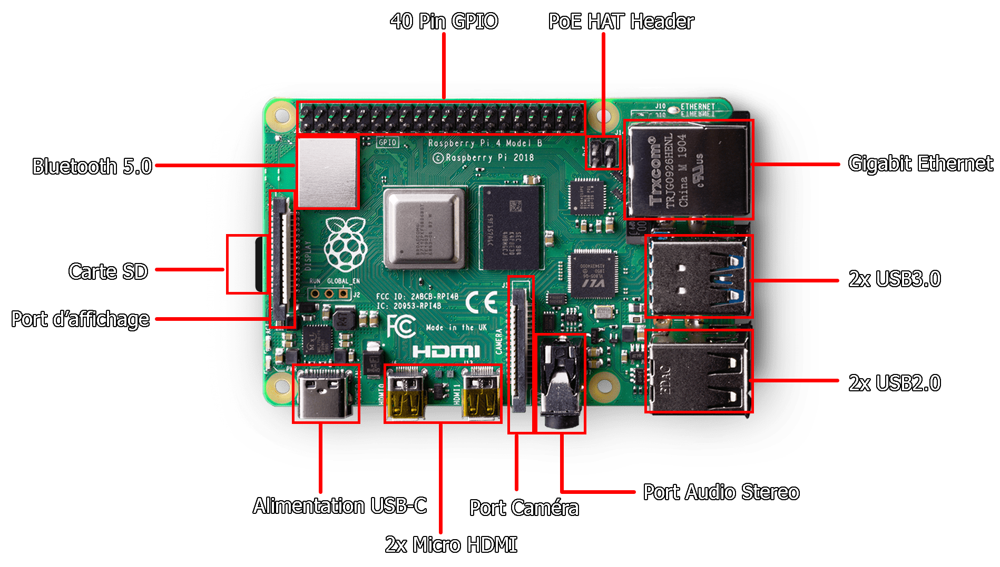 Pour le GPIO, voici les pins disponibles :

")
À noter, la pin numéro 1 se situe à côté du module Bluetooth tandis que la pin 39 se situe en diagonal du `PoE HAT Header`.

##### Pi 0 WiFi

Le Pi 0 WiFi détient moins d'éléments que le Pi 4, cependant il en détient quelque-uns de différents tel que :


#### Images des Raspberry Pi
Les images qui ont été faites pour les différents raspberry pi nécessitent de télécharger divers paquets. Ces paquets doivent être installés sur les divers raspberry pi afin de lancer les différents scripts.

##### Pi 4

Voici la liste des commandes à effectuer dans l'ordre :

Pour mettre à jour le raspberry pi, utilisez la commande : `sudo apt update && sudo apt full-upgrade`
Ensuite, il faut installer git : `sudo apt install git`.

- Cloner le repos : `git clone https://github.com/ACKERMANNGUE/ACKERMANNGUE-AG_Dipl_Tech_2021_VoitureAssistee`
- Installer les dépendences :
    - `sudo apt install python3-pip`
    - `sudo pip3 install flask`
    - `sudo pip3 install flask_bootstrap`
    - `sudo pip3 install flask_nav`
    - `sudo pip3 install flask_cors`
    - `sudo pip3 install pylgbst`
    - `sudo pip3 install gatt`
    - `sudo pip3 install pygatt`
    - `sudo pip3 install matplotlib`
    - `sudo pip3 install -U numpy`
    - `sudo apt install libatlas-base-dev`
    - `sudo apt install bluetooth pi-bluetooth bluez blueman`
    - `sudo pip3 install RPi.GPIO`
    - `sudo pip3 install opencv-python`
    - `sudo pip3 install smbus`
    - `sudo pip3 install dbus`
    - `sudo pip3 install asyncio`

##### Pi 0 WiFi

Pour mettre à jour le raspberry pi, utilisez la commande : `sudo apt update && sudo apt full-upgrade`
Ensuite, il faut installer git : `sudo apt install git`.

- Cloner le repos : `git clone https://github.com/ACKERMANNGUE/ACKERMANNGUE-AG_Dipl_Tech_2021_VoitureAssistee`
- Installer les dépendences :
    - `sudo apt install python3-pip`
    - `sudo pip3 install flask`
    - `sudo pip3 install flask_cors`
    - `sudo pip3 install libwebp-dev`
    - `sudo pip3 install libtiff-dev`
    - `sudo pip3 install libopenjp2-7`
    - `sudo pip3 install libilmbase-dev`
    - `sudo pip3 install libopenexr-dev`
    - `sudo pip3 install opencv-python`
    - `sudo pip3 install smbus`
    - `sudo pip3 install picamera`
    - `sudo pip3 install imutils`

##### Clonage de carte SD

Pour cloner les cartes SD, j'utilise le programme [balenaEtcher](https://www.balena.io/etcher/). 
Une fois les cartes SD branchées en USB au PC, lorsque le programme est lancé, il faut sélectionner le disque à copier, puis le disque sur lequel la copie doit être effectuée et cliquer sur `Flash` : 


### Ventilateur

Un ventilateur dans le cadre informatique est utilisé afin de faire descendre la température du processeur, car lorsqu'il fait beaucoup de traitement en même temps, il surchauffe et ceci peut causer des problèmes matériels. 

Le ventilateur est nécessaire, car lorsque toutes les caméras sont allumées et que le lidar tourne, sans le ventilateur, le processeur atteint des températures excédant 70° Celsius tandis qu'avec le ventilateur cette température est limitée à 55° Celsius.

Entre temps, je suis passé du ventilateur de gauche à celui de droite :


Celui de gauche était temporaire. Je l'avais démonté d'un vieux disque dur, car j'avais demandé à ce que l'on en commande pour un raspberry pi étant donné que mon processeur surchauffait. 

#### Mise en place

Pour le connecter, il faut brancher le câble d'alimentation (rouge) sur la pin 4, le câble de la terre (noir) sur la pin 6 et le câble de transmission (bleu) sur la pin 8  du GPIO comme le montre la boîte dans laquelle le ventilateur était : 

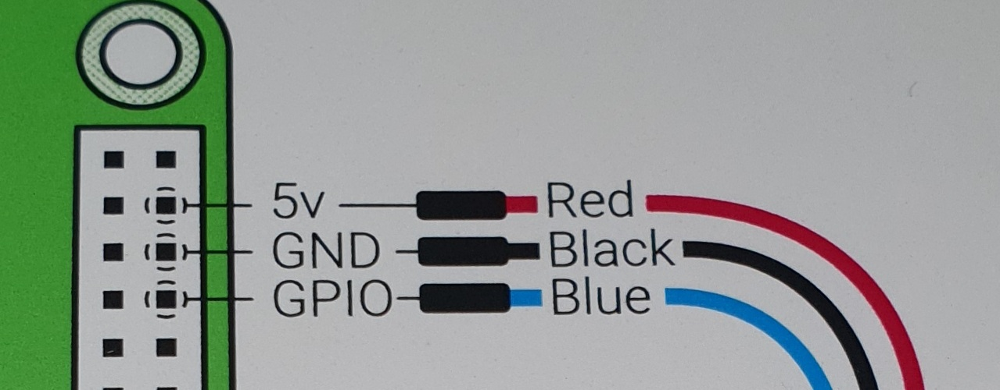

Étant donné qu'il est fournit avec un socle, socle qui est démontable. Je ne l'ai pas enlevé, car sinon il aurait été difficle de faire tenir le ventilateur, car il toucherait le processeur. C'est pourquoi j'ai utilisé un élastique afin de le maintenant sur le Raspberry Pi 4 :

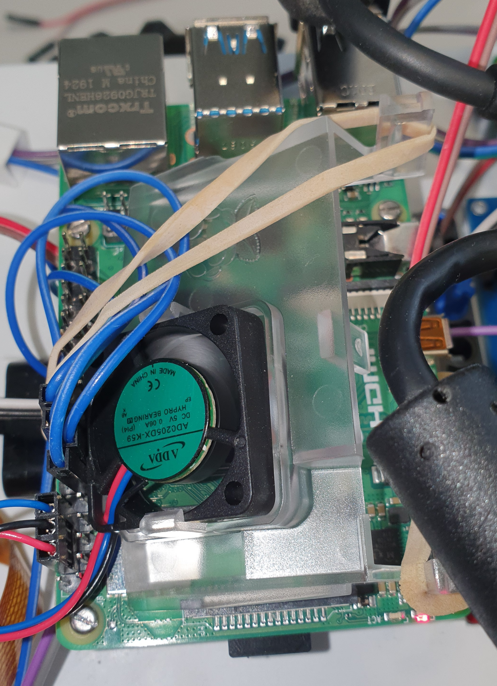

L'élastique passe sous le Raspberry Pi 4, et est tenu par les branches présentes sur les côtés.

### Caméra

La caméra est un module permettant d'avoir accès à un flux vidéo.

#### Mise en place

J’ai utilisé le guide de la caméra disponible sur sur le [site officiel de MagPi](https://magpi.raspberrypi.org/books). Pour commencer, j’ai activé la caméra dans le panneau de configuration du Raspberry Pi, puis j’ai branché la caméra dans l’emplacement prévu qui se situe entre la prise jack et les ports HDMI.

Si vous branchez une caméra à un Pi 4 :

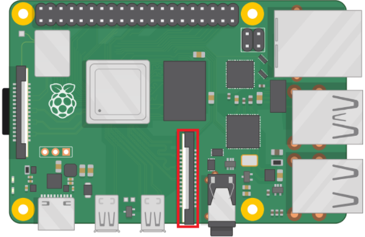

Si vous branchez une caméra à un Pi 0 WiFi :


Le ruban de la caméra doit être placé de sorte que la languette bleue fasse face à la prise jack. Pour m’assurer que la caméra soit fonctionnelle, j’utilise la commande suivante pour prendre une photo `raspistill -o test.jpg`.

À noter que si vous utiliser une caméra sur un Raspberry Pi 0 WiFi, il faut le câble orange comme ci-dessous :

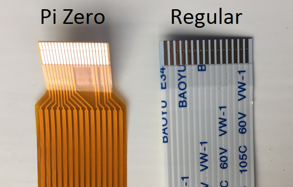

#### Utilisation

Pour vérifier qu'un flux vidéo pouvait être lu, j'ai utilisé le code ci-dessous :

```python
from picamera import PiCamera
from time import sleep

camera = PiCamera()

camera.start_preview()
sleep(5)
camera.stop_preview()
```

À noter, il est nécessaire d'exécuter ce code depuis le Raspberry Pi et non par VNC, car l'affichage de la prévisualisation du flux ne s'affiche pas. D'après [ce post](https://raspberrypi.stackexchange.com/questions/29537/sending-raspberry-pi-camera-preview-to-a-laptop-running-vnc-viewer) disponible sur StackEchange, il semblerait que l'aperçu de la caméra soit géré à un bas niveau dans le processeur graphique et par conséquent n'est visible que par le moniteur directement branché au Raspberry Pi.

### Phare (Bright Pi v1.0)

Le Bright Pi est un module comportant 4 leds infrarouges situées aux extrémités et au centre 8 leds.

#### Mise en place

Pour l’utilisation du Bright Pi, je me suis basé sur le guide disponible à l’adresse suivante : https://learn.pi-supply.com/make/bright-pi-quickstart-faq/. J’ai commencé par activer l’I2C dans le panneau de configuration du Raspberry Pi puis j’ai branché les pins aux emplacements indiqués dans le guide de démarrage. Les couleurs ci-dessous doivent être respectées (pour le placement uniquement).
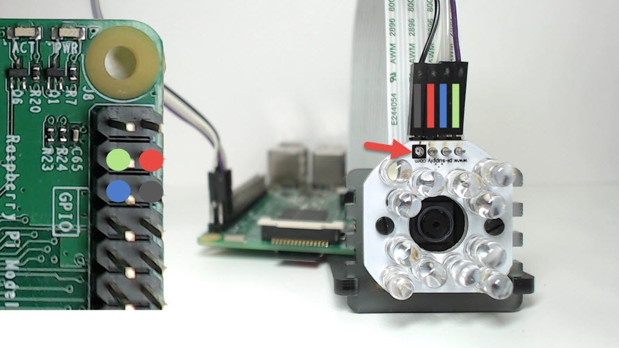

Pour s'assurer que le branchement soit correct, il est nécessaire d'utiliser la commande `i2cdetect -y 1`. Ceci devrait être affiché dans la console :


Pour tester le Bright Pi, il est nécessaire d'avoir le kit de développement disponible sur [ce repos Github](https://github.com/PiSupply/Bright-Pi).

#### Utilisation

Une fois cela fait, il faut importer les éléments concernant le brightpi avec

```python
from brightpi import *
import time
```

Pour faire clignoter les leds manuellement (à l’aide de lignes de code) j’aurai pu utiliser l’objet BrightPi, mais j’ai finalement utilisé le BrightPiSpecialEffects, car il permet d’avoir accès à des fonctions prédéfinies concernant la manipulation des leds, par exemple à les faire s’allumer une à une dans le sens des aiguilles d’une montre, ce qui peut devenir utile par la suite du travail. Voici le code que j'ai écrit. Ce code permet de faire clignoter les leds d'un côté spécifié.

```python
def blink(repetitions, speed, right_leds, left_leds, side):
    # fait clignoter les leds des côtés spécifiés
    duration = speed / 2
    leds_to_activate = []
    leds_to_desactivate = []
    for i in range(0, repetitions):
        if side == "L":
            leds_to_activate = left_leds
            leds_to_desactivate = right_leds
        if side == "R":
            leds_to_activate = right_leds
            leds_to_desactivate = left_leds

        bright_special.set_led_on_off(leds_to_desactivate, OFF)
        bright_special.set_led_on_off(leds_to_activate, ON)
        time.sleep(duration)
        bright_special.set_led_on_off(leds_to_activate, OFF)
        time.sleep(duration)

bright_special = BrightPiSpecialEffects()
bright_special.reset()

RIGHT_LEDS = [1, 2]
LEFT_LEDS = [3, 4]

blink(10, 1, RIGHT_LEDS, LEFT_LEDS, "R")
```

### Détecteur infrarouge (Flying-Fish)

Le Flying-Fish est un module comportant 2 leds infrarouges, une qui émet et une autre qui reçois. Il est équipé d'un potentiomètre réglant la distance d'émission.

#### Mise en place

Comme le montre ce schéma, le Flying-Fish doit être connecté à une alimentation ainsi qu'à un _Ground_ (appelé _Terre_ en français). La dernière broche est la sortie. C'est-à-dire que lorsque la distance d'émission réglée à l'aide du potentiomètre est dépassée, la lumière d'obstacle s'éteindra et cette broche enverra un signal électrique informant du changement d'état.


Il faut importer l'accès au GPIO du Raspberry Pi avec :

```python
import RPi.GPIO as GPIO
```

#### Utilisation

C'est pourquoi, j'ai branché le _Vcc_ sur la pin 1 du GPIO, car le voltage accepté est compris entre 3 et 6 Volts, ensuite j'ai branché le _Gnd_ sur la pin 6. J'ai branché le _Out_ à la pin 16 (GPIO 23). Voici le code de test :

```python
import RPi.GPIO as GPIO
import time

# Set the mode into Broadcom SOC channel
# It allows to use GPIO number instead of pin number
GPIO.setmode(GPIO.BCM)

# Set the GPIO 23 into input mode
GPIO.setup(23, GPIO.IN)

while True:
    # The actual state of the GPIO 23
    input_state = GPIO.input(23)
    if input_state == True:
        print("ATTENTION ! IL N'Y A PLUS DE SOL !")
        time.sleep(0.5)
    else:
        print("Sol détecté")
        time.sleep(0.5)
```

### Connexion bluetooth avec le LEGO 4x4 X-trem Off-Roader

Le LEGO 4x4 X-trem Off-Roader est une voiture télécommandable en bluetooth.

#### Mise en place

Dans un premier temps, il faut installer `bleak`, `pygatt` et `bluepy` pour ce faire, j'ai utilisé cette commande : `sudo pip3 install pygatt && pip3 install gatt && pip3 install gattlib && pip3 install bluepy && pip3 install bleak` puis j'ai télécharger le code sources du [repository pylgbst](https://github.com/undera/pylgbst).
Pour tester la connexion bluetooth, j'ai lancé la commande `sudo bluetoothctl`, ensuite j'ai lancé les commandes suivantes : `power on` pour m'assurer que le service soit actif, puis `scan on`. Une fois que des appareils ont été détectés, on peut lancer l'interface graphique située dans la barre des tâches :


ou il est possible d'aller dans les préférences pour l'ouvrir :

.

Une fois cette interface ouverte, il faut cliquer sur le bouton _Rechercher_, ce qui effectuera un scan des alentours. Une fois le `Technic Hub` trouvé dans la liste, il est nécessaire de noter son adresse mac : `90:84:2B:50:36:43` afin de pouvoir l'utiliser par la suite.

#### Utilisation

Pour gérer le déplacement de la voiture, à l'aide du kit de développement fourni par pylgbst, voici le code que j'ai écrit :

```python
from pylgbst.hub import MoveHub
from pylgbst.peripherals import Motor, EncodedMotor
from pylgbst import *
from time import sleep

MY_MOVEHUB_ADD = "90:84:2B:50:36:43"
MY_BTCTRLR_HCI = "hci0"

def forward(motor_1, motor_2, motor_3):
    motor_1.start_power(-1)
    motor_2.start_power(-1)
    motor_3.angled(0)
    print("done!")

def downward(motor_1, motor_2, motor_3):
    motor_1.start_power(1)
    motor_2.start_power(1)
    motor_3.angled(0)
    print("done!")

def go_left(motor_3):
    motor_3.angled(-180)
    print("done!")

def go_right(motor_3):
    motor_3.angled(180)
    print("done!")

def stop_moving(motor_1, motor_2):
    motor_1.start_power(0)
    motor_2.start_power(0)
    print("done!")

def reset_angle(motor_3):
    motor_3.angled(degrees=-150)
    print("test 1")
    sleep(1)
    motor_3.angled(degrees=-75)
    print("test 2")
    sleep(1)

def play_scenario(movehub):
    motor_a = Motor(movehub, movehub.PORT_A)
    motor_b = Motor(movehub, movehub.PORT_B)
    motor_c = EncodedMotor(movehub, movehub.PORT_C)

    print("Reset angle:")
    reset_angle(motor_c)
    sleep(2)

    print("Forward:")
    forward(motor_a, motor_b, motor_c)
    sleep(1)

    print("Downward:")
    downward(motor_a, motor_b, motor_c)
    sleep(1)

    print("Stop")
    stop_moving(motor_a, motor_b)

    print("Left:")
    go_left(motor_c)
    sleep(2)

    print("Right:")
    go_right(motor_c)
    sleep(2)

def exiting(connection):
    print("bye")
    connection.disconnect()

conn = get_connection_gatt(hub_mac=MY_MOVEHUB_ADD)

try:
    movehub = MoveHub(conn)
    play_scenario(movehub)
    exiting(conn)
finally:
    exiting(conn)
```

Le code fournit, propose différentes méthodes de connexion tel que :

- bluepy
- bluegiga
- gatt
- bleak
- gattool
- gattlib

Ayant vu dans plusieurs documentations le nom de `GATT` ressortir, je m'y suis penché pour comprendre de quoi il s'agissait. `GATT` est un acronyme de l'anglais _Generic Attribute Profile_, il définit comment les 2 appareils vont échanger leurs données, tout en suivant un système de _Services_ et de _Characteristics_. C'est pourquoi j'ai utilisé la connexion avec `GATT`.

#### Problème rencontré

Au départ, je tentais d'appareiller le Raspberry Pi au Technic Hub depuis les commandes disponibles dans le mode `bluetoothctl`, mais j'avais cette erreur `Failed to pair: org.bluez.Error.AuthenticationFailed`.

##### Comment je l'ai résolu

J'ai alors compris que pour me connecter au Technic hub, j'aurai besoin d'y avoir accès par un moyen qui permette de transmettre des données, car depuis la documentation LEGO, j'ai aperçu des commandes écrites avec des bytes en hexadécimal. De plus,j'ai remarqué qu'ils mettaient à disposition les UUID des hubs, car ils ont tous le même fabricant.

Il y a plein de pistes que j'ai entrevues sur les différents repository, cependant je ne m'y étais pas intéressé plus que ça, car aucun ne mentionnait le nom de Technic Hub. Après avoir été dans les différents repository ci-dessous et après avoir regardé comment étaient écrites leurs transmissions au hub bluetooth. J'ai réussi à comprendre comment je pouvais m'appareiller au Technic Hub et comment interagir avec.

### Radar 360 (RPLiDAR A2M8)

Le RPLiDAR A2M8 est un scanner laser à 360°. Il permet de connaître la distance entre lui et les obstacles à chaque angle.

#### Mise en place

Le lidar est branchable par port série. Cependant, un adaptateur est fourni avec et nous permet de récupérer les données par USB.

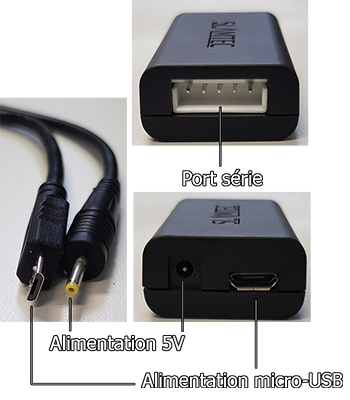

Au dos de l'adaptateur, on peut y voir les éléments suivants :

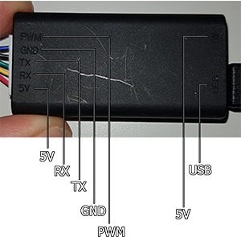

| Couleur du câble | Nom du signal | Type de signal |                       Description                        | Tension minimale | Tension habituelle | Tension maximale |
| :--------------: | :-----------: | :------------: | :------------------------------------------------------: | :--------------: | :----------------: | :--------------: |
|      Rouge       |      VCC      |     Power      |                     Puissance totale                     |       4.9V       |         5V         |       5.2V       |
|       Vert       |      TX       |     Output     | Sortie des données sur le port série relative au scanner |        0V        |        3.3V        |       3.5V       |
|      Jaune       |      RX       |     Input      | Entrée des données sur le port série relative au scanner |        0V        |        3.3V        |       3.5V       |
|       Noir       |      GND      |     Power      |                         La Terre                         |        0V        |         0V         |        0V        |
|       Bleu       |    MOTOCTL    |     Input      |            Moteur de scan, régulé avec un PWM            |        0V        |        3.3V        |        5V        |

Informations complémentaires pour le PWM, voici les valeurs utilisées :

|                               |  Unité   | Valeur minimale | Valeur habituelle | Valeur maximale |
| :---------------------------: | :------: | :-------------: | :---------------: | :-------------: |
|    Haut niveau de tension     |  Volts   |       3.0       |        3.3        |        5        |
|       Fréquence du PWM        |   Herz   |     24,500      |      25,000       |     25,500      |
| Plage de cycles d'utilisation | Pourcent |        0        |        60         |       100       |

Si on le souhaite, on peut modifier la vitesse de transmission. De base, la vitesse de transmission est paramétrée sur 115'200 Baud, mais on peut la montée à 256'000 Baud.


Il faut commencer par télécharger le kit de développement disponible sur [le repository officiel de Slamtec](https://github.com/Slamtec/rplidar_sdk/releases/tag/release%2Fv1.12.0). Une fois le SDK téléchargé sur le Raspberry. Nous pouvons brancher le Lidar à l'adaptateur. Depuis l'adaptateur, branché le micro-USB dessus puis l'USB au Raspberry Pi.


#### Utilisation

Afin de vérifier qu'il soit bien détecté, il faut exécuter la commande suivante `ls /dev/*USB*` ceci devrait être retourné `/dev/ttyUSB0`. Dans le dossier du code source, il faut aller dans le répertoire `sdk/app/` et exécuter la commande make dans un terminal. Pour exécuter l'un des 3 programmes suivant :

1. ultra_simple
2. simple_grabber
3. frame_grabber

Nous pouvons maintenant exécuter le programme souhaité en utilisant la commande suivante dans un terminal : `nom_du_programme /dev/ttyUSB0`.

#### Problème rencontré

Les codes fournis fonctionnent parfaitement, sauf qu'aucun ne permet de récupérer depuis une variable ou autre les valeurs d'angles. Cependant, elles sont affichées dans la console.

##### Comment je l'ai résolu

Il y avait 2 possibilités :

1. La première était de récupérer les câbles séries (rouge, bleu, jaune, ...) et de les connecter directement au GPIO sur les pins qui fournissent :
   - TX
   - RX
   - VCC
   - Ground
   - MotorCTL est un PWM

Comme indiqué sur ce schéma du GPIO du raspberry pi de manière plus détaillé que le premier vu dans la section parlant des Raspberry Pi :


Il s'agirait donc des pins : 2 (VCC), 6 (GND), 8 (TX), 9 (RX)

2. La seconde option était de récupérer les données que l'API de Slamtec, [ici présente](https://github.com/Slamtec/rplidar_sdk/releases) écrite en `C++`. Cette dernière fournissait les données en les affichant dans la console sous un format : `Theta: 210.31 Dist: 00875.00`, Theta représentant un angle et Dist représentant la distance en millimètre d'un obstacle.
   Malheureusement trop tard, j'ai trouvé [cette librairie](https://rplidar.readthedocs.io/en/latest/) en python qui faisait quasiment tout le travail à ma place.

Cela dit, la méthode que j'utilise actuellement se résume à ça :

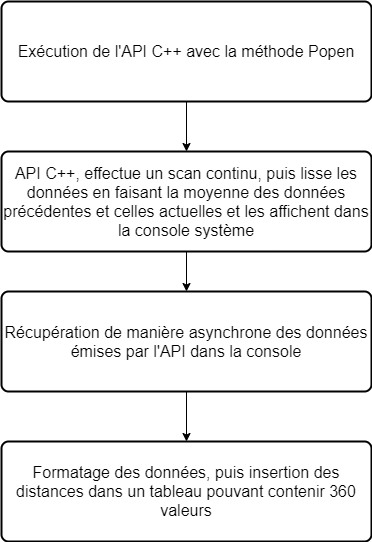

Le problème de cette méthode est qu'elle n'est vraiment pas optimisée, car on va lire de manière asynchrone les données reçues par le programme `C++` et traitée puis mise dans le tableau de distance à chaque itération. Cette même itération est stoppable à tout moment avec un paramètre à changer dans le lancement du processus.

### Émetteur WiFi (ASUS RT-AC58U)

Un émetteur sans fil diffuse des ondes en utilisant la fréquence radio (RF). Il permet de rendre une connexion internet sans y être connecté de manière filaire. Pour ce projet, nous utilisons un ASUS RT-AC58U.

#### Mise en place

##### Branchement

Pour mettre en place le routeur, il faut d'abord brancher l'alimentation dans le port indiqué ainsi que le câble ethernet permettant la connexion à internet dans le port bleu. Pour récupérer les sorties ethernet, il faut les brancher dans les ports jaunes.


Sur le haut du routeur, on peut voir différentes leds s'allumer, voici la signification de ces dernières : 


Une fois que le branchement est fait, il faut se rendre sur http://router.asus.com/, la page de connexion vous sera alors affichée. Par défaut, les identifiants pour s'y connecter sont pour le nom d'utilisateur ainsi que pour le mot de passe `admin`.


##### Configuration

Pour commencer à paramétrer le réseau, il faut en un premier temps cliquer sur le bouton `Quick Internet Setup`


Cette première page sera affichée, vous laissant le choix entre une configuration rapide ou détaillée. Le mode avancé n'étant pas nécessaire, il est préférable de cliquer sur le bouton `Create A New Network`


Ensuite, cette page de configuration s'affichera, et vous pourrez renter les différentes informations telles que le SSID (nom du réseau) et son mot de passe. Une fois les différents champs remplis, il faut cliquer sur `Apply`.


Le routeur va nous demander si l'on veut que `Yandex` soit active, son rôle est de restreindre l'accès aux sites malicieux et aux contenus pour adulte. Dans mon cas, je l'ai activé :  


Il est fort probable que vous deviez mettre à jour votre appareil avec le firmware :


##### Changement des paramètres de connexion à l'interface web

Pour modifier le nom d'utilisateur ainsi que son mot de passe, il faut cliquer sur le bouton `Administration` : 

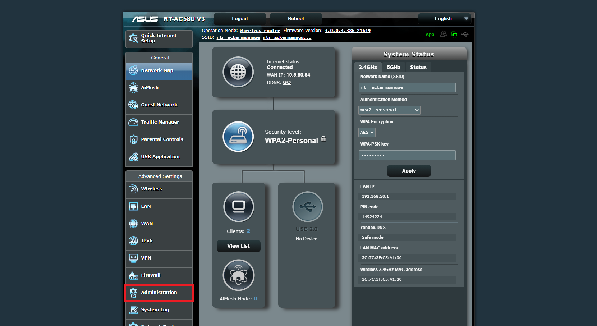

Cette page s'affichera, et il faudra cliquer sur l'onglet `System` afin d'avoir accès à l'interface nous permettant de modifier ces informations : 

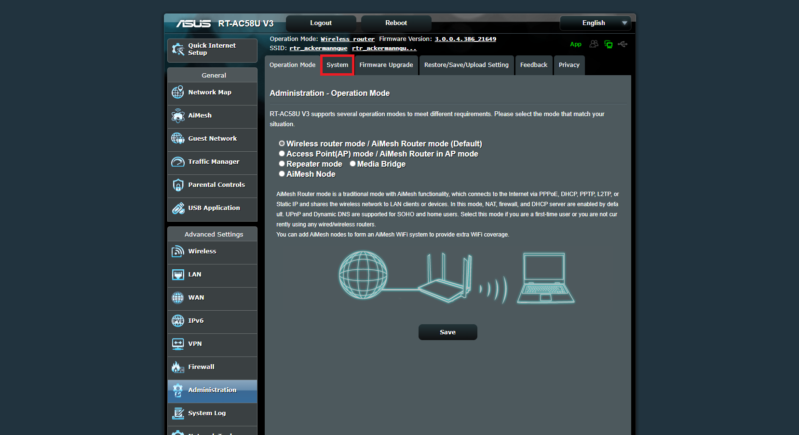

Une fois dans l'onglet, vous pourrez modifier les informations ici : 


#### Utilisation

Il faut activer le WiFi sur l'appareil que l'on souhaite connecter, une fois les réseaux scannés. Nous devrions pouvoir avoir accès au réseau `le_SSID_du_réseau` et s'y connecter en entrant le mot de passe choisi sur l'interface nous permettant de paramétrer notre réseau.

## Python Flask

Flask est un framework web disponible en python qui permet de développer aisément des applications web.

### Mise en place

Flask est téléchargeable depuis la commande `pip3 install Flask`.

### Utilisation

Dans un premier temps, il est important de créer un fichier python. Dans cet exemple, ce sera `hello.py`.

#### Application de base

Il faut d'abord importer Flask. Et l'initialiser de la manière suivante :

```python
from flask import Flask
app = Flask(__name__)

@app.route('/')
def hello_world():
    return 'Hello, World!'
```

Pour lancer l'application, il faut d'abord exporter la variable d'environnement `FLASK_APP` de la manière suivante dans un terminal : `export FLASK_APP=hello.py`. Une fois cela fait, lancer le serveur avec la commande : `flask run --host=0.0.0.0`. Le `--host=0.0.0.0` rend l'accès au serveur public depuis d'autres appareils connectés sur le réseau. Dans mon cas, mon Raspberry Pi a cette adresse IP : `10.5.50.42` et mon PC `10.5.50.52`. Pour aller sur le site, je tape l'adresse IP du Raspberry Pi ainsi que le port 5000, http://10.5.50.42:5000/.

```
 * Serving Flask app "hello.py"
 * Environment: production
   WARNING: Do not use the development server in a production environment.
   Use a production WSGI server instead.
 * Debug mode: off
 * Running on http://0.0.0.0:5000/ (Press CTRL+C to quit)
127.0.0.1 - - [28/Apr/2021 08:42:15] "GET / HTTP/1.1" 200 -
127.0.0.1 - - [28/Apr/2021 08:42:16] "GET /favicon.ico HTTP/1.1" 404 -
10.5.50.52 - - [28/Apr/2021 08:42:32] "GET / HTTP/1.1" 200 -
10.5.50.52 - - [28/Apr/2021 08:42:32] "GET /favicon.ico HTTP/1.1" 404 -
```

Le port 5000 étant le port par défaut définit par Flask, mais qui est changeable avec le paramètre `flask run --host=0.0.0.0 -p 8000`, dans ce cas, le port de Flask sera changé à 8000.

##### Routes

Flask fonctionne avec un système de routes. Les routes sont écrites de la manière suivante :

```python
@app.route('/nom_de_la_route')
def nom_de_la_fonction():
    # Code ...
    return html_a_afficher
```

Lors de l'accès à une route, le code à l'intérieur de la fonction sera exécuté puis rendra de l'HTML à afficher.

On peut aussi récupérer une valeur depuis la route de la manière suivante :

```python
@app.route('/hello/<name>')
def hello(param_name):
    return render_template('hello.html', name=param_name)
```

##### Templates

Si les routes rendent de l'HTML, c'est que l'on peut injecter des valeurs dans du code HTML pré-écrit. Pour ce faire, à la racine du projet, il faut créer un dossier précisément nommé de la sorte : `templates`. Ce répertoire contiendra les différents templates HTML à afficher. Voici comment un fichier de template HTML est écrit :

```HTML
<!doctype html>
<title>Hello from Flask</title>

  <h1>Hello {{ name }}!</h1>

  <h1>Hello, World!</h1>

```

Les balises  permettent d'écrire du code comme des tests et des boucles.

Les balises {{ nom_de_la_variable }} permettent d'injecter des valeurs dans l'HTML dynamiquement.

Depuis le code python, pour pouvoir utiliser des templates, il faut importer `render_template` comme suit : `from flask import render_template`

##### Barre de navigation

En prérequis, il faut installer les librairies :

1. flask_bootstrap
2. flask_nav

Voici la commande à utiliser : `sudo pip3 install flask_bootstrap && sudo pip3 install flask_nav`

Ensuite, dans le code une fois les libraires importées comme suit :

```python
from flask_bootstrap import Bootstrap
from flask_nav import Nav
from flask_nav.elements import *
```

Nous pouvons initialiser notre barre de navigation avec un nom ainsi que leurs routes :

```python
topbar = Navbar(
    View('Accueil', 'home'),
    View('Télécommande', 'control_car'),
    View('Déconnexion', 'close_connection'),
    View('Créer une connexion', 'create_car'),
)

nav = Nav()
nav.register_element('top', topbar)


app = Flask(__name__)
Bootstrap(app)
```

Pour y avoir accès, on peut l'inclure dans une page HTML de la manière suivante :

```python

    {{nav.top.render(id='top-navbar')}}

```

##### Formulaires

Les formulaires avec Flask sont écrits en HTML classique :

```html
<form action="/route_apres_validation" method="POST ou GET">
  <input type="text" name="input_txt" placeholder="..." />
  <input type="checkbox" name="input_cbx" checked="true" />
  <input type="submit" value="valider" name="input_validation" />
</form>
```

Pour récupérer les informations des différents champs du formulaire, voici le code qui permet de les récupérer :

```python
@app.route('/route_apres_validation', methods=['GET', 'POST'])
def nom_de_fonction():
    if request.method == 'POST' and request.form["input_validation"]:
        valeur = request.form["nom_input_html"]
        # Traitement ...
    return html_a_afficher
```

Dans le paramètre `methods` de la route, le paramètre GET est celui de base, mais peut être changé par POST.

##### Javascript / AJAX

Étant donné que Flask nous permet d'écrire des pages HTML qui seront insérées dans la page lors de l'appel (voir la section regroupant les Templates), cela veut dire que nous pouvons écrire du javascript à l'aide des balises `<script type=text/javascript></script>`. Pour le cas d'AJAX, il suffit de télécharger la librairie JQuery afin d'y avoir accès ou en utilisant le CDN `<script src="https://code.jquery.com/jquery-3.6.0.min.js" integrity="sha256-/xUj+3OJU5yExlq6GSYGSHk7tPXikynS7ogEvDej/m4=" crossorigin="anonymous"></script>`.

À noter que l'unique différence entre ces deux manières d'avoir accès à JQuery, est que l'un est accessible en ligne et l'autre sur la machine donc la rapidité d'exécution, car en utilisant la version en ligne, en fonction du débit de la connexion, il peut y avoir de la latence.

Pour mettre en place de l'AJAX, il faut dans des balises script sur l'une des pages HTML présentent dans le répertoire `templates`. La méthode `serialize()`, permet de récupérer de sérialiser les données présentes dans le formulaire HTML.

```javascript
<script>
function execute(){
    $.ajax({
            url: '/bg_processing_car/',
            data: $('form').serialize(),
            type: 'POST',
            success: function(response) {
                console.log("action performed");
            },
            error: function(error) {
                console.log(error);
            }
        });
    }
</script>
```

Et dans le code python, voici comment on récupère et traite les données : 


On peut considérer les données envoyées par l'appel AJAX comme ceci :

```javascript

[
  {
    rngMove : 75,
    rngRotationAngle : 1
  }
]

```

Et on les récupère exactement comme pour un formulaire classique : 

```python

@app.route("/bg_processing_car/", methods=["POST"])
def bg_process_car():
    """Process the values passed by Javascript"""
    automatic_mode = MODE_OFF
    move_speed = request.form["rngMove"]
    angle_rotation = request.form["rngRotationAngle"]
    car = CarController()
    # Reverse the result because it returns True if there isn't a ground below
    grounded = not GPIO.input(GPIO_FLYING_FISH_FRONT_RIGHT)
    car.move(float(move_speed), int(angle_rotation), grounded)
    return render_template(
        "form_remote_car.html",
        mode=automatic_mode,
        speed=move_speed,
        angle=angle_rotation,
    )
```


## Bluetooth

### Qu'est-ce que le bluetooth ?

Le bluetooth est une norme de communication à courte distance utilisant des ondes radio sur la bande de fréquence 2,4GHz. Ce qui permet d'échanger des données dans les deux sens en _peer-to-peer_ dans un picoréseau.


Un picoréseau (en anglais piconet) est un mini-réseau qui se crée de manière instantanée et automatique quand plusieurs périphériques Bluetooth sont dans un même rayon.

#### Comment est-il structuré ?

Quand on parle de bluetooth, au niveau des protocoles, on peut parler de relations _Maîtres_ et d'_Esclaves_. Le _Maître_ Bluetooth est celui qui peut initier une connexion avec un périphérique (ou _Esclave_), cependant une fois les appareils connectés, le _Maître_ et l'_Esclave_ peuvent échanger des informations sans restriction (en fonction de la limitation de l'application).

")

Les relations _Maître_-_Esclave_ sont gérées par le gestionnaire de liaison. Il implémente le protocole L2CAP (de l'anglais _Logical Link Control and Adaptation Protocol_) et le gère (création, destruction de canaux). Il implémente aussi les mécanismes de sécurité comme :

- l'authentification
- l'appairage (l'association)
- la création et la modification des clés
- et le chiffrement

#### Sécurité

Il existe 3 modes de sécurité :

- Mode 1
  - Non sécurisé pour toutes opérations
  - Peut uniquement communiquer avec des appareils du même mode
- Mode 2
  - Fournit un niveau de sécurité à la couche application après l'établissement d'une liaison avec un autre dispositif
- Mode 3
  - Fournit un niveau de sécurité avant l'établissement du canal de communication
  - Chiffrement sécurisé au niveau de la liaison avec autre dispositif

À noter, si un service effectue une demande de connexion, le mode de sécurité les plus haut sera celui utilisé afin de traiter la demande tout en s'assurant de la sécurité relative aux différents modes.

Le bluetooth est divisé en deux parties :

1. La couche contrôleur implémentant la partie matérielle
2. La couche hôte implémentant la partie logicielle.

L'émission et la réception de signaux radio sont possibles grâce à un module RF (RadioFrequency).

L'interface host-controller (HCI) fait la liaison entre la couche hôte et la couche contrôleur en assurant le transfert des événements et des paquets de données. Cette interface assure le transfert d’information pour que la couche hôte puisse découvrir, ajouter et gérer les appareils dans un picoréseau.

Chaque paquet possède un champ header permettant de distinguer le picoréseau de l’appareil des autres picoréseaux. Voici le format d'un paquet :

| Champ          | Header | Access Address | Protocol Data Unit (PDU) | Cyclic redundancy Check (CRC) |
| -------------- | :----: | :------------: | :----------------------: | :---------------------------: |
| Taille en bits |   8    |       32       |        de 2 à 39         |              24               |

Le PDU est une unité de mesure des informations échangées dans un réseau informatique. Appliqué aux couches du modèle OSI, le PDU de :

- La couche physique est le bit.
- La couche liaison est la trame.
- La couche réseau est le paquet.
- La couche transport est le segment pour TCP, et le datagramme pour UDP.
- Les couches application, présentation et session sont les données.

Le Cyclic Redundancy Check, autrement appelé contrôle de redondance cyclique, permet de détecter des erreurs de transmission ou de transfert par ajout, combinaison et comparaison de données redondantes, obtenues grâce à une procédure de hachage. Cette méthode est comparable au checksum, mais ce dernier est plus élaboré.

Les paquets reçus par le HCI sont traités par le protocole L2CAP. Il assure le transport des paquets vers les couches supérieures du modèle OSI, la segmentation et le réassemblage des paquets.

La couche de liaison est définie dans les systèmes bluetooth comme la couche assurant le transport des paquets entre les appareils d’un même picoréseau à travers plusieurs canaux :

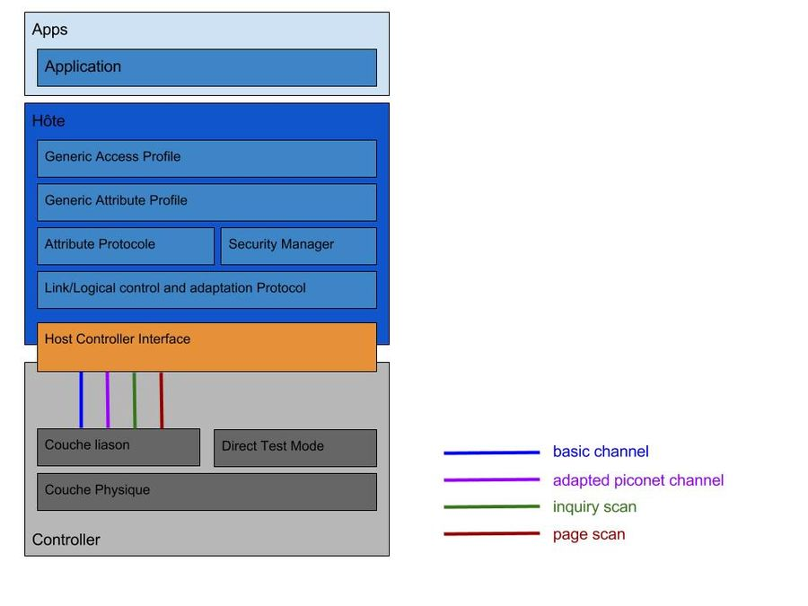

- Basic channel : Canal pour la communication entre deux appareils
- Adapted piconet channel : Canal pour la communication dans le picoréseau
- Inquiry scan : Canal pour l'acquisition des appareils bluetooth aux alentours
- Page scan : Canal pour la connexion avec un nouvel appareil

#### Qu'est-ce que Generic Access Profile

Generic Access Profile (GAP), est responsable de la connexion. De plus, il gère aussi :

- les modes d'accès
- les procédures du dispositif
- la découverte du dispositif
- l'établissement et la fin de la liaison
- le lancement des fonctions de sécurité
- la configuration du dispositif.


- Veille : le dispositif est dans l'état initial de veille lors de la réinitialisation.
- Annonce : Le dispositif envoie un message d'annonce avec des données spécifiques pour faire savoir aux dispositifs initiateurs qu'il est un dispositif connectable (cette annonce contient l'adresse du dispositif et peut contenir des données supplémentaires telles que le nom du dispositif).
- Scan : Lorsqu'il reçoit l'annonce, le dispositif de scan envoie une demande de scan à l'annonceur qui répondra par une réponse d'analyse. Cette méthode est appelée découverte du dispositif. Le dispositif d'analyse connaît le dispositif ayant émis l'annonce et peut établir une connexion avec lui.
- Initiation : Lors de l'initialisation, l'initiateur doit spécifier une adresse de dispositif homologue à laquelle se connecter. S'il reçoit une annonce correspondant à l'adresse du dispositif homologue, le dispositif initiateur envoie une demande de connexion avec les paramètres disponible ci-dessous :
  - Intervalle de connexion (entre 7.5 et 3200 ms)
  - La latence de l'esclave
  - Délai de supervision (entre 10 et 3200 ms)
- Esclave/Maître : Lorsqu'une connexion est établie, le dispositif fonctionne comme un esclave s'il s'agit de l'annonceur sinon comme un maître s'il s'agit de l'initiateur.

##### Qu'est-ce que Generic Attribute Profile

Generic Attribute Profile (GATT), est responsable de la communication de données entre les appareils connectés. Il est structuré en _Services_ et _Characteristics_ comme ci-dessous :


Les attributs sont groupés en _services_, chaque _services_ peut contenir 0 ou + _characteristics_. Ces dernières peuvent avoir de 0 à + _descriptors_.

- GATT Server : Technic Hub
- Service : Generic Attribute
  - Characteristic : Service Change
- Service : Generic Access
  - Characteristic : Device Name
  - Characteristic : Appearance
  - Characteristic : Peripheral Preferred Connection Parameters
- Service : LegoTechnicHub (renommée car de base l'application affichait Unknown ervice)
  - Characteristic : Unknown Charateristic

Pour avoir accès à ces informations, j'ai utilisé l'application EFRConnect disponible sur le playstore.
J'ai lancé un scan depuis le Raspberry Pi, voici les informations qui ont été retournées :

```
[NEW] Device 90:84:2B:50:36:43 Technic Hub
[CHG] Device 90:84:2B:50:36:43 RSSI: -58
[CHG] Device 90:84:2B:50:36:43 TxPower: 0
[CHG] Device 90:84:2B:50:36:43 ManufacturerData Key: 0x0397
[CHG] Device 90:84:2B:50:36:43 ManufacturerData Value:
  00 80 06 00 61 00                                ....a.
```

Par la suite, j'ai lancé un scan depuis l'application afin de comparer les données, voici les informations que l'application m'a retournées concernant le Technic Hub :

- Flags : `0x06: LE General Discoverable Mode, BR/EDR Not Supported`
- Complete list of 128-bit service class UUIDs : `00001624-1212-EFDE-1623-785FEABCD123`
- Manufacturer Data :

  1. Company Code : `0x0397`
  2. Data : `0x008006004100`
  3. Slave connection interval range : `20.0ms`
  4. Tx power level: `0 dBm`
  5. Complete local name : `Technic Hub`

- Generic attribute : `0x1801`
  1. UUID : `0x2A05`
  2. Descriptor : _champs vide_
  3. Client characteristic configuration : `0x2902`
- Generic access :
  1. Device name : `0x1800`
  2. Appearance : `0x2A01`
  3. Peripheral preffered connection parameters : `0x2A04`
- _Unknown Service_ :
  1. UUID : `00001624-1212-EFDE-1623-785FEABCD123`
  2. Descriptor : _champs vide_
  3. Client characteristic configuration : `0x2902`
  4. Value : `05 00 04 03 00 2E 00 00 10 00 00 00 10 00 00 00 00 00 00 00`

### T'chat en bluetooth

#### Mise en place

Il faut que les 2 Raspberry Pi soient en mode "Découvrable" activable ici :

.

Il faut ensuite effectuer un scan des appareils si nous ne connaissons pas le nom d'hôte de l'autre Raspberry Pi. Le script doit être présent sur les deux Raspberry Pi afin de pouvoir écouter, recevoir ainsi qu'envoyer des messages. La machine hôte, moi dans ce contexte, doit être en mode MODE_SEND tandis que l'autre en mode MODE_RECEIVE.

#### Utilisation

Le code fonctionne de la manière suivante. La machine hôte va en premier temps lancer le scan à la recherche de l'appareil nommé `morenoPi42`.


Une fois l'appareil trouvé, je m'y appareille, puis lui envoie le premier message.


Le mode actuel, change et je deviens la machine qui écoute le port spécifié en attendant un message.


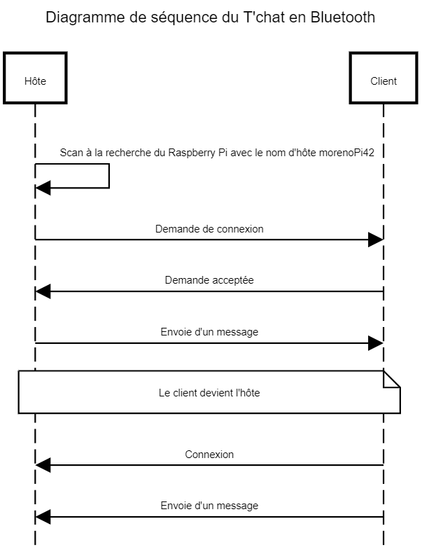

## Remote GPIO

Le GPIO nous permet d'accéder aux entrées / sorties des appareils connectés au Raspberry Pi.

### Mise en place

Pour pouvoir utiliser le Remote GPIO, il faut tout d'abord l'activer dans l'interface de configuration présente ci-dessous :


Puis dans la fenêtre présente, tout en bas, cliquer sur _Activé_ :

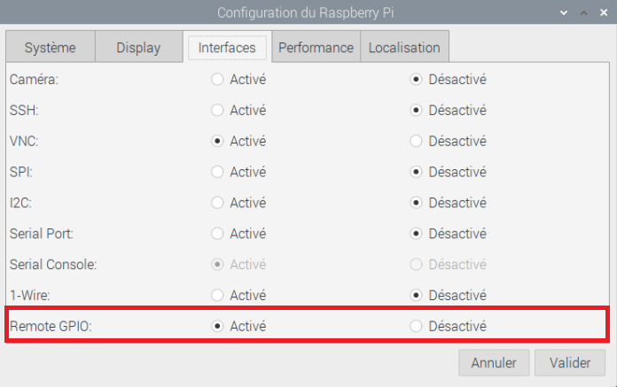

Une fois que la configuration des différents Raspberry Pi est faite, il ne manque plus qu'à télécharger GPIO Zero, une librairie nous donnant accès à la gestion des différentes pins :
`sudo pip3 install gpiozero`

Ensuite nous aurons besoin de Pi GPIO :
`sudo apt install pigpio`

Une fois installé, il faut lancer le service PiGPIO : `sudo pigpiod` sur la machine qui sera contrôlée à distance.

### Utilisation

Pour pouvoir se connecter au Raspberry Pi, il faut connaître son adresse IP. Une fois connue, voici comment établir une connexion :

```python
import gpiozero
from gpiozero import LED,Button
from gpiozero.pins.pigpio import PiGPIOFactory
from signal import pause

factory = PiGPIOFactory('10.5.50.42')

btn = Button(2) # local RPi.GPIO pin
led = LED(17, pin_factory=factory) # remote pin

btn.wait_for_press()
print("button pressed !")
led.off()
pause()
```

Dans notre cas, avec M. Moreno interprétant le Raspberry Pi _principal_ qui interagirait avec les pins de mon Raspberry Pi.


- Le bouton est connecté au GPIO 2, donc la pin 3


- La led est connectée au GPIO 17, donc la pin 11


## Matplotlib

Matplotlib est une librairie complète permettant la création de statistiques sur un large panel de graphiques utilisable en Python.

### Mise en place

Il faut d'abord installer Matplotlib avec la commande `sudo apt-get install python3-matplotlib` 

### Utilisation

Sur le site officiel, il y a cet exemple que j'ai repris pour en faire l'affichage de mon radar 360° :

```python

import numpy as np
import matplotlib.pyplot as plt


# Fixing random state for reproducibility
np.random.seed(19680801)

# Compute areas and colors
N = 150
r = 2 * np.random.rand(N)
theta = 2 * np.pi * np.random.rand(N)
area = 200 * r**2
colors = theta

plt.subplot(projection='polar')
plt.scatter(theta, r, c=colors, s=area, cmap='hsv', alpha=0.75)

```

Voici ce que l'exemple [ici](https://matplotlib.org/stable/gallery/pie_and_polar_charts/polar_scatter.html#sphx-glr-gallery-pie-and-polar-charts-polar-scatter-py) présent donne : 

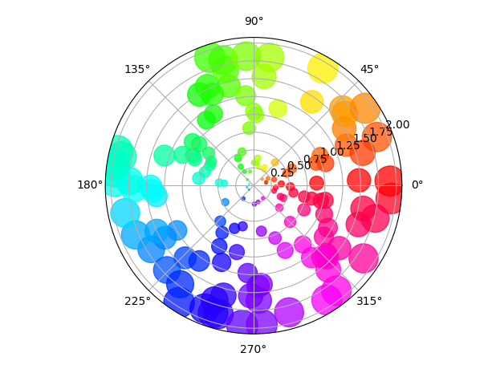

Voici le code créant le graphique que j'utilise pour afficher les points : 

```python

def make_chart():
    """
    Will process the chart and save it into a png
    """
    global rows
    area = 5
    colors = [(1, 0.2, 0.3), (1, 0.8, 0), (0.1, 0.5, 0.1)]  # near -> mid -> far
    cmap_name = "distance_warning"
    cmap = matplotlib.colors.LinearSegmentedColormap.from_list(cmap_name, colors)
    data_x = []
    data_y = []
    angle = 0
    # Create the colors I need, values between 0 and 1 for (r, g, b)
    # add angle in radian and his value in two array x and y
    for distance in rows:
        data_x.append(math.radians(angle))
        data_y.append(distance)
        angle += 1

    # set the projection to polar
    plt.subplot(projection="polar")
    plt.scatter(data_x, data_y, s=area, c=data_y, cmap=cmap)
    plt.ylim(0, 2000)
    plt.savefig(constants.CHART_PATH + constants.CHART_NAME)
    plt.clf()

```


Voici un exemple du scanner en un quasi-temps réel : 


Ici, on parle de quasi-temps réel, car comme vu dans le section parlant du Lidar, on traite les données émises par l'API en temps réel de manière asynchrone, mais le graphique étant une image enregistrée, le temps d'écriture de l'image ainsi que le temps de lecture fait que les images s'accumulent et que par conséquent l'image gagne du délai.

## RaspAP
RaspAP est une application permettant de mettre en place un point d'accès WiFi avec un raspberry pi facilement.
### Mise en place
Par précaution, il est nécessaire de mettre son raspberry pi à jour avec la commande `sudo apt update && sudo apt full-upgrade`.

Ensuite, il faut télécharger le code du repository Git avec la commande suivante : `wget -q https://git.io/voEUQ -O /tmp/raspap && bash /tmp/raspap`. Durant toute l'installation, il faut tout accepter, à moins d'avoir une bonne raison, mais dans ce cas il n'y a pas de raison valable de dire non.

Après l'installation, il faut redémarrer le raspberry pi. Une fois redémarré, le raspberry pi devrait avoir cette adresse IP : `10.3.141.1`. Pour pouvoir avoir accès à cette information, ouvrez un terminal et exécuter la commande : `ip a` ou `ifconfig`. Normalement vous devriez voir un section nommée `Wlan0`.

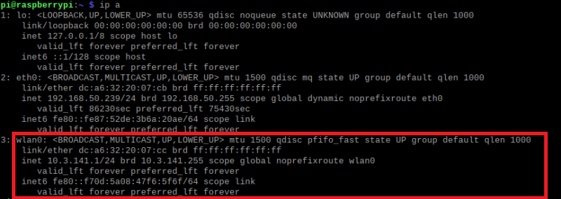

### Utilisation
Une fois RaspAP installé, vous pouvez vous rendre sur `10.3.141.1` dans un navigateur web afin d'avoir accès au tableau de bord de RaspAP : 

Pour se connecter, une fenêtre comme celle ci-dessous apparaîtra. Les identifiants par défaut sont `admin` pour le nom d'utilisateur et `secret` comme mot de passe.

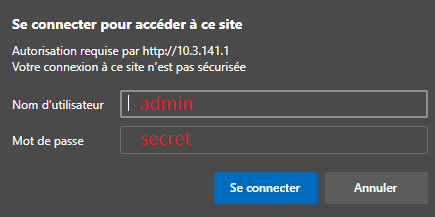

Pour pouvoir se connecter au WiFi (toujours avec les valeurs par défaut) le nom du réseau est : `raspi-webgui` avec pour mot de passe `ChangeMe`. Vous pourrez le voir dans les appareils permettant d'accéder à des réseaux WiFi.

Une fois connecté, vous arriverez sur la page de tableau de bord de RaspAP :

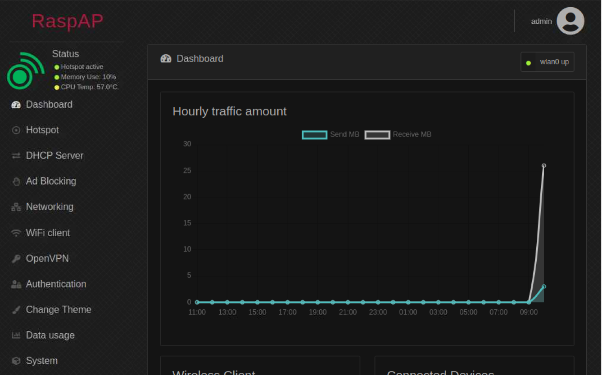

Depuis l'interface utilisateur, il faut cliquer sur `Hotspot` pour pouvoir changer le nom du réseau `SSID`. 

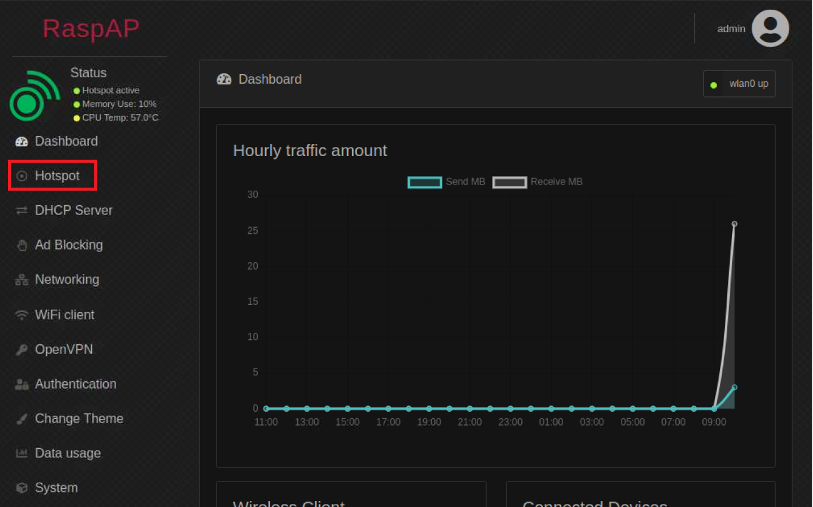

Une fois sur la page de configuration du Hotspot, il faut changer le SSID du réseau par le nom que vous souhaiteriez qu'il adopte. Dans mon cas je l'ai changé à `rps4_access_point` :


Pour changer le mot de passe `Pre Shared Key`, il faut aller dans l'onglet `Security`, remplir les informations que vous souhaitez utiliser pour vous connecter au réseau WiFi. :


Pour terminer, cliquez sur `Restart hotspot` en bas à droite de la page.

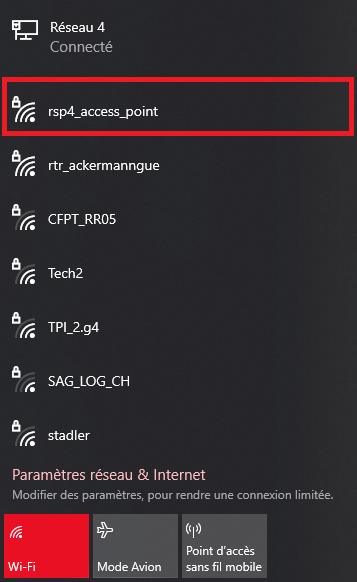

Si vous souhaitez connaître toutes les personnes connectées sur le réseau, allez dans la section `DHCP Server` :

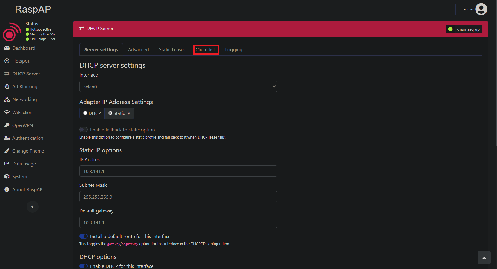

Une fois sur la page `DHCP Server`, allez dans l'onglet `Client list`. Vous y trouverez une liste comme celle ci :

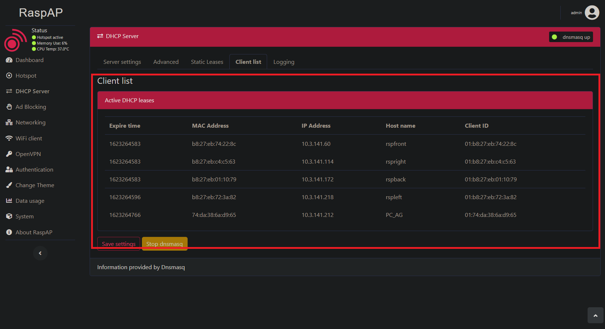

## Asyncio ?
[Asyncio](https://docs.python.org/3/library/asyncio-eventloop.html#asyncio.AbstractEventLoop.run_forever) est une librairie python nous permettant d'écrire du code `concurrent` c'est à dire sur différents thread à l'aide de la syntaxe async / await. 

### Mise en place
Pour installer asyncio il faut exécuter la commande `sudo pip3 install asyncio`.


### Utilisation

Voici un code d'exemple pour montrer la mécanique :

```python
import asyncio

try:
    # Tente de récupérer la référence d'une boucle
    loop = asyncio.get_running_loop()
except RuntimeError:  
    # Si aucune référence n'a été trouvée, on crée une nouvelle boucle
    loop = asyncio.new_event_loop()
finally:
    # Exécution de la méthode jusqu'à ce qu'elle soit finie
    loop.run_until_complete(main("Ceci est un message asynchrone"))


async def main(message)
    print(message)
```

Il est important de savoir qu'il existe 2 différentes manières d'exécuter le code.

1. `run_until_complete`, va exécuter le code jusqu'à être arrivé à la fin de la méthode.
2. `run_forever`, va exécuter le code en boucle jusqu'à ce que l'on stop la boucle avec `loop.stop()`.